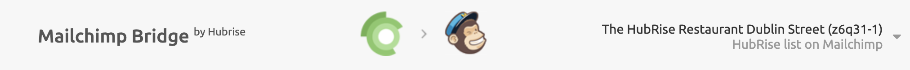
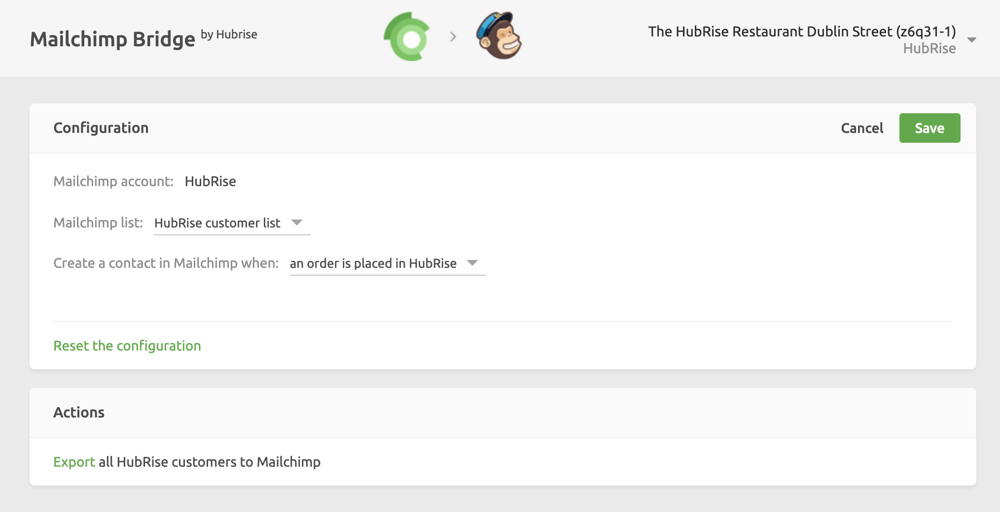

## Configuration Options

In order to configure your connection to Mailchimp:

1. Open your Mailchimp Bridge. For assistance, see [Open an App](/docs/connections/#open-an-app).

1. In the top right hand corner, click the down arrow <InlineImage width="28" height="21"></InlineImage> next to your **Location name** and select **Configuration**.

1. In the configuration section you have three options:

   - **Mailchimp account**: This option indicates which Mailchimp account is connected to your HubRise location.

   - **Mailchimp list**: This option indicates the Mailchimp Audience where the customers are exported to. In the drop-down list, you can select the Mailchimp audience to use. The selected audience also appears in the far right hand side of the Mailchimp header, immediately below the name of your business.
     

   - **Create a contact in Mailchimp when**: This option allows you to specify when a contact is created in Mailchimp. In the drop-down list you can either select **a customer is added to HubRise** or **an order is placed in HubRise**.

1. Once you have set the configuration according to your preferences, click **Save**.

If you want to reset the configuration and erase its values, click **Reset the configuration** at the bottom of the page.

## Customer Export

If you already have customers registered in HubRise when you connect Mailchimp, you can export your data to Mailchimp through the following steps:

1. Open Mailchimp Bridge. For assistance, see [Open An App](/docs/connections/#open-an-app).
1. In the top right hand corner, click the down arrow <InlineImage width="28" height="21"></InlineImage> next to your **Location name** and select **Configuration**.
1. In the **Actions** section, select **Export all HubRise customers to Mailchimp**.

This will export the customers in your HubRise customer list to your Mailchimp audience.
