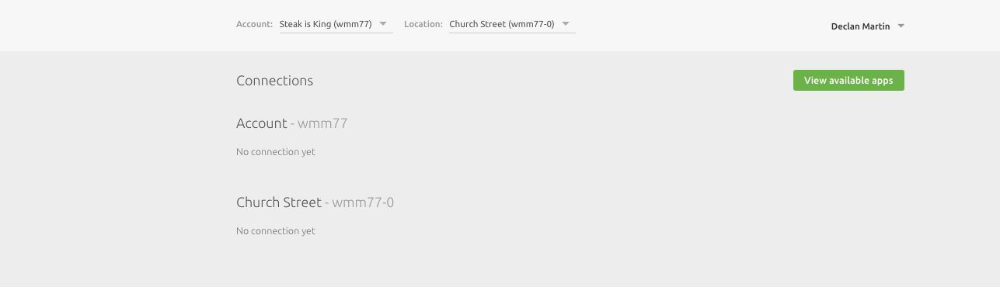
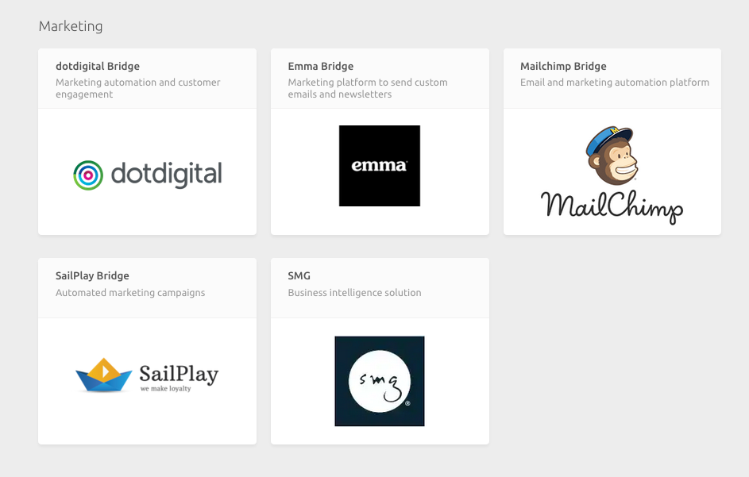
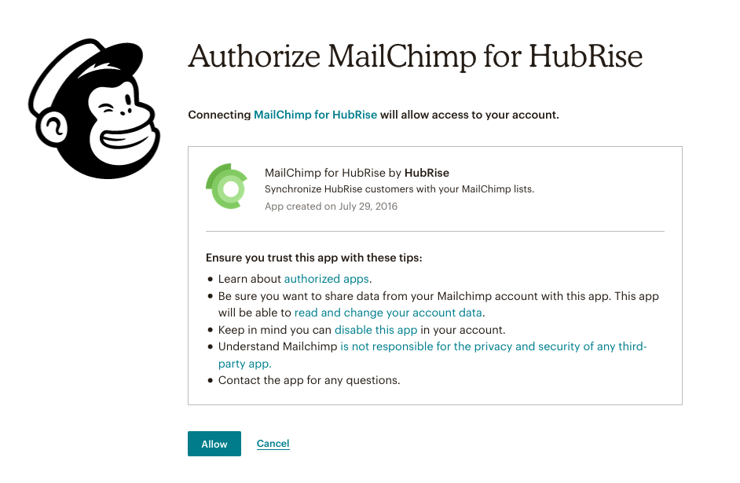

The instructions below detail how to connect your Mailchimp account to a your HubRise account. 

---

**IMPORTANT NOTE**: Note that both Mailchimp and HubRise have their own vocabulary, and may refer to the same things by different names. For example, a list in HubRise refers to an audience in Mailchimp. For more information on the terms and definitions used between these two platforms, see [HubRise Definitions vs Mailchimp Definitions](/apps/mailchimp/mailchimp-terms).

---

## Connect Mailchimp to HubRise

To connect your Mailchimp account to your HubRise account:

1. Login to your HubRise backoffice.
1. In the left navigation pane of the back office, select **Connections**.

1. On the page that opens, select **View Available Apps**.

1. On the page that opens, you will find a list of apps which are possible to integrate with HubRise. Scroll down to **Marketing**.

1.  Select **Mailchimp Bridge**.
1. On the popup that opens, select **Connect your Mailchimp Account**.

1. In the open that opens, select the location you want to connect and click **Allow**.
1. You will be taken to the Mailchimp login screen. Here you will login to your Mailchimp account. If you don't have a Mailchimp account, you will need to create one.

Once logged in, you will be asked whether you want to authorise HubRise. Select **Allow**.

1. After authorization, you will be taken to the configuration screen. You can close the window and log back into your HubRise back office.
1. In the left navigation pane, select **Connections**. You will see that your location is now connected to Mailchimp.

---

**IMPORTANT NOTE**: You should note that for every location in HubRise, you will need to perform a new connection to Mailchimp. 

---

## Disconnect Mailchimp

In order to disconnect your HubRise location from Mailchimp:

1. Login to your HubRise backoffice.
1. In the left navigation pane of the back office, select **Connections**.
1. On the screen that opens, on the Mailchimp item, select the **Actions** drop-down list.
1. Select **Disconnect** from the drop-down list that appears.
1. In the popup window that appears, you will be asked to confirm whether you want to disconnect Mailchimp Bridge. Select **Confirm**.

Your HubRise location is now disconnected from your Mailchimp account.