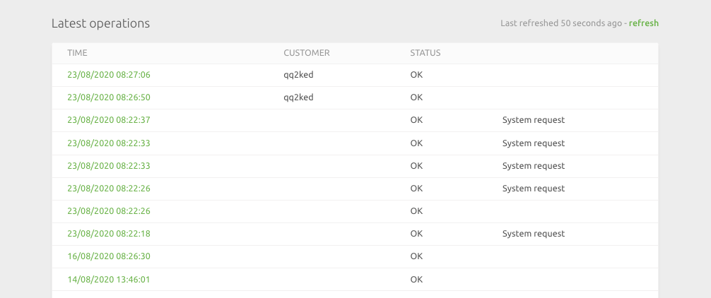

The logs page on Mailchimp Bridge shows a list of activities on Mailchimp Bridge. On the logs page you will find two different types of activities. Activities which contain an entry in the Customer column are, are activities where a customer's details was sent to Mailchimp. Other activities are, for instance, when the list of customers was sent to Mailchimp when the service was connected.

When clicked each activity opens and displays all the logs of the API requests exchanged between HubRise and Mailchimp via the Mailchimp Bridge. Information about each API request is contained in three columns:

- **Time**: the time the activity took place.
- **Direction**: the direction of the activity, i.e. whether it was data sent from HubRise to Mailchimp Bridge or whether it was data sent from Mailchimp Bridge to Mailchimp.
- **Status**: The status of the request. The value OK confirms that the request was successfully sent. 

Each log, when opened, is divided into two parts: Request and Response. The former displays the information sent in the request, and the latter the response received.

## The Request from HubRise to MailChimp Bridge

The information contained in the **Request** and **Response** logs in the case of a request from HubRise to Mailchimp Bridge are in JSON format. The request log for the request made from HubRise to Mailchimp Bridge contains the following data fields:

- `id`: the id for the specific request.
- `resource_type`: In respect of the interaction between the Mailchimp Bridge and HubRise, this will always be `customer' as Mailchimp Bridge only allows the transmission of customer data between Mailchimp and HubRise.
- `event_type`: When the customer is created for the first time in Mailchimp, this value will be `create` and any subsequent actions such as the placing of an order, will reflect as `update`.
- `customer_id`: The unique identifier or id of the specific customer.
- `customer_list_id`: The identifier of the list or audience in Mailchimp of which the specific customer will be a member of.
- `email`: The email address of the user.
- `first_name`: The first name of the customer.
- `last_name`: The last name of the customer.
- `phone`: The telephone number of the customer.
- `address_1`, `address_2`, `postal_code`, `city`, `state`, and `country`: The address of the customer.
- `sms_marketing`: This indicates whether the customer is signed up to receive sms marketing. A value of `true` indicates that the customer is signed up and a value of `false` indicates that the customer is not.
- `email_marketing`: This indicates whether the customer is signed up to receive email marketing. A value of `true` indicates that the customer is signed up and a value of `false` indicates that the customer is not.
- `nb_orders`: The number of orders the customer has placed. When the customer is first created, this value will be `0`.
- `order_total`: This is the value of the order placed by the customer.
- `first_order_date`: The date on which the customer placed the first order with the location. When the customer is first created, this value will be `null`.
- `last_order_date`: The date of the last order of the customer. When the customer is first created, this value will be `null`.

For more information on reading and understanding JSON documents, you can look at the [HubRise Documentation](/docs/hubrise-logs) on logs.

## The Request from Mailchimp Bridge to MailChimp

In the case of a request made from Mailchimp Bridge to Mailchimp, the data is transferred as an URL Encoded Form. In this case the keys and values are encoded in key-value tuples separated by '&', with a '=' between the key and the value. Non-alphanumeric characters in both keys and values are percent encoded: this is the reason why this type is not suitable to use with binary data.

The request made from Mailchimp Bridge to Mailchimp contains the following data fields:

- `email_address`:
- `status`:
- `merge_fields`:
- `FNAME`:
- `LNAME`:

