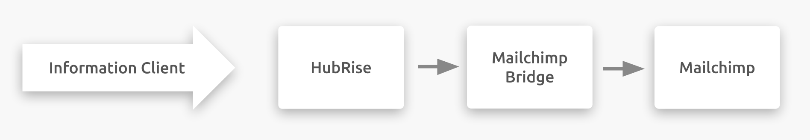

---

**REMARQUE IMPORTANTE :** La documentation complète est disponible <Link href="/apps/mailchimp">en anglais uniquement</Link>.

---

## Description

Mailchimp est une plateforme d'automatisation marketing tout‑en‑un destinée aux petites entreprises.

Mailchimp se connecte à votre compte HubRise via l'application Mailchimp Bridge développée par HubRise.

## Fonctionnalités de l'intégration

Connecter Mailchimp à HubRise permet à votre solution d'e-marketing de :

- Recevoir les commandes de HubRise.
- Recevoir les informations clients de HubRise.

Mailchimp Bridge peut être connecté à HubRise depuis le back-office de HubRise.

## Pourquoi se connecter ?

La connexion de Mailchimp à HubRise permet de synchroniser vos audiences Mailchimp avec vos solutions de commande en ligne et votre logiciel de caisse.

Grâce à HubRise, synchronisez votre menu, vos informations clients et vos commandes avec votre logiciel de caisse, les plateformes de livraison de repas (dont Deliveroo, Uber Eats et Just Eat), les solutions de gestion de livreurs ou de services de livraison, les solutions d'e-marketing (SMS/e-mailing) et de business intelligence, les systèmes de gestion de stock et de fidélisation client, et bien d'autres encore. Le nombre d'applications compatibles augmente chaque mois. Pour voir les applications que vous pouvez connecter, consultez notre [page Apps](/apps).

## Prérequis

Pour établir la connexion entre Mailchimp et HubRise, vous devez disposer d'un compte Mailchimp existant.
