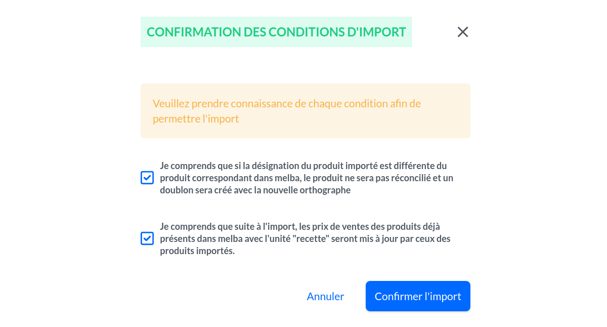

## Importer les produits dans Melba

Pour importer un catalogue HubRise dans Melba, suivez les étapes suivantes :

1. Depuis le back-office de Melba, cliquez sur l'icône **EXTENSIONS** dans le menu à gauche.

1. Trouvez HubRise dans la liste des extensions. Si HubRise est connecté, vous voyez le label **Installée**. A droite de ce label, cliquez sur l'icône avec les 3 points verticaux, puis sur **Importer des produits**.

1. Une nouvelle page s'ouvre. Vérifiez que la première option sélectionnée est **HubRise**, et que la deuxième est **Importer les produits**, comme dans la capture d'écran ci-dessous :
   

1. Cliquez sur le bouton **Importer les produits** situé en bas à droite de la page.

1. Une popup de confirmation s'ouvre. Cochez les cases, puis cliquez sur **Confirmer l'import**.
   

1. Une nouvelle page s'ouvre pour confirmer que la procédure d'import est en cours. Cliquez sur **Vérifier et classer par type**.
   

1. Par défaut, Melba importe les produits HubRise en tant que recettes. Sélectionnez les produits à importer en tant qu'articles, si nécessaire, puis cliquez sur **Aller aux recettes**.
   

1. Vous êtes redirigé vers la page des recettes. L'importation est terminée.

## Déroulement de l'importation

L'importation d'un catalogue HubRise dans Melba est toujours déclenchée par une action de l'utilisateur dans le back-office de Melba. Ainsi, la modification d'un catalogue dans HubRise ne déclenche pas automatiquement l'importation.

Melba utilise les codes ref des SKUs pour identifier les articles et les recettes. Lors de l'importation, si un code ref n'existe pas, Melba crée un nouvel article ou une nouvelle recette. Si le code ref existe déjà, Melba met à jour le prix de l'article ou de la recette. Le nom du produit et les autres informations ne sont pas mis à jour.

## Informations reçues dans Melba

Les sections suivantes décrivent les informations reçues dans Melba lors de l'importation d'un catalogue HubRise.

### Catégories

Les catégories HubRise sont créées dans Melba. Les sous-catégories sont importées comme des catégories.

### Produits et SKUs

Les produits HubRise sont créés dans Melba en tant que recettes ou articles, selon le type d'import sélectionné pour chaque produit. Les SKUs HubRise sont importées comme des prix de vente du produit.

Les informations suivantes sont importées dans Melba : nom, code ref, prix, catégorie.

Les codes ref sont importés dans le champ **Code vente**, visible dans la section **Informations de vente** de la fiche article ou recette.

Les tags HubRise ne sont pas importés. Les produits importés reçoivent néanmoins un tag `Import produit {{date}} HubRise`.
