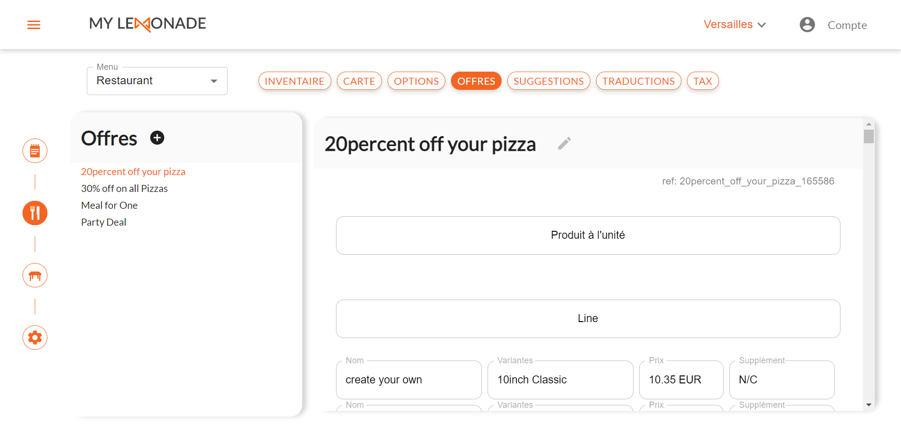
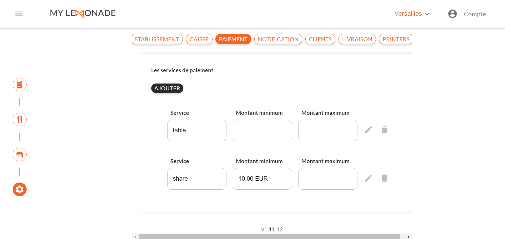
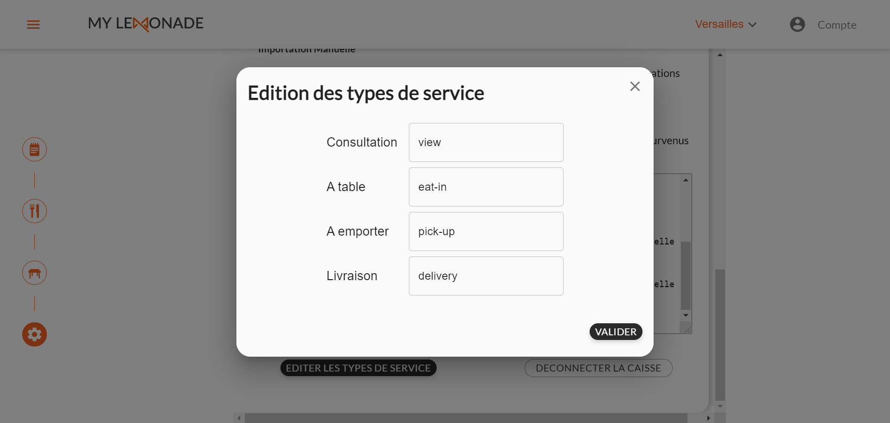

Une fois My Lemonade connecté à HubRise, vous devez configurer My Lemonade afin que les différents éléments présents dans les commandes envoyées soient bien identifiés par vos autres applications connectées, telles que votre solution d'encaissement.

## Produits et SKUs

Les SKUs dans HubRise correspondent aux variante dans My Lemonade.

Un produit est toujours composé d'au moins une SKU. HubRise ignore le code ref du produit et prend en compte le code ref de la SKU.

Pour modifier le code ref d'une variante, suivez les étapes suivantes :

1. Dans le menu latéral du back office, sélectionnez **Gestion du Menu**.
2. Dans la section **Carte**, sélectionnez la catégorie du produit.
3. Sélectionnez le produit désiré.
4. Dans la section **VARIANTES**, indiquez le code ref de la variante dans le champ **Référence**.
   

## Options

Pour modifier le code ref d'une option, suivez les étapes suivantes :

1. Dans le menu latéral du back office, sélectionnez **Gestion du Menu**.
2. Sélectionnez l'onglet **OPTIONS**.
3. Dans la section **Options**, sélectionnez l'option désirée.
4. Indiquez le code ref dans le champ **ref**.
   

## Promotions

Une promotion dans HubRise correspond à une offre dans My Lemonade.

Pour modifier le code ref d'une offre, suivez les étapes suivantes :

1. Dans le menu latéral du back office, sélectionnez **Gestion du Menu**.
2. Sélectionnez l'onglet **OFFRES**.
3. Dans la section **Offres**, sélectionnez l'offre désirée.
4. Indiquez le code ref dans le champ **ref**.
   

## Méthodes de paiement

Une méthode de paiement dans HubRise correspond à un service de paiement dans My Lemonade.

Pour modifier le code ref d'un service de paiement, suivez les étapes suivantes :

1. Dans le menu latéral du back office, sélectionnez **Paramètres**.
2. Sélectionnez l'onglet **PAIEMENT**.
3. Indiquez le code ref dans le champ **Service**.
   

## Types de service

Pour modifier le code ref d'un type de service, suivez les étapes suivantes :

1. Dans le menu latéral du back office, sélectionnez **Paramètres**.
2. Sélectionnez l'onglet **CAISSE**.
3. Cliquez sur **EDITER LES TYPES DE SERVICE**.
4. Indiquez le code ref dans le champ éditable.
   
