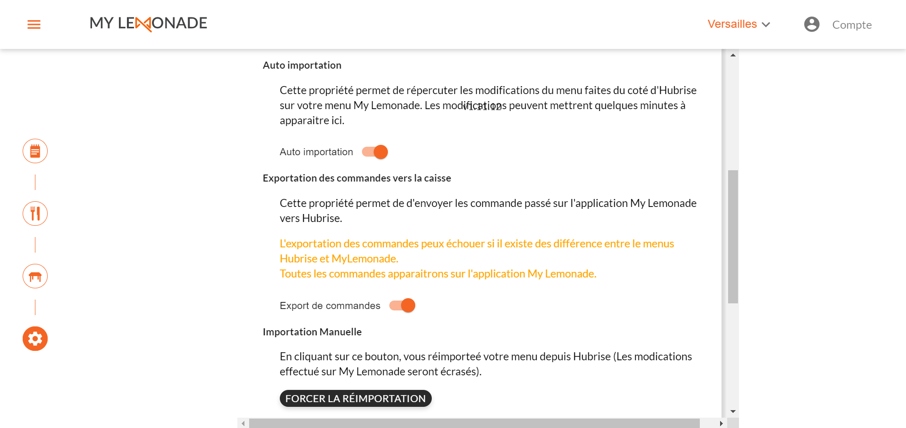

My Lemonade peut importer un catalogue depuis HubRise. L'importation a lieu dans l'un des trois cas suivants :

- Importation initiale au moment de la connexion avec HubRise.
- Importation manuelle déclenchée par l'utilisateur.
- Auto-importation déclenchée par HubRise.

### Importation initiale

Le catalogue est importé automatiquement dans My Lemonade au moment de la connexion avec HubRise.

### Importation manuelle

À tout moment, vous pouvez ré-importer manuellement le catalogue depuis HubRise :

1.  Dans le menu latéral du back office, sélectionnez **Paramètres**.
1.  Sélectionnez l'onglet **Caisse**.
1.  Cliquez sur **FORCER LA RÉIMPORTATION**.

---

**REMARQUE IMPORTANTE** : Cette opération remplace votre menu My Lemonade actuel.

---

### Auto-importation

Les mises à jour de catalogue dans HubRise peuvent être automatiquement importées dans My Lemonade. Pour cela, vous devez activer l'auto-importation en suivant ces étapes :

1.  Dans le menu latéral du back office, sélectionnez **Paramètres**.
1.  Sélectionnez l'onglet **Caisse**.
1.  Cochez l'option **Auto importation**.
    
