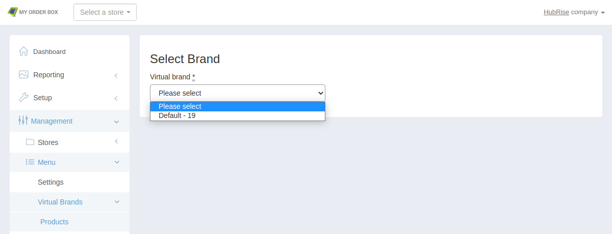

To connect MyOrderBox to Deliveroo, Uber Eats, or Just Eat, use the configuration parameters provided below.

## Virtual Brands

MyOrderBox uses service type ref codes to identify the source of orders. To connect several virtual brands to a single MyOrderBox EPOS, you need to include virtual brand identification information in the service type ref codes. To connect a single brand, just use the service type ref codes provided in the sections below.

For example, to connect Deliveroo:

- If you operate a single Deliveroo account, use `DLO` as the service type ref code
- If you operate multiple Deliveroo accounts, look up the virtual brand id for the account you need to connect in MyOrderBox. If the id is `123456789`, the service type ref code you need to enter is `DLO_123456789`.

To find a virtual brand id:

1. Log in to your [MyOrderBox back office](https://go.myorderboxhq.com/).
1. Check that no store is selected in the store selector dropdown at the top. If a store is selected, click on the cross icon to unselect. If you cannot unselect the store, check that you have account manager permissions.
1. From the navigation menu, select **Management** > **Menu** > **Virtual Brands** > **Products**.
1. Open the **Virtual brand** dropdown.
1. The virtual brand id is the number next to the brand name, after the **-** character.

## Deliveroo

To receive Deliveroo orders in MyOrderBox, you first need to connect Deliveroo Bridge, an app included in your HubRise
subscription. For more information about Deliveroo Bridge, see the [Deliveroo Bridge documentation](/apps/deliveroo).

To correctly receive your orders, specify the following values in the Deliveroo Bridge configuration page. To learn how
to view and modify the configuration page for Deliveroo Bridge, see
the [Deliveroo Configuration page](/apps/deliveroo/configuration).

| Section       | Name                                  | Ref code                                                   |
| ------------- | ------------------------------------- | ---------------------------------------------------------- |
| Service types | Deliveroo fulfilled ref code          | `DLO` or `DLO_xxx` - see [Virtual Brands](#virtual-brands) |
| Service types | Restaurant fulfilled ref code         | (same as above)                                            |
| Service types | Takeaway ref code                     | (same as above)                                            |
| Service types | Send orders delivered by Deliveroo as | `collection orders`                                        |
| Discounts     | Offer ref code                        | (leave empty)                                              |
| Charges       | Delivery charge ref code              | (leave empty)                                              |
| Charges       | Surcharge ref code                    | (leave empty)                                              |
| Payments      | Deliveroo payment ref code            | (leave empty)                                              |
| Payments      | Cash payment ref code                 | (leave empty)                                              |

## Uber Eats

To receive Uber Eats orders in MyOrderBox, you first need to connect Uber Eats Bridge, an app included in your HubRise
subscription. For more information about Uber Eats Bridge, see the [Uber Eats Bridge documentation](/apps/uber-eats).

To correctly receive your orders, specify the following values in the Uber Eats Bridge configuration page. To learn how
to view and modify the configuration page for Uber Eats Bridge, see
the [Uber Eats Configuration page](/apps/uber-eats/configuration).

| Section        | Name                                  | Ref code or value                                          |
| -------------- | ------------------------------------- | ---------------------------------------------------------- |
| Service types  | Uber delivery ref code                | `UBE` or `UBE_xxx` - see [Virtual Brands](#virtual-brands) |
| Service types  | Restaurant delivery ref code (\*)     | (same as above)                                            |
| Service types  | Takeaway ref code                     | (same as above)                                            |
| Service types  | Eat-in ref code                       | (same as above)                                            |
| Service types  | Send orders delivered by Uber Eats as | `collection orders`                                        |
| Special items  | Disposable items ref code             | Create a product in MyOrderBox and use its ref code.       |
| Discounts      | Discount ref code                     | (leave empty)                                              |
| Payments       | Payment ref code                      | (leave empty)                                              |
| Order statuses | Mark the order as Accepted            | `When it is sent to HubRise`                               |
| Order statuses | Mark the order as Denied              | `When HubRise status changes to "Rejected"`                |
| Order statuses | Mark the order as Cancelled           | `When HubRise status changes to "Cancelled"`               |

(\*) BYOC - Bring Your Own Courier

MyOrderBox can display the product-level comments included by your customers in their orders.

## Just Eat

To receive Just Eat orders in MyOrderBox, you first need to connect Just Eat Flyt Bridge, an app included in your
HubRise subscription.

To correctly receive your orders, specify the following values in the Just Eat Flyt Bridge configuration page.

| Section       | Name                                     | Ref code                                                   |
| ------------- | ---------------------------------------- | ---------------------------------------------------------- |
| Service types | Just Eat delivery ref code               | `JUE` or `JUE_xxx` - see [Virtual Brands](#virtual-brands) |
| Service types | Restaurant delivery ref code             | (same as above)                                            |
| Service types | Takeaway ref code                        | (same as above)                                            |
| Service types | Send orders delivered by the platform as | `collection orders`                                        |
| Charges       | Delivery charge ref code                 | (leave empty)                                              |
| Charges       | Service charge ref code                  | (leave empty)                                              |
| Payments      | Just Eat payment ref code                | (leave empty)                                              |
| Payments      | Cash payment ref code                    | (leave empty)                                              |
