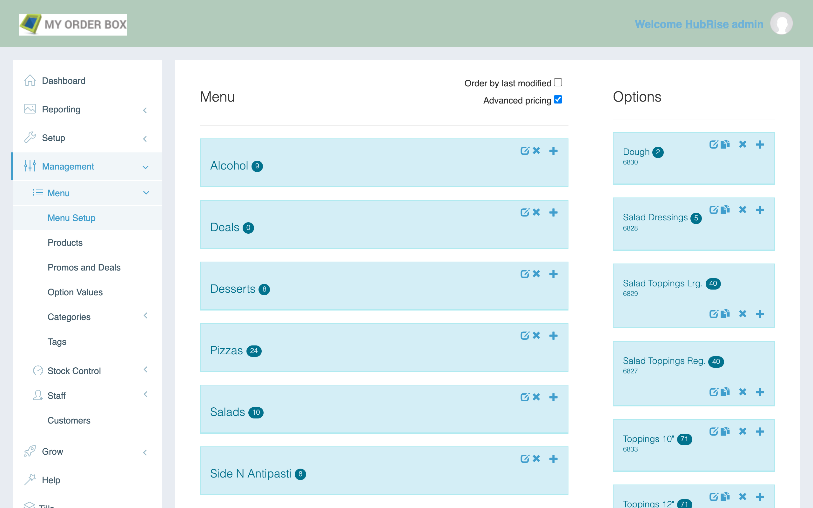

When you create a product or option, MyOrderBox automatically assigns a ref code.
You can manage your products and find the relative ref codes from the **Menu setup** page in your MyOrderBox back office.

## SKUs

If you need to find the ref code associated to a specific product, follow these steps.

1. From the navigation menu, go to **Management** > **Menu** > **Menu setup**.
1. From the list of categories under the **Menu** column, double-click on the category that contains the product.
1. Identify the product from the list. The product ref code appears under the name, and typically starts with the prefix `p_` or `pa_`.

## Options

If you need to find the ref code associated to a specific option, follow these steps.

1. From the navigation menu, go to **Management** > **Menu** > **Menu setup**.
1. From the list of options under the **Options** column, double-click on the option that contains the option value.
1. Identify the option value from the list. The option ref code appears under the name, and is typically a number without prefix.

