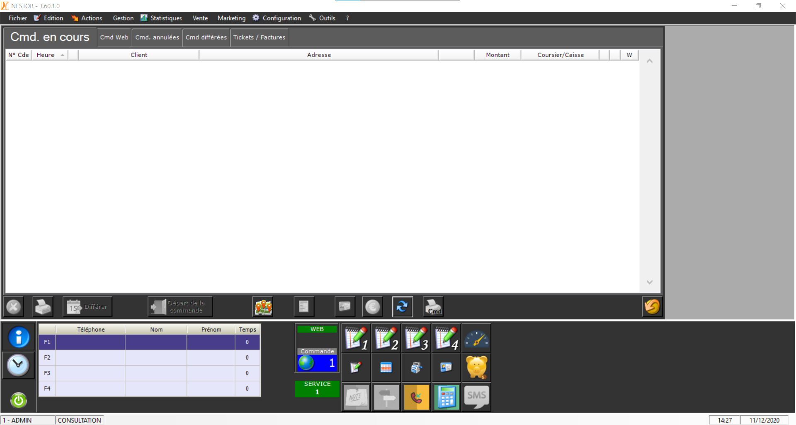
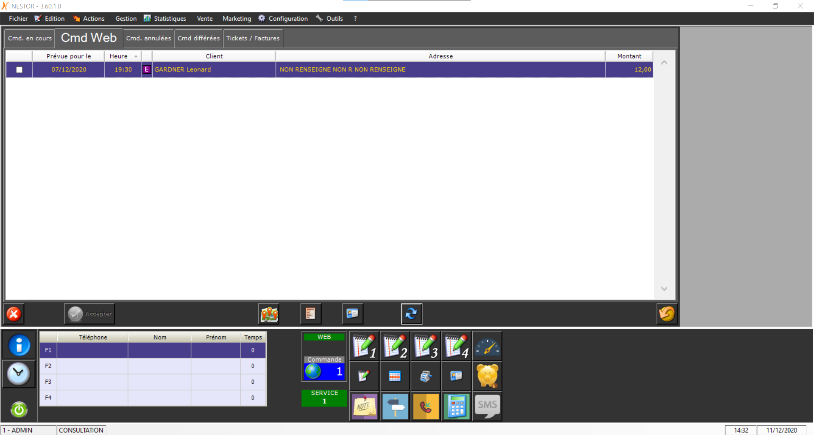
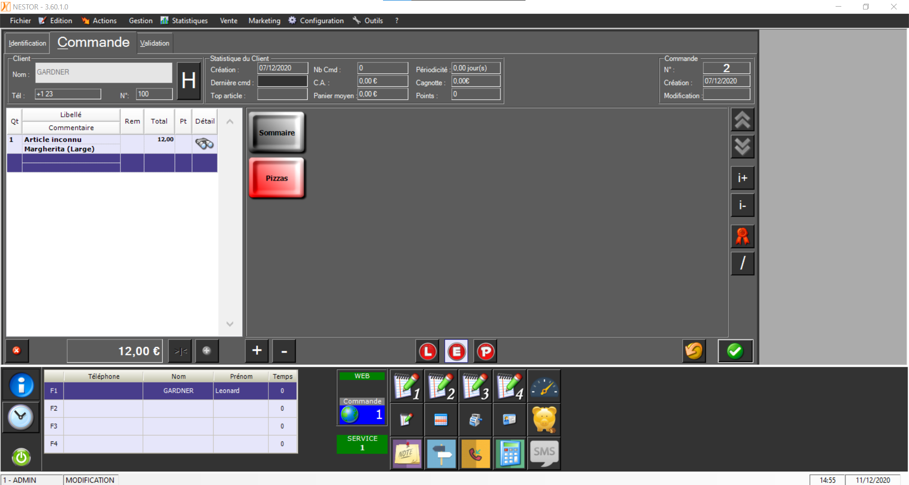
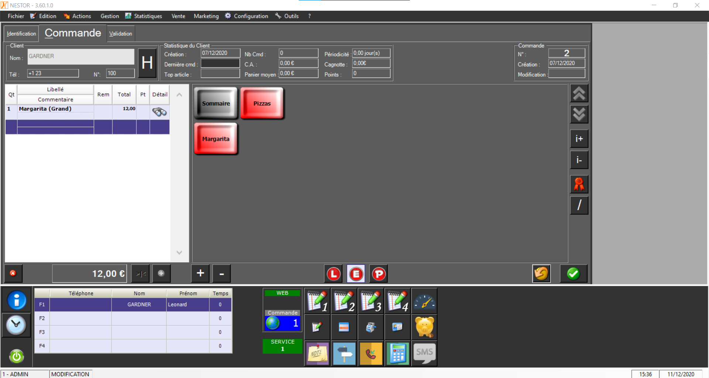
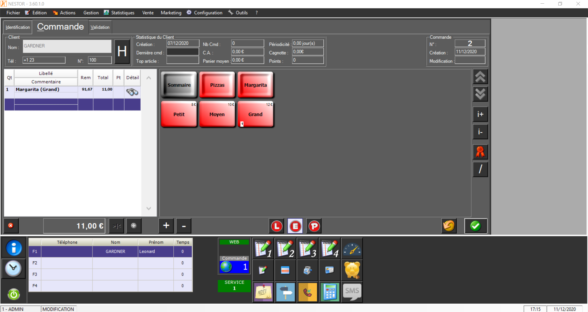
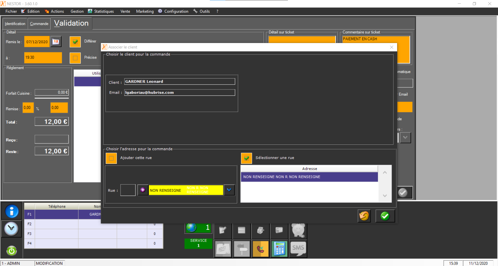
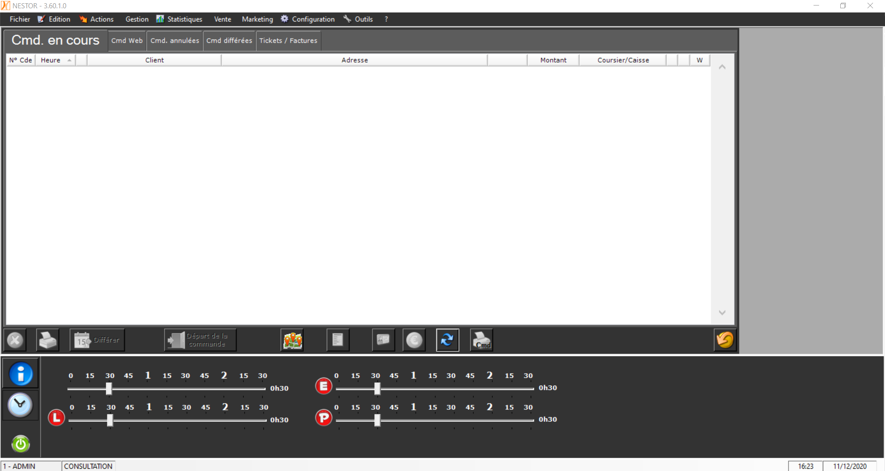

Lorsque Nestor est connecté à HubRise, les commandes envoyées à HubRise arrivent automatiquement dans votre logiciel de caisse.

## Recevoir des commandes

Nestor vérifie l'arrivée de nouvelles commandes toutes les 20 secondes grâce à l'utilitaire WebNES. Une alerte visuelle et sonore signale l'arrivée d'une nouvelle commande.

Pour voir la liste des commandes en attente, cliquez sur l'alerte. Pour voir le détail de la commande et la valider, cliquez sur la ligne correspondante.

### Commande avec des articles inconnus

Lorsqu'une commande contient des articles dont le code ref n'est pas reconnu, ces derniers sont remplacés par des articles nommés **Article inconnu**. Il est alors impossible de valider la commande. Pour remédier à ce problème, suivez les étapes suivantes :

1. Sélectionnez votre commande pour en voir le détail. Certaines lignes intituées **Article inconnu** sont présentes.
1. Sélectionnez la dernière ligne vide. Votre menu apparaît.
   
1. Sélectionnez et ajoutez l'article correspondant en vous aidant de la description de la ligne **Article inconnu**.
1. Supprimez la ligne **Article inconnu** désormais remplacée.
   
1. Répétez ces étapes pour chaque ligne **Article inconnu**.
1. Validez la commande.

Pour éviter que ce problème se reproduise, assurez-vous que les codes ref de vos produits ont bien été saisis. Pour plus d'informations, consultez la page [Associer les codes ref](/apps/nestor/associer-codes-ref).

### Articles avec des prix différents

Lorsqu'une commande contient des articles dont le prix ne correspond pas à celui de Nestor, une remise en pourcentage est appliquée automatiquement.

Par exemple, si une _Margarita Grande_ est à 11.00 € dans la commande, mais que son prix est 12.00 € dans le catalogue Nestor, un champ _Remise_ égal à 91,67% sera indiqué dans le détail de la commande.

### Enregistrement d'un client

Si le client qui a passé la commande n'est pas connu de Nestor, une étape d'association du client apparaît avant celle de validation de la commande. Deux choix sont alors proposés :

- Créer un nouveau client.
- Le rattacher à un client connu de Nestor. Dans ce cas, les informations du client seront écrasées par celles provenant d'HubRise.

Lors de cette étape, les même choix sont proposés pour l'adresse.

### Statut de la commande

Le statut de la commande dans HubRise évolue de la façon suivante :

1. _New_ : la commande vient d'être créée.
1. _Received_ : la commande a été reçue dans Nestor.
1. _Accepted_ : la commande a été validée dans Nestor.

La mise à jour du statut dans HubRise peut prendre jusqu'à 20 secondes.

### Détails de la commande

Vous pouvez retrouver toutes vos commandes en suivant les étapes suivantes.

1. Dans la barre de menu Nestor, sélectionnez **Actions**.
1. Sélectionnez l'option **Carnet de commandes**. La fenêtre des commandes s'ouvre.
1. Sélectionnez l'onglet correspondant au type de commande que vous souhaitez visualiser : _En cours_, _Web_, _Annulées_, _Différées_, _Tickets / Factures_.
1. Double-cliquez sur la ligne correspondant à la commande désirée. La fenêtre détaillant ses informations s'ouvre.

**Fonctionnalité prévue :** Il n'est pour l'instant pas possible de connaître l'origine d'une commande. Cette fonctionnalité est en cours de développement. Si elle est nécessaire à votre utilisation de Nestor, contactez l'éditeur de Nestor.

## Envoyer les commandes

Cette fonctionnalité est en cours de développement et sera disponible prochainement.

## Temps de préparation

Nestor permet de configurer les temps de préparation en livraison (*L), sur place (*P) et à emporter (\*E). La valeur par défaut est de 30 minutes pour ces trois paramètres. Seul le temps de préparation en livraison est remonté vers HubRise.

Pour modifier les temps de préparation, sélectionnez le bouton avec un icône en forme d'horloge en bas à gauche de Nestor.

