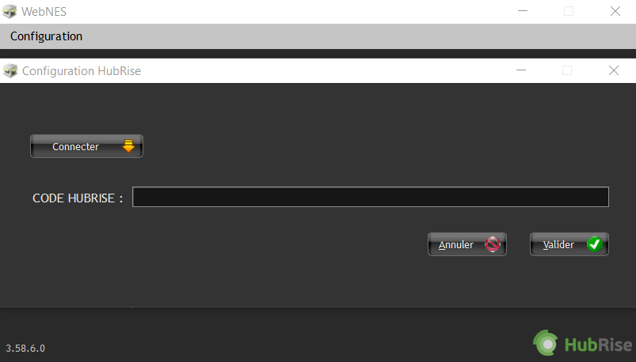
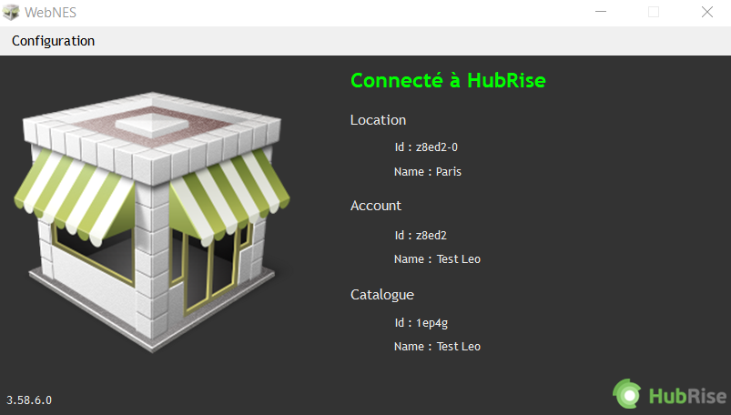
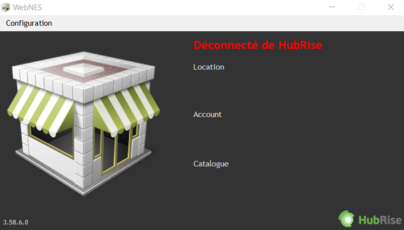

Pour connecter Nestor à HubRise, il suffit de suivre quelques étapes.

## Connecter Nestor

Pour établir la connexion entre un point de vente Nestor et HubRise :

1. Depuis votre poste Windows, lancez l'application **WebNES**, incluse dans l'installation de Nestor.
1. Dans la barre de menu, sélectionnez **Configuration** > **HubRise**. Une fenêtre nommée **Configuration HubRise** s'ouvre.
   
1. Cliquez sur **Connecter**. Vous êtes redirigé vers l'interface HubRise.
1. Choisissez le point de vente que vous désirez connecter et cliquez sur **Autoriser** pour donner à Nestor l'accès à vos informations. Si plusieurs listes de clients ou catalogues sont disponibles, cliquez sur **Suivant** afin d'afficher les listes déroulantes correspondantes, sélectionnez l'option voulue, puis cliquez sur **Autoriser**.

---

**REMARQUE IMPORTANTE :** Vérifiez bien le choix du catalogue avant d'autoriser la connexion, car le catalogue HubRise est écrasé dès que la connexion est établie.

---

1. Copiez le code affiché et collez-le dans la fenêtre **Configuration HubRise** de l'utilitaire WebNES.
   
1. Cliquez sur **Valider**. L'interface WebNES affiche **Connecté à HubRise**, ainsi que les informations de votre point de vente.
   
1. En cas de besoin, l'éditeur du logiciel Nestor peut vous venir en aide. Pour leur donner accès à votre compte HubRise, [ajoutez les permissions nécessaires](/apps/nestor/connect-hubrise#give-access).

---

**REMARQUE IMPORTANTE :** Vous devrez vous connecter à un compte HubRise existant, ou créer un nouveau compte pour terminer d'établir la connexion. Pour plus d'informations sur la manière de créer un profil utilisateur ou vous connecter à HubRise, consultez notre [Guide de prise en main](/docs/get-started).

---

## Donner accès au support de Nestor {#give-access}

Pour faciliter la prise en charge de vos demandes de support, nous vous recommandons de donner accès à votre compte HubRise à l'éditeur de la solution Nestor.

Pour donner accès à Nestor, procédez comme suit :

1. Depuis le back-office de HubRise, sélectionnez **CONFIGURATION** dans le menu de gauche.
1. Dans la section **Permissions**, ajoutez info@svitex.com en sélectionnant l'option **Manager** dans la liste déroulante des rôles.
1. Cliquez sur l'icône **+** pour ajouter le nouvel utilisateur.

L'ajout d'un utilisateur est le moyen recommandé de donner accès à un tiers à votre point de vente. Le partage de mot de passe est déconseillé pour des raisons de sécurité.

## Déconnecter Nestor

1. Ouvrez l'application **WebNES**.
1. Dans la barre de menu, sélectionnez **Configuration** > **HubRise**. Une fenêtre nommée **Configuration HubRise** s'ouvre.
1. Cliquez sur **Déconnecter**.
   
