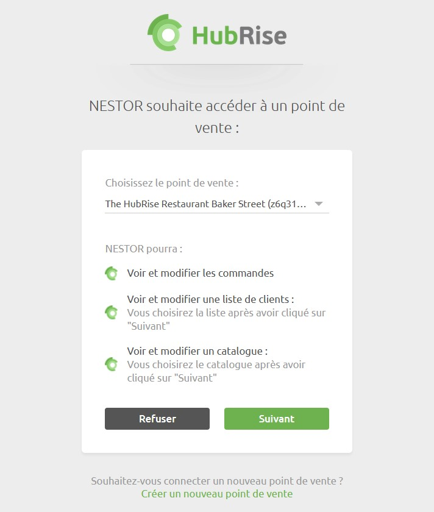
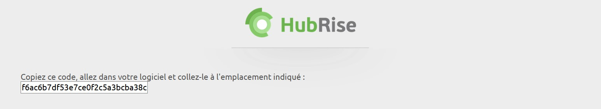

Connecter Nestor à HubRise peut être fait en seulement quelques étapes.

## Se connecter

Pour établir la connexion entre un point de vente Nestor et HubRise :

1. Lancez l'application **WebNES**, incluse dans l'installation de Nestor, depuis votre poste Windows.
1. Cliquez sur le menu **Configuration** dans la barre de menu.
1. Cliquez sur **HubRise**. Une fenêtre nommée **Configuration HubRise** s'ouvre.
1. Cliquez sur **Connecter**. Vous êtes redirigés vers l'interface HubRise.
1. Choisissez le point de vente que vous désirez connecter et cliquez sur **Autoriser** pour donner à Nestor l'accès à vos informations. Si plusieurs listes de clients ou catalogues sont disponibles, cliquez sur **Suivant** afin d'afficher les listes déroulantes correspondantes avant de cliquer sur **Autoriser**.
   

1. Copiez le code affiché et collez-le dans la fenêtre **Configuration HubRise** de l'utilitaire WebNES. Par exemple : `f6ac6b7df53e7ce0f2c5a3bcba38c`
   

1. Cliquez sur **Valider**. L'interface WebNES affiche **Connecté à HubRise**, ainsi que toutes les informations de votre point de vente.

---

**NOTE IMPORTANTE** Vous devrez vous connecter à un compte HubRise existant, ou créer un nouveau compte pour terminer d'établir la connexion. Pour plus d'informations sur la manière de créer un profil utilisateur ou vous connecter à HubRise, veuillez consulter notre [Guide de prise en main](/docs/getting-started/).

---

## Se déconnecter

1. Ouvrez l'application **WebNES**.
1. Sélectionnez **Configuration** dans la barre de menu.
1. Sélectionnez **HubRise**. Une fenêtre nommée **Configuration HubRise** s'ouvre.
1. Cliquez sur **Déconnecter**.
