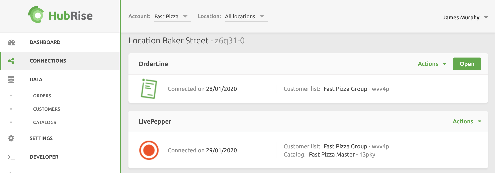

Google Chrome is our recommended browser for the best experience.

To launch OrderLine, follow these steps:

1. Log in to your [HubRise account](https://manager.hubrise.com).
2. Open the **CONNECTIONS** page.
3. Click **Open** next to the OrderLine app. OrderLine will open in a new browser tab.

---

**IMPORTANT NOTE:** In case you encounter any issues, such as a blank screen, refer to our [Troubleshooting](/apps/orderline/troubleshooting) section.

---

To facilitate daily access, consider bookmarking the OrderLine link in your browser.

To end your OrderLine session, simply close the corresponding browser tab.
