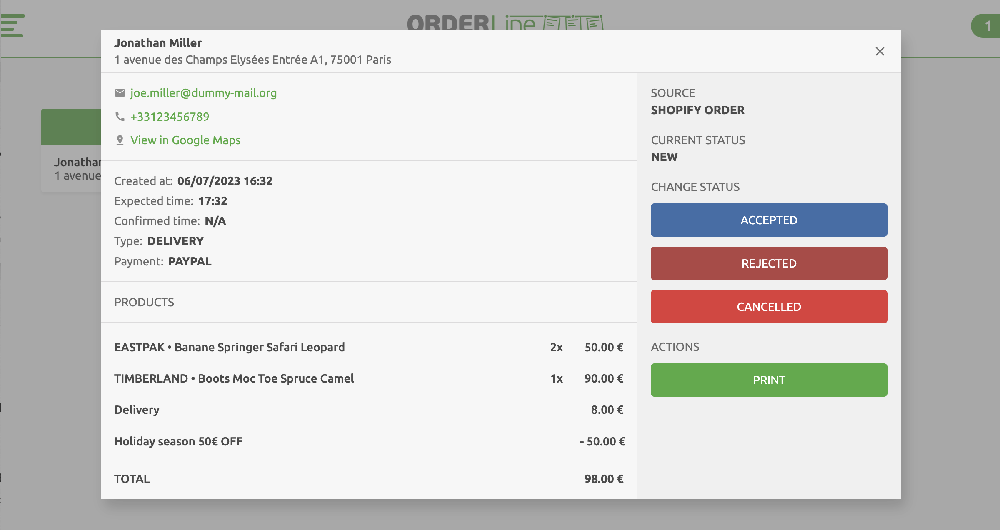
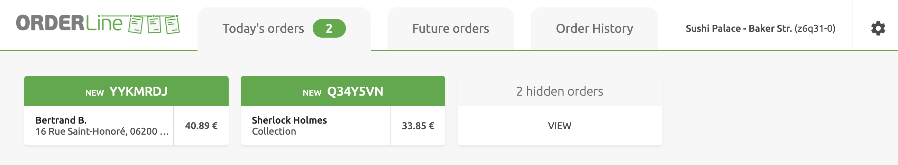
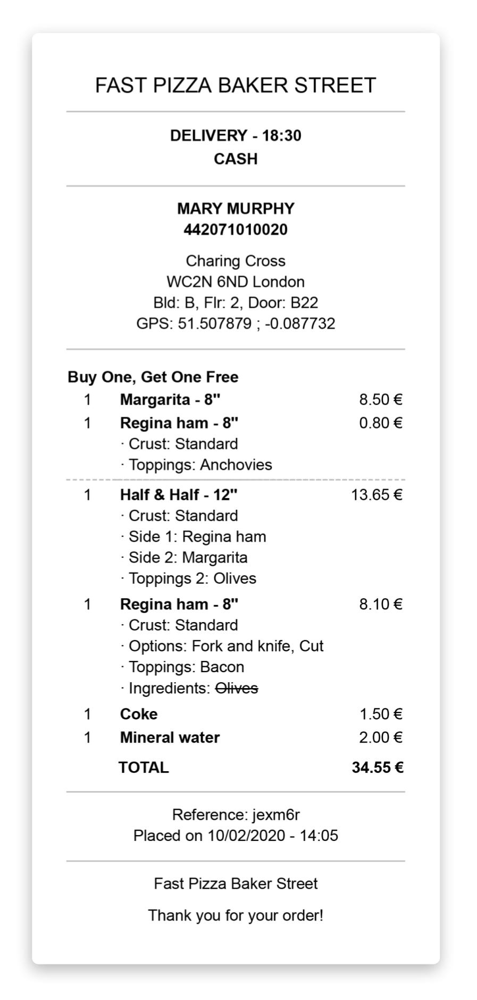

OrderLine users can change the statuses flow to manage orders in the way that best suits the business. This section describes the default status flow to accept, or print the order receipt by selecting the corresponding button. To customise this flow, see [Order Status Flow](/apps/orderline/settings#order-status-flow).

## Receive Orders

Upon order receipt, OrderLine displays it under the **Today's Orders** or **Future Orders** tab, based on the delivery date.

OrderLine can also emit a sound notification to inform you of new orders. To configure sound notifications, go to the **Settings** page and open the **Notifications** tab. For more information, see [Notifications](/apps/orderline/settings#notifications).

---

**IMPORTANT NOTE:** Browsers may block sound notifications. To keep them permanently enabled, follow the instructions in the FAQ [How Do I Keep Sound Notifications Enabled](/apps/orderline/faqs/keep-sound-notifications-enabled).

---

On first connection, OrderLine synchronises all orders from the past 30 days.

## View Order {#view-order}

To view the order details, click on the order card. To close it, click the close icon <InlineImage width="23" height="23"></InlineImage> or anywhere outside the card.

Order cards display all the details needed to process the order, including the following:

- Client address. A **View in Google Maps** link will be displayed if the online ordering solutions sends the GPS coordinates to HubRise.
- Order creation date and time.
- Expected date and time for delivery or collection requested by the customer.
- Confirmed date and time, which initially matches the expected time, until an OrderLine user updates it to the actual delivery time.
- Order type, indicating processing mode: **DELIVERY**, **COLLECTION** or **EAT-IN**.
- List of products to prepare, including customer notes if any.
- Current order status. Users can update the status for an order, or print the order receipt by selecting the corresponding button.

## Update Order's Status

To update an order's status, open the order card and choose the appropriate status button.

Depending on your OrderLine configuration, you may have the option to add extra details during specific status updates. To adjust the configuration, see [Additional Data Prompt](/apps/orderline/settings#additional-data-prompt). These prompts can be useful in certain situations, such as:

- Providing an optional **Message for the customer** when marking an order as **Cancelled**, to justify the cancellation.
- Specifying a **Confirmed time** for delivery, when an order is marked as **Accepted** but cannot be delivered at the expected time. If no **Confirmed time** is specified, the initial expected delivery time will be used.

To modify the delivery time or add a message for your client, click on the pen icon beside the status button. After making your adjustments, click the status button to confirm.

---

**IMPORTANT NOTE:** Your online ordering system must support delivery time updates and messaging for additional data prompts to be taken into account.

---

Certain status updates, such as marking an order as **Completed**, might cause the order to disappear from the **Today's Orders** tab, depending on your OrderLine configuration. To view it again, click **VIEW** on the **hidden orders** card, or select the **Order History** tab. To adjust the hidden statuses, see [Hide Orders](/apps/orderline/settings#hide-orders).

## Print Order

OrderLine supports printing on any printer recognised by your web browser via the system's print dialog.

To print an order receipt, follow these steps:

1. Open the order card.
1. Click **PRINT**.
1. Follow the instructions on the browser print dialog.

## Receipts

Receipts are presented into sections for readability with a solid line starting and ending each section, mirroring the order card's information. For more information on order cards, see [View Order](#view-order).

Receipts include the following information:

- Order type: **DELIVERY**, **COLLECTION** or **EAT-IN**.
- Payment method.
- Delivery address, comments, and GPS coordinates (if supplied by the online ordering solution).
- Expected date and time.
- Confirmed date and time will only be displayed if it differs from the expected delivery time.
- Deal names followed by the associated products.
- Ordered products, grouped with any included additions or exclusions. Standard options that were removed are struck out.
- Order number reference.

