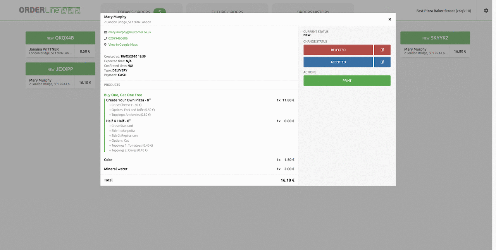

OrderLine users can change the statuses flow to manage orders in the way that best suits the business. This section describes the default status flow to accept, or print the order receipt by selecting the corresponding button. To customise this flow, see [Set Order Statuses](/apps/orderline/settings/#set-order-statuses).

## View Order

To view the order details, select the Order Card. Click the close icon <InlineImage width="23" height="23"></InlineImage> or anywhere outside the Order Card to close it.

<video controls title="OrderLine Open and Close Orders Example">
  <source src="../images/018-en-order-card-open-close.webm" type="video/webm" />
</video>

Order Cards display all the details needed to process the Order, including the following:

- Client address. A **View in Google Maps** link will be displayed if the online ordering solutions sends the GPS coordinates to HubRise.
- Creation date and time the order was made.
- Expected date and time for delivery or collection requested by the customer.
- Confirmed date and time will equal the expected time until an OrderLine user updates this to the actual delivery time the order can be processed.
- Type indicates how the Order will be processed. Types include **DELIVERY**, **COLLECTION** or **EAT-IN**.
- List of products to prepare, including customer notes if any.
- The order's current status. Users can update the status for an order, or print the order receipt by selecting the corresponding button.

## Accept Order

To accept an Order, open the Order Card and click **ACCEPTED**.

Users can add a personalised message to the customer, adjust the delivery time, and have those updates delivered to the customer. To update the date or add a comment, click on the pen <InlineImage width="44" height="38"></InlineImage>, adjust the date and time, write your message and click **ACCEPTED**. An automated email will be sent to the customer with your message and the updated delivery time.

---

**IMPORTANT NOTE:** Delivery time updates and messaging must be supported by your online ordering system. For more information on how to set it up, see [Additional Data Prompt](/apps/orderline/settings/##additional-data-prompt).

---

Once accepted, the Order status changes to **Accepted**. You may print the order receipt and change the status again when you are ready.

<video controls title="OrderLine Accept Order Example">
  <source src="../images/020-en-accept-order.webm" type="video/webm" />
</video>

## Reject Order

To reject an order, go to the order details and click **REJECTED**. You may add a comment when rejecting the order. For more information, see [Additional Data Prompt](/apps/orderline/settings/#additional-data-prompt).

Once rejected, the order disappears from **Today's Orders** list and becomes hidden. You can click on **Today's Orders** hidden card to see all orders and reopen them if needed.

<video controls title="OrderLine Reject Order Example">
  <source src="../images/021-en-reject-order.webm" type="video/webm" />
</video>

## Mark Order as In Delivery

With the order in **Accepted** status, select **IN DELIVERY** when the Order is being delivered to the customer.

<video controls title="OrderLine Order in Delivery Example">
  <source src="../images/022-en-order-set-status-in-delivery.webm" type="video/webm" />
</video>

## Complete Order

Orders set with the status **In Delivery** can be updated to the following:

- Click **COMPLETED** when the Order has been delivered finished. Once set to completed, you can print the order receipt but not change its status again.
- Click **DELIVERY FAILED** if the Order can not be successfully delivered.

Completed Orders are hidden from **Today's Orders** by default. Click the **Today's Orders** hidden card to see it again.

<video controls title="OrderLine Complete Order Example">
  <source src="../images/023-en-order-set-completed.webm" type="video/webm" />
</video>

## Print Order

OrderLine connects to printers recognised by the operating system. It uses the system print dialog to print receipts.

To print an Order receipt from a local printer, follow these steps:

1. View order details.
1. Click **PRINT**.
1. Follow the instructions on the browser print dialog.

OrderLine also prints order receipts automatically upon order reception, skipping the print dialog. Auto printing requires the printer to be registered in Google Cloud Print. For more details, see [Printing](/apps/orderline/settings/#printing).

Receipts are presented into sections for readability with a solid line starting and ending each section. These reflect the same information as listed on the Order Card. For more information on Order Cards see [OrderLine View Order](#view-order).

Receipts include the following information:

- The Order type. Types include **DELIVERY**, **COLLECTION** or **EAT-IN**.
- Payment type.
- The address and delivery comments with GPS coordinates, if the online ordering solutions sends the GPS coordinates to HubRise.
- The delivery time confirmed by users to reflect the actual delivery time, if supported by the EPOS system. For more information, see [Additional Data Prompt](/apps/orderline/settings/#additional-data-prompt).
- Deals are listed with the name of the deal followed by the list of products included in the deal.
- Products the client ordered are grouped together with additions and exclusions listed in bullet points including:
  - Standard items removed from the product are struck out with a solid line.
  - Options.
  - Toppings or other additions.
- Reference displays the Order number. Delivery date and time will display only if the confirmed delivery time differs from the original delivery time.
