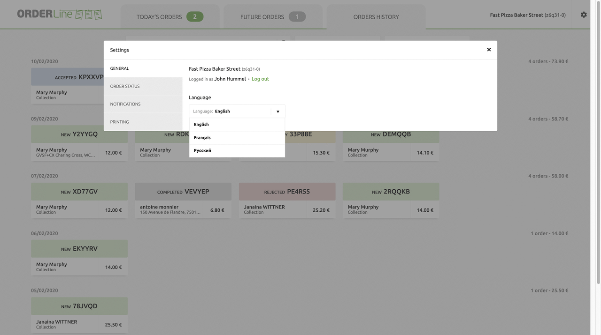
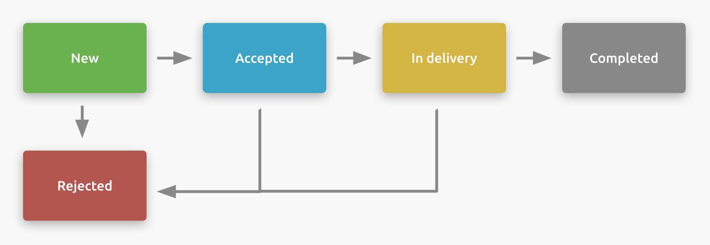
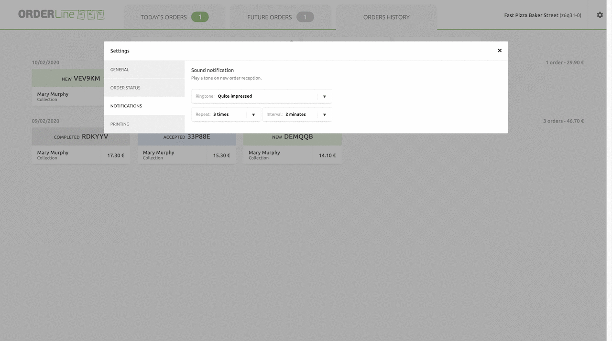

Go to Settings to customise OrderLine to best fit your needs. Users are able to update how OrderLine displays and functions through the **Settings** menu. To access Settings, select the gear icon <InlineImage width="20" height="20"></InlineImage> in the upper right hand corner.

<video controls title="OrderLine Access Settings">
  <source src="../images/031-en-access-settings.webm" type="video/webm" />
</video>

The following options are available through the **Settings** menu:

- General
- Order Status
- Notifications
- Printing

## General Settings

The following options are available through **Settings** > **General**:

- **Log Out**: The user terminates their OrderLine session.
- **Language**: Select the user's preferred Language. OrderLine supports **English**, **French**, and **Russian**.

## Status Flow

Orders are managed through their Status values. In **Settings** > **ORDER STATUS** users are able to set the status flow to customise how orders are managed.

Statuses are used to move orders from one state to the next, much like a flowchart. Orders always start with **New**, but can proceed in different ways depending how the user sets up their status flow. For example, a status flow might allow Orders to be **Accepted**, then **In delivery**, then ending with **Completed**, with every status except **Completed** able to lead to **Rejected**:

Users can use the OrderLine standard status flow, simplify it, or personalise it completely to match the way they work in their establishment.

The following statuses are available:

- New
- Received
- Accepted
- In Preparation
- Awaiting Shipment
- Awaiting Collection
- In delivery
- Completed
- Rejected
- Cancelled
- Delivery Failed

Users can set the Order status flow through the following steps:

1. Select the Status to update.
1. Select the <InlineImage width="40" height="42"></InlineImage> plus symbol to set the statuses that an Order can change to from the current status. The <InlineImage width="40" height="40"></InlineImage> checkmark indicates that the Status was already selected. To remove all options, select **Uncheck all**.

In the following example, the status **Delivery Failed** is added as a possible status flow for the status **In Delivery**.

<video controls title="OrderLine Set Status Flow Example">
  <source src="../images/011-en-set-status-flow.webm" type="video/webm" />
</video>

## Additional Data Prompt

When an Order is set to a specified Status, OrderLine can prompt the user for an updated **Delivery Time**, or a **Comment**.

---

**IMPORTANT NOTE:** OrderLine does not send out emails or updates to clients directly. These are sent by your online ordering solution under two conditions: Your online ordering solutions supports customer messaging.
Customer messaging has been integrated with HubRise. Before setting up this feature, check that both of these conditions are met. It is recommended to create a test Order and verify that the updated confirmation time and comments are sent to the client.

---

To prompt the user to update the **Delivery Time** based on the Status, follow these steps:

1. Select the Status list under **Prompt for expected delivery time...**
1. Select the <InlineImage width="40" height="42"></InlineImage> plus symbol to set a Status a user can select from. To remove all options, select **Uncheck all**. The <InlineImage width="40" height="40"></InlineImage> checkbox symbol indicates that Status was already selected.

The following demonstrates adding a delivery time prompt when an Order is set to the status **In Delivery**.

<video controls title="OrderLine in Delivery Prompt">
  <source src="../images/012-en-add-prompt-in-delivery.webm" type="video/webm" />
</video>

Users can be prompted to add a comment when an Order is set to a specific Status, which will be related to the client. Use these steps to prompt users for a comment based on the new Order status:

1. Select the Status list under **Prompt for user's comment when updating the order status to**.
1. Select the <InlineImage width="40" height="42"></InlineImage> symbol to set a Status a user can select from. To remove all options, select **Uncheck all**. The <InlineImage width="40" height="40"></InlineImage> indicates that Status was already selected.

The following example adds a prompt for a user to comment when Orders are set to **COMPLETED**.

<video controls title="OrderLine Prompt Comment Example">
  <source src="../images/013-en-add-prompt-user-comment.webm" type="video/webm" />
</video>

## Hide Orders

Orders that match a specific status can be hidden from the **Today's Order** list. Hidden Orders can be displayed from **Today's Order** by selecting the hidden Order Card.

To hide Orders from the **Today's Order** list, follow these steps:

1. Select the Status list under **Hide orders in these statuses from Today's orders list**.
1. Select the <InlineImage width="40" height="42"></InlineImage> symbol to hide an Order with this status. To remove all options, select **Uncheck all**. The <InlineImage width="40" height="40"></InlineImage> indicates that Status was already selected.

The following example shows the setting to hide **Completed** Orders.

<video controls title="OrderLine Status Hide Example">
  <source src="../images/015-en-setting-hidden-completed.webm" type="video/webm" />
</video>

## Notifications

Users can be prompted with a sound when new Orders are fetched by OrderLine based on the Notification settings. This applies both to **Today's Orders** and **Future Orders**.

The following settings are available:

| Settings | Description                                                               |
| -------- | ------------------------------------------------------------------------- |
| Repeat   | How many times the notification sound is played.                          |
| Internal | How long OrderLine will wait before playing the notification sound again. |
| Ringtone | The tune that the notification sound will play.                           |

Some ringtones have sharper sounds than others. Select the tone that best suits your taste and environment. Volume can be changed in your device settings and not in OrderLine.

See the following video as an example of how to set the Notifications settings.

<video controls title="OrderLine Set Notifications Settings Examples">
  <source src="../images/025-en-settings-notifications.webm" type="video/webm" />
</video>

## Printing

### Local printer

OrderLine can print to any printer connected to the device through the browser print dialog. Orders received are manually validated and printed. This process is recommended to acknowledge order reception.

### Auto-print via Google Cloud Print

Google Cloud Print allows the automatic printing of an order receipt upon order reception, without manual interaction.

---

**IMPORTANT NOTE:** Google Cloud Print will no longer be supported as of December 31, 2020.

---

### Register the Printer with Google Cloud Print

You must have a computer:

- Permanently on.
- Connected to the internet.
- With the Google Chrome browser installed.
- Connected to a switched on printer.
- With the printer visible in the operating system printer settings.

To add your printer to your Google Account, perform the following:

1. Open Google Chrome.
1. Type **chrome://devices** into the address bar and press Enter.
1. Under **New devices** find your printer.
1. Next to your printer, click **Manage**.
1. In the **Confirm registration** box that appears, click **Register**.
1. On your printer screen, follow the steps to finish registering. You may have verify access by pressing a button that says **Register** or **OK**.
1. To verify your printer registration, go to [https://www.google.com/cloudprint](https://www.google.com/cloudprint) and click **Printers**.

<video controls title="OrderLine Add Google Cloud Printer">
  <source src="../images/026-en-add-google-cloud-printer.webm" type="video/webm" />
</video>

If you wish to configure Google Cloud Print settings, go to [https://www.google.com/cloudprint](https://www.google.com/cloudprint).

### Connect OrderLine with Google Cloud Print

Once you register your printer in Google Cloud Print, you must connect OrderLine with Google Cloud Print through the following process:

1. Go to **Settings** or click on the <InlineImage width="46" height="46"></InlineImage> settings icon.
1. Select **PRINTING** in the settings menu.
1. Click **Connect**.
1. Google Cloud Print will request permission to connect the HubRise application.
   **Note**: Google will list HubRise as an unregistered application. HubRise will not register with Google, as the Google Cloud Print service will not be supported as of December 2020.
1. Click **Advanced**, then **Go to hubrise-apps.com**.
1. Google will request permission to grant HubRise access to your Google Cloud Print device. Click **Allow** to complete the process.

<video controls title="OrderLine Grant HubRise Google Printer Access">
  <source src="../images/027-en-register-google-cloud-printer.webm" type="video/webm" />
</video>

Once you have granted HubRise permission to use your Google Cloud Print device, follow these steps to set up automatic printing:

1. Click **Settings** > **Select Printer** then click on the expander arrow.
1. Choose to print with your internet-connected printer in the dropdown.

<video controls title="Orderline Set Automatic Printing">
  <source src="../images/028-en-setting-automatic-printer.webm" type="video/webm" />
</video>
