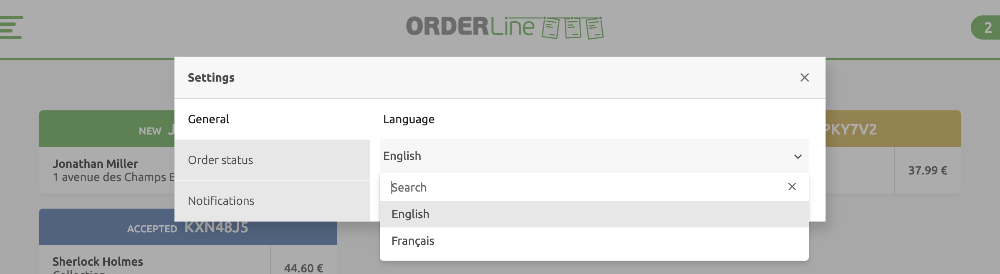
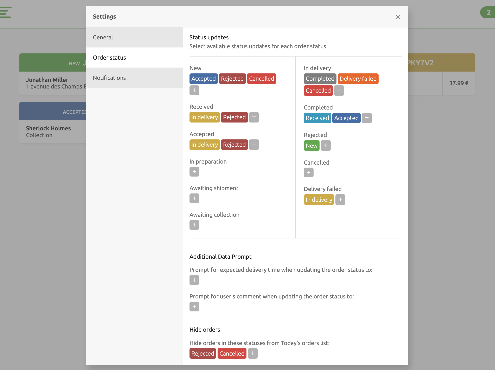
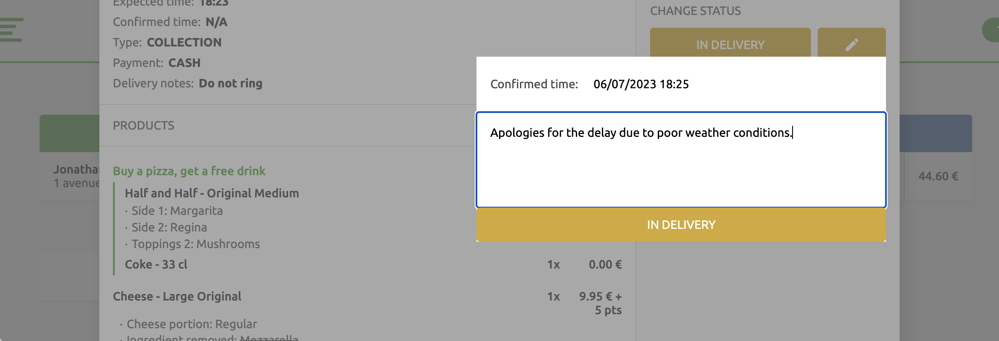
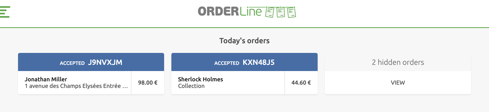

The **Settings** page provides options to personalise the display and adjust several functionalities within OrderLine.

To access the **Settings** page, select the gear icon <InlineImage width="20" height="20"></InlineImage> in the upper right hand corner of the screen. On mobile devices, select it on the burger menu.

The following options are available through the **Settings** menu:

- **General**
- **Order status**
- **Notifications**

## General

In **Settings** > **General**, you can select the display language. OrderLine can be used in either **English** or **French**.

## Order Status Flow {#order-status-flow}

In **Settings** > **Order status**, you can configure the order status flow, which determines the statuses that an order can change to from the current status. Customise status flows to best match your operational workflow.

Orders always start with **New**, but can proceed in different ways, depending on how you set up the status flow. For example, a status flow might allow orders to be **Accepted**, then **In delivery**, then ending with **Completed**, with every status except **Completed** able to lead to **Rejected**.

You can use the OrderLine standard status flow, simplify it, or personalise it completely to match the way you work.

The following statuses are available:

- New
- Received
- Accepted
- In preparation
- Awaiting shipment
- Awaiting collection
- In delivery
- Completed
- Rejected
- Cancelled
- Delivery failed

To change the status flow, follow these steps:

1. For each status, select the <InlineImage width="40" height="42"></InlineImage> plus symbol to set the statuses that an order can change to from the current status. The <InlineImage width="40" height="40"></InlineImage> checkmark indicates that the status was already selected. To remove all options, select **Uncheck all**.
1. Repeat for each status you want to change.

For example, if you want to add **Delivery Failed** as a possible status from **In Delivery**, you need to select **Delivery Failed** from the list of possible statuses for **In Delivery**.

## Additional Data Prompt {#additional-data-prompt}

When an order is set to a specified status, OrderLine can prompt the user for an updated **Delivery Time**, or a **Comment**.

---

**IMPORTANT NOTE:** OrderLine does not send out emails or updates to clients directly. These are sent by your online ordering solution under two conditions: Your online ordering solutions supports customer messaging.
Customer messaging has been integrated with HubRise. Before setting up this feature, check that both of these conditions are met. It is recommended to create a test order and verify that the updated confirmation time and comments are sent to the client.

---

To prompt the user to update the **Delivery Time** based on the status, follow these steps:

1. Select the status list under **Prompt for expected delivery time...**
1. Select the <InlineImage width="40" height="42"></InlineImage> plus symbol to set a status a user can select from. To remove all options, select **Uncheck all**. The <InlineImage width="40" height="40"></InlineImage> checkbox symbol indicates that status was already selected.

Users can be prompted to add a comment when an order is set to a specific status. Use these steps to prompt users for a comment based on the new order status:

1. Select the status list under **Prompt for user's comment when updating the order status to**.
1. Select the <InlineImage width="40" height="42"></InlineImage> symbol to set a status a user can select from. To remove all options, select **Uncheck all**. The <InlineImage width="40" height="40"></InlineImage> indicates that status was already selected.

## Hide Orders {#hide-orders}

Orders that match a specific status can be hidden from the **Today's Orders** list. Hidden Orders can be displayed from **Today's Orders** by selecting the **hidden orders** card.

To hide Orders from the **Today's Orders** list, follow these steps:

1. Select the status list under **Hide orders in these statuses from Today's orders list**.
1. Select the <InlineImage width="40" height="42"></InlineImage> symbol to hide an order with this status. To remove all options, select **Uncheck all**. The <InlineImage width="40" height="40"></InlineImage> indicates that status was already selected.

## Notifications {#notifications}

Users can be prompted with a sound when new Orders are fetched by OrderLine based on the Notification settings. This applies to both **Today's Orders** and **Future Orders**.

The following settings are available:

| Settings | Description                                                               |
| -------- | ------------------------------------------------------------------------- |
| Repeat   | How many times the notification sound is played.                          |
| Internal | How long OrderLine will wait before playing the notification sound again. |
| Ringtone | The tune that the notification sound will play.                           |

Different ringtones produce varying levels of sharpness. Choose the tone that aligns with your preference and suits your environment. Remember, volume adjustments can only be made through your device settings, not in OrderLine. If your device's sound isn't loud enough for a noisy workspace, consider connecting to an external Bluetooth speaker.

