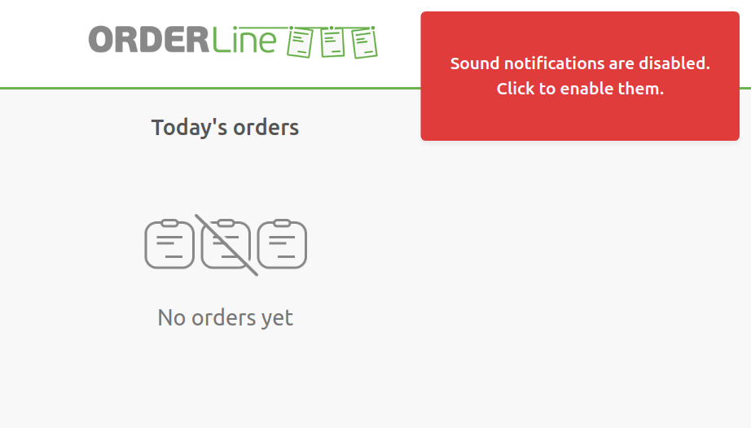

## Missing Order Notifications On Mobile Devices

To resolve the issue of not receiving new order notifications on your mobile device, make sure the Auto-Lock feature is turned off. You can usually find this in your device's display settings.

Keeping your device connected to a power source can also enhance the reliability of notification delivery. For an optimal mobile experience, we recommend using Google Chrome.

## Disabled Sound Notifications Popup {#disabled-popup}

Some browsers, in an effort to prevent unexpected and unwanted noise, may limit websites from playing sounds without user interaction. This feature, known as **Autoplay Policy** in Google Chrome, could affect impact OrderLine notifications.

OrderLine routinely checks for blocked sound notifications and will display a popup alert if any are blocked. Simply click the popup to re-enable these sound notifications.

---

**IMPORTANT NOTE:** On most browsers, the policy can be adjusted to allow OrderLine to play sound notifications without user interaction. For detailed browser specific instructions, refer to our [How Do I Keep Sound Notifications Enabled?](/apps/orderline/faqs/keep-sound-notifications-enabled) FAQ.

---

## Blank Page Upon Launching OrderLine

Should you come across a blank page when starting OrderLine, it might be caused by an ad blocker running on your browser. Ad blockers, such as **uBlock Origin**, could potentially trigger this problem. We suggest disabling it specifically for OrderLine.
