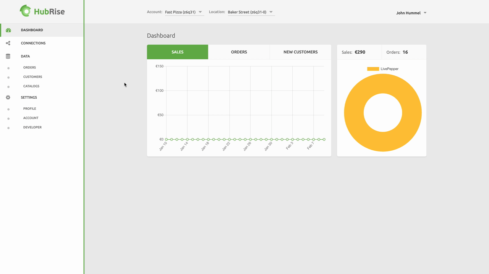
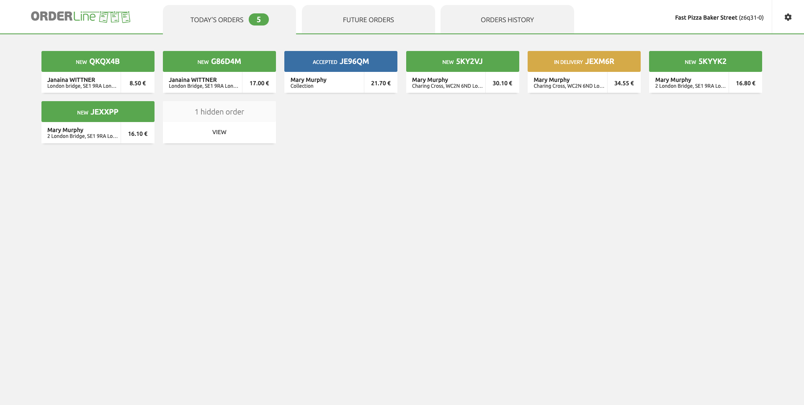
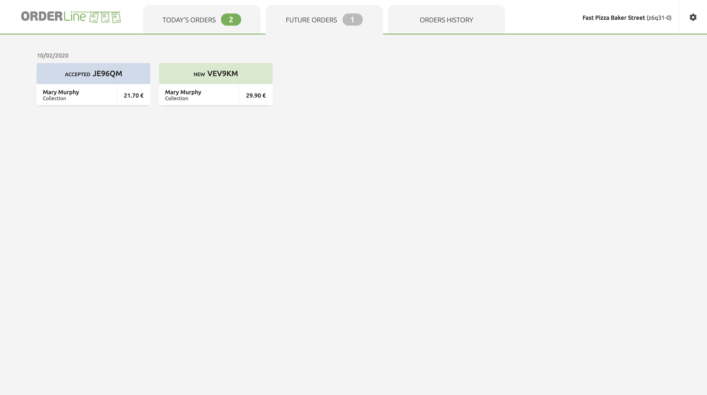
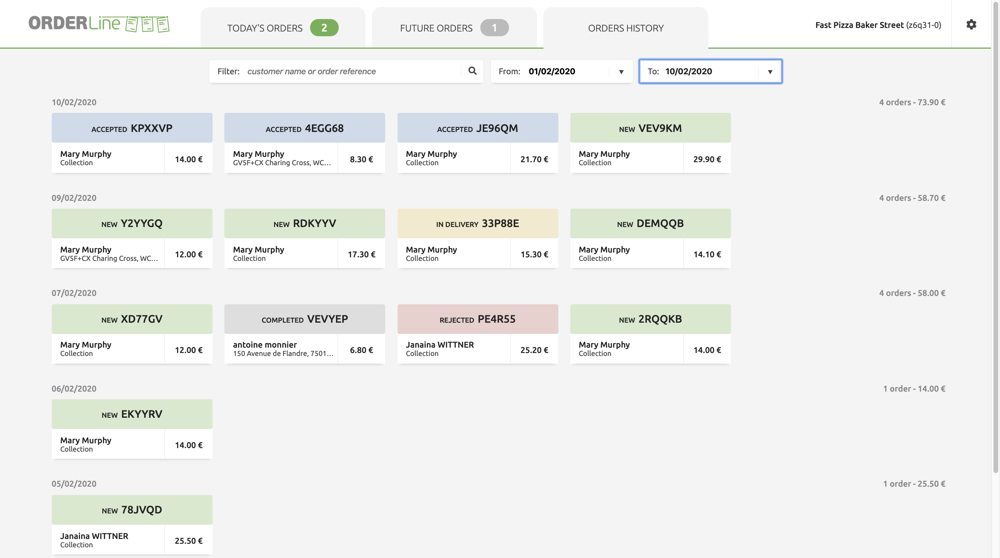
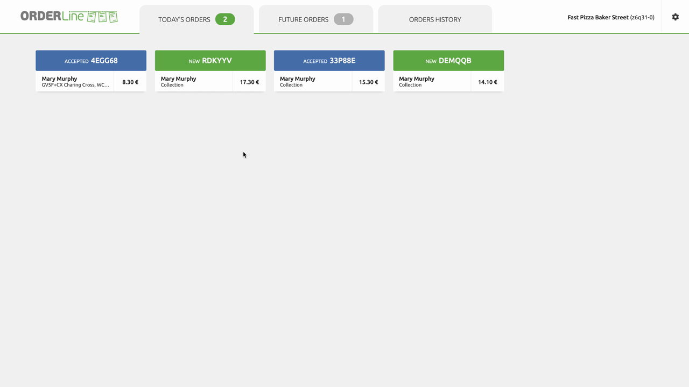
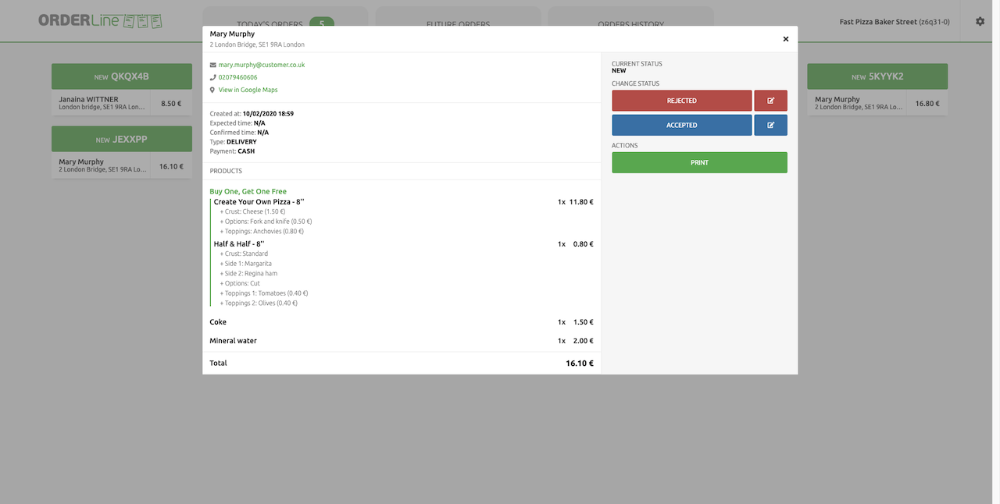
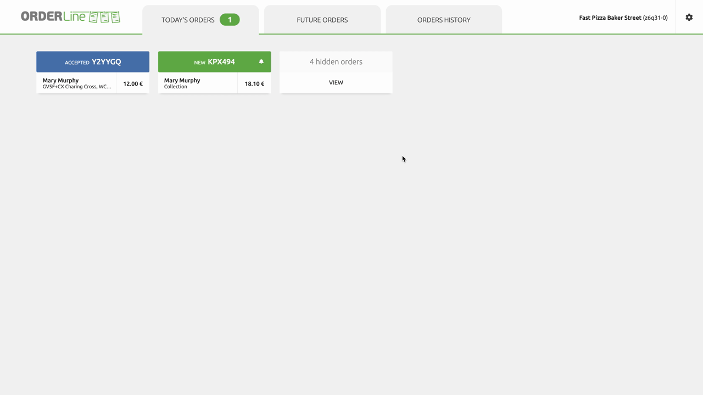
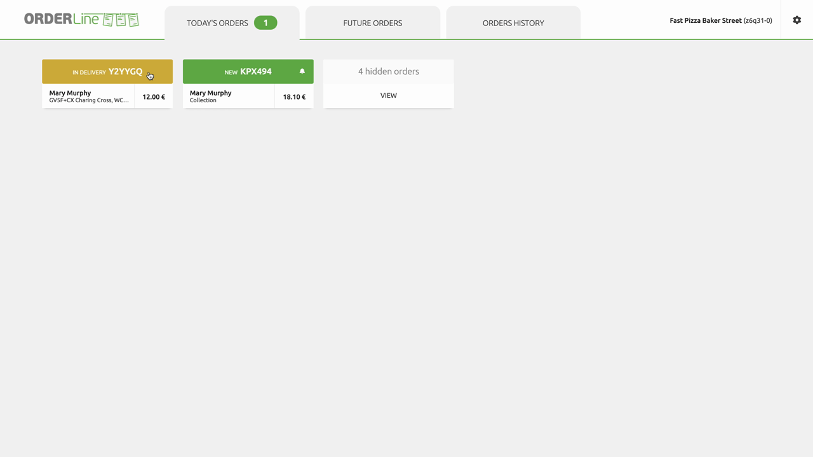
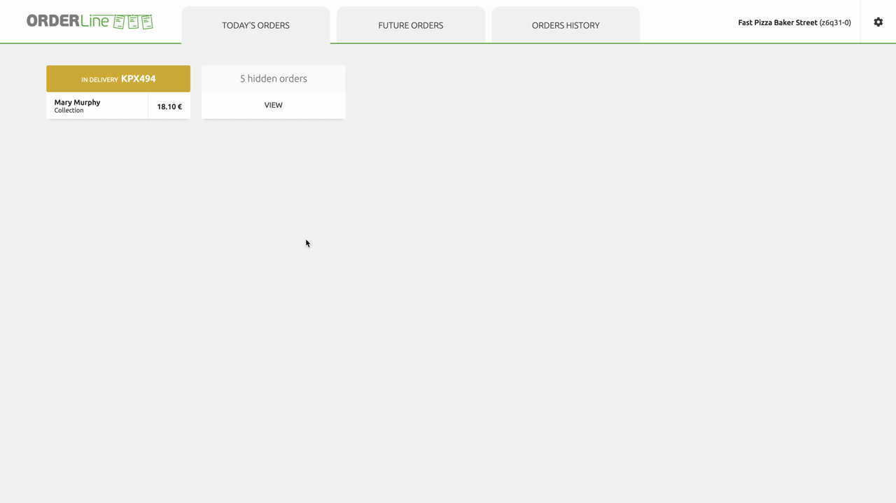

## Log In

To access OrderLine from HubRise, select **CONNECTIONS** then **Open** next to the store location. You are now logged into OrderLine.

## OrderLine Presentation

OrderLine is separated into the following sections:

- **TODAY’S ORDERS**: The orders scheduled for today’s date.
- **FUTURE ORDERS**: Orders scheduled for a future date (tomorrow and forward).
- **ORDERS HISTORY**: Displays the history of Orders for the last 30 days.
- **SETTINGS**: Settings to customize OrderLine to best fit your needs.

### Today’s Orders

When OrderLine fetches an Order from HubRise with the same delivery date as the current day, it displays an order counter notification on the top right hand corner of the window and plays a notification sound to alert the user.

Orders may be hidden depending on the **Hide Order Status** setting. These Orders can be seen from **Today’s Orders** by selecting **View** to display **Orders History**. For more information, see [Order Status](/apps/orderline/settings/#order-status).

### Future Orders

When OrderLine fetches an order from HubRise with the delivery date set to a date in the future, it displays an order counter next to the OrderLine’s **FUTURE ORDERS** tab. It also plays a notification sound to alert the user that a new Order has been received.

### Orders History

OrderLine aggregates today’s orders, future orders, and all orders completed in the last 30 days in a list. To view this list, click **ORDERS HISTORY**.

You may filter orders by a combination of:

- Customer name or Order reference.
- Delivery date range.

Orders are displayed in descending order by date, with the most recent (or future) date first.

## Manage Orders

Users can open Orders to view details, update the Order status, and print a receipt.

### View Order

To view the order details, select the Order Card. Click the close icon  or anywhere outside the Order Card to close it.

Order Cards display all the details needed to process the Order, including the following:

- Client address. A **View in Google Maps** link will be displayed if the online ordering solutions sends the GPS coordinates to HubRise.
- Creation date.
- Expected delivery time requested by the customer.
- Confirmed delivery time. This will equal the expected delivery time until a user updates this to the actual delivery time.
- Type indicates how the Order will be processed. Types include **DELIVERY**, **COLLECTION** or **EAT-IN**.
- The order’s payment method.
- The order’s products list.
- The order’s current status. See [Order Status](/apps/orderline/settings/#order-status) for more details.

## Update Order Status

Orders are processed according to the status flow as explained in the section [Order Status](/apps/orderline/settings/#order-status). Users can set the new status for an Order, or print the order receipt by selecting the corresponding button.

### Accept Order

To accept an Order, open the Order Card and click **ACCEPTED**.

Users can add a personalised message to the customer, adjust the delivery time, and have those updates delivered to the customer. To update the date or add a comment, click on the pen , adjust the date and time, write your message and click **ACCEPTED**. An automated email will be sent to the customer with your message and the delivery time updated.

- **IMPORTANT NOTE**: Delivery time updates and messaging must be supported by your online ordering system. For more information, see Additional Data Prompt.

Once accepted, the Order status changes to Accepted. You may print the order receipt and change the status again when you are ready.

### Reject Order

To reject an order, go to the order details and click **REJECTED**. You may add a comment when rejecting the order. For more information, see [Additional Data Prompt](/apps/orderline/settings/#additional-data-prompt)\*\*.

Once rejected, the order disappears from **Today’s Orders** list and becomes hidden. You can click on **Today's Orders** hidden card to see all Orders and reopen them if needed.

### Set Order to In Delivery

With the order in Accepted status, select **IN DELIVERY** when the Order is being delivered to the customer.

### Complete Order

Orders set with the status In Delivery can be updated to the following:

- Click **COMPLETED** when the Order has been delivered finished. Once set to completed, you can print the order receipt but not change its status again.
- Click **DELIVERY FAILED** if the Order can not be successfully delivered.

Completed Orders are hidden from **Today’s Orders** by default. Click the **Today's Orders** hidden card to see it again.

### Mark Delivery as Failed

Orders with the status **In delivery** can print the Order receipt.

## Print Order

OrderLine connects to printers recognised by the operating system. It uses the system print dialog to print receipts.

To print an Order receipt from a local printer, follow these steps:

1. View order details.
2. Click **PRINT**.
3. Follow the instructions on the browser print dialog.

OrderLine also prints order receipts automatically upon order reception, skipping the print dialog. Auto printing requires the printer to be registered in Google Cloud Print. For more details, see [Printing](/apps/orderline/settings/#printing).

### Order Receipt

Receipts are presented into sections for readability with a solid line starting and ending each section. These reflect the same information as listed on the Order Card. For more information on Order Cards see [View Order](#view-order).

Receipts include the following information:

- The Order type. Types include **DELIVERY**, **COLLECTION** or **EAT-IN**.
- Payment type.
- The address and delivery comments with GPS coordinates, if the online ordering solutions sends the GPS coordinates to HubRise.
- The delivery time confirmed by users to reflect the actual delivery time, if supported by the POS system. For more information, see [Additional Data Prompt](/apps/orderline/settings/#additional-data-prompt).
- Deals are listed with the name of the deal followed by the list of products included in the deal.
- Products the client ordered are grouped together with additions and exclusions listed in bullet points including:
  - Standard items removed from the product are struck out with a solid line.
  - Options.
  - Toppings or other additions.
- Reference displays the Order number. Delivery date and time will display only if the confirmed delivery time differs from the original delivery time.

## Log Out

To terminate OrderLine Session, click **Settings > General > Log Out**.
