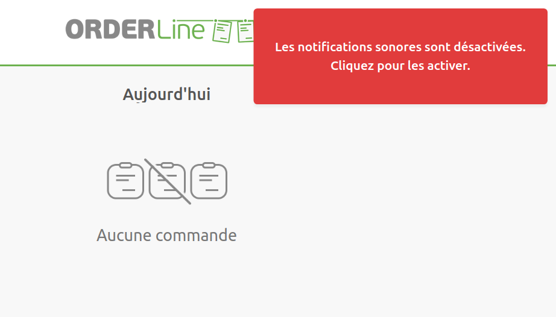

## Je ne reçois pas de notification sonore sur mon périphérique mobile

Sur les périphériques mobiles, veillez à désactiver le verrouillage automatique de l'écran dans les paramètres d'affichage. Brancher votre périphérique sur le secteur peut également être utile pour empêcher sa mise en veille.

Nous recommandons d'utiliser le navigateur Google Chrome sur les périphériques mobiles.

## Une alerte sur les notifications sonores apparaît de temps en temps

Certains navigateurs ont une fonctionnalité qui empêche les sites Web de jouer des sons sans interaction avec l'utilisateur. Cela permet de bloquer les sons ennuyeux qui se jouent automatiquement, mais peut aussi poser problème pour OrderLine. Sur Google Chrome, cette fonctionnalité s'appelle **Autoplay Policy**, et elle ne peut pas être désactivée.

Pour éviter de manquer des notifications, OrderLine vérifie toutes les quelques secondes si votre navigateur bloque les notifications sonores et affiche une alerte si c'est le cas. Vous pouvez alors cliquer sur l'alerte pour autoriser à nouveau les notifications sonores.

## Mon navigateur montre une page blanche lorsque je lance OrderLine

Si vous avez installé le bloqueur de publicités uBlock Origin sur votre navigateur, désactivez-le. OrderLine n'est pas compatible avec cette extension.
