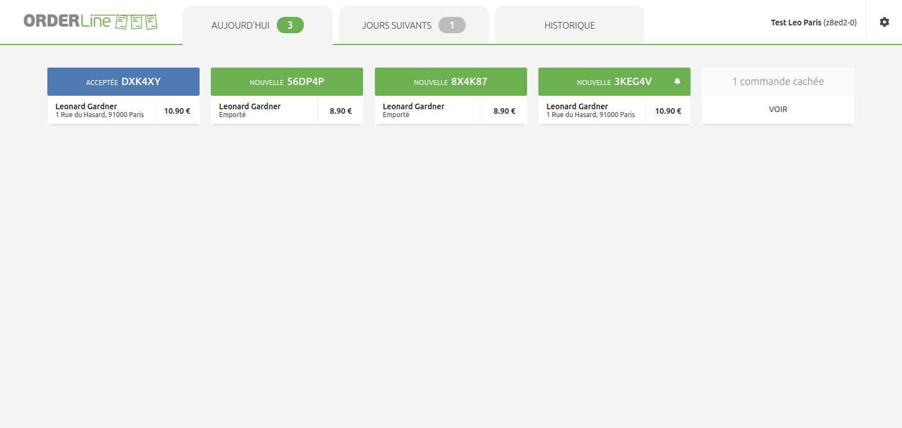
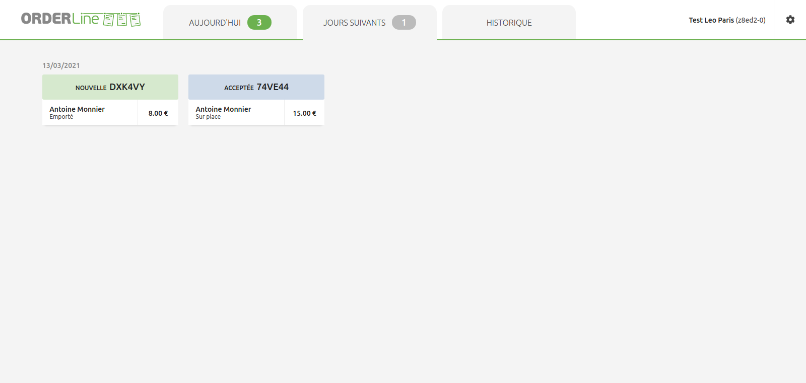
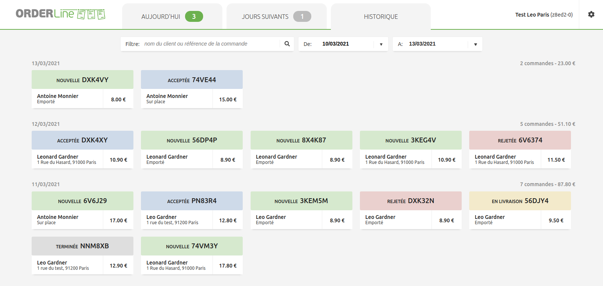

## Afficher les commandes du jour

Lorsque OrderLine recherche sur HubRise une commande ayant la même date de livraison que le jour en cours, une notification du nombre de commandes s'affiche dans le coin supérieur droit de l'onglet correspondant, et une notification sonore est émise pour alerter l'utilisateur.

Les commandes peuvent être masquées, selon l'état du paramètre **Masquer le statut de la commande**. Dans ce cas, ces commandes peuvent être visualisées sous l'onglet **Aujourd'hui** en sélectionnant **Afficher** sur la carte de la commande masquée. Pour plus d'informations, reportez-vous à [Statut des commandes](/apps/orderline/settings/#set-order-statuses).

## Afficher les commandes des jours suivants

Lorsque OrderLine trouve une commande dont la date de livraison se situe dans le futur, un compteur de commandes s'affiche près de l'onglet **JOURS SUIVANTS** d'OrderLine. Une notification sonore est également émise afin d'avertir l'utilisateur qu'une nouvelle commande a été reçue.

## Consultation de l'historique des commandes

OrderLine regroupe les commandes du jour, les commandes futures et toutes les commandes passées au cours des 30 derniers jours dans une liste. Pour consulter celle-ci, cliquez sur **HISTORIQUE**.

Les commandes sont classées par ordre de date décroissant, la commande la plus récente apparaissant en premier.

Vous pouvez filtrer les commandes en combinant :

- Le nom du client ou la référence de la commande.
- La plage de dates de livraison.

