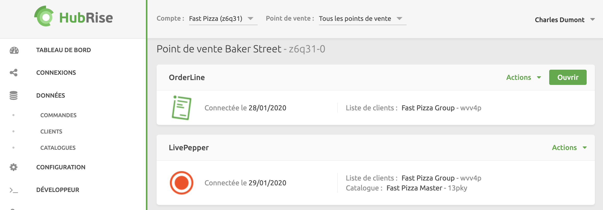

Google Chrome est notre navigateur recommandé pour une expérience optimale.

Pour lancer OrderLine, suivez ces étapes :

1. Connectez-vous à votre [compte HubRise](https://manager.hubrise.com).
2. Ouvrez la page **CONNEXIONS**.
3. Cliquez sur **Ouvrir** à côté de l'application OrderLine. OrderLine s'ouvre dans un nouvel onglet du navigateur.

---

**REMARQUE IMPORTANTE :** Si vous rencontrez des problèmes, comme un écran vide, reportez-vous à notre rubrique [Dépannage](/apps/orderline/troubleshooting).

---

Pour faciliter l'accès quotidien, vous pouvez mettre en signet le lien OrderLine dans votre navigateur.

Pour mettre fin à votre session OrderLine, il vous suffit de fermer l'onglet du navigateur.
