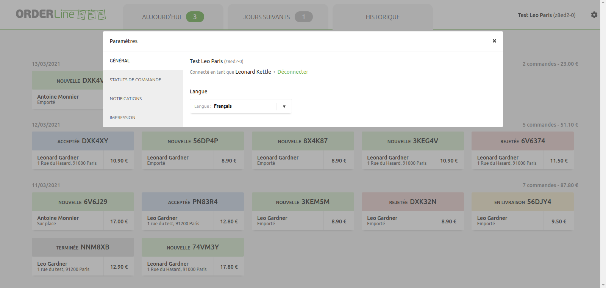
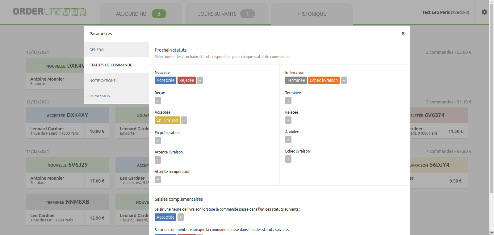
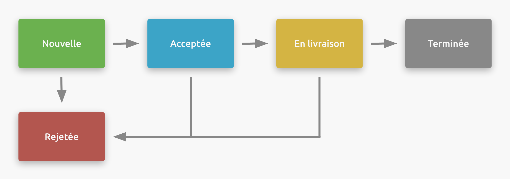
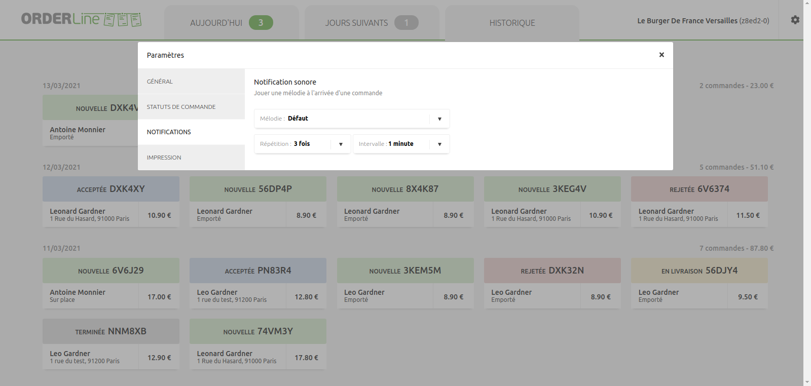

La section Paramètres vous permet de personnaliser OrderLine selon vos besoins. Vous pouvez modifier l'affichage et le fonctionnement d'OrderLine depuis le menu **Paramètres**. Pour accéder à la section Paramètres, sélectionnez l'icône en forme de roue dentée <InlineImage width="20" height="20"></InlineImage> dans le coin supérieur droit.

<video controls title="OrderLine Access Settings">
  <source src="../images/031-en-access-settings.webm" type="video/webm" />
</video>

Le menu **Paramètres** comporte les options suivantes :

- Général
- Statuts de commande
- Notifications
- Impression

## Paramètres généraux

Le menu **Paramètres** > **GÉNÉRAL** comporte les options suivantes :

- **Déconnecter** : met fin à la session OrderLine.
- **Langue** : change la langue de l'interface. OrderLine prend en charge l'**anglais**, le **français** et le **russe**.

## Enchaînement des statuts de commande

Les commandes se traitent en faisant évoluer leur statut suivant un enchaînement prédéfini. Dans **Paramètres** > **STATUTS DE COMMANDE**, vous pouvez personnaliser cet enchaînement.

L'écran permet de choisir les prochains statuts accessibles à partir du statut actuel, un peu à la manière d'un diagramme de flux. Les commandes arrivent toujours dans le statut **Nouvelle**, mais elles peuvent évoluer de différentes manières selon l'enchaînement configuré. Dans l'exemple suivant, la commande peut successivement être **Acceptée**, puis **En livraison**, puis **Terminée**. A chaque étape, sauf pour le statut **Terminée**, la commande peut être **Rejetée** :

En partant de l'enchaînement de statuts standard d'OrderLine, vous pouvez le simplifier, ou le personnaliser entièrement de manière à ce qu'il corresponde à votre façon de travailler.

Les statuts disponibles sont les suivants :

- Nouvelle
- Reçue
- Acceptée
- En préparation
- Attente livraison
- Attente récupération
- En livraison
- Terminée
- Rejetée
- Annulée
- Échec livraison

Pour définir l'enchaînement des statuts, procédez comme suit :

1. Sélectionnez le statut de départ.
1. Sélectionnez <InlineImage width="40" height="42"></InlineImage> pour définir les prochains statuts disponibles à partir du statut de départ. La coche <InlineImage width="40" height="40"></InlineImage> indique que le statut a déjà été sélectionné. Pour supprimer toutes les options, sélectionnez **Tout décocher**.

Dans l'exemple qui suit, le statut **Échec livraison** est ajouté en tant que prochain statut possible pour le statut **En livraison**.

<video controls title="OrderLine Set Status Flow Example">
  <source src="../images/011-en-set-status-flow.webm" type="video/webm" />
</video>

## Saisies complémentaires

Pour certains statuts, OrderLine peut vous demander de mettre à jour l'**heure de livraison**, ou d'ajouter un **commentaire**.

---

**REMARQUE IMPORTANTE :** OrderLine n'envoie pas d'e-mails ni de mises à jour directement aux clients. Ces informations sont envoyées par votre solution de commande en ligne, sous deux conditions : Que votre solution de commande en ligne supporte l'envoi de messages aux clients. Que l'envoi de messages soit intégré à HubRise. Avant de mettre en place cette fonctionnalité, vérifiez que ces deux conditions sont remplies. Nous recommandons de tester sur une commande fictive que le client reçoit bien la nouvelle heure de livraison et le commentaire.

---

Pour que OrderLine propose de mettre à jour de l'**heure de livraison** lorsqu'une commande passe dans un certain statut, procédez comme suit :

1. Sous l'option **Saisir une heure de livraison lorsque la commande passe dans l'un des statuts suivants**, sélectionnez la liste des statuts.
1. Sélectionnez <InlineImage width="40" height="42"></InlineImage> pour indiquer que le statut déclenchera une invite de mise à jour de l'heure de livraison. Pour déselectionner tous les statuts, sélectionnez **Tout décocher**. La coche <InlineImage width="40" height="40"></InlineImage> indique que le statut a déjà été sélectionné.

Les indications qui suivent montrent comment ajouter une invite d'heure de livraison lorsqu'une commande passe en statut **En livraison**.

<video controls title="OrderLine in Delivery Prompt">
  <source src="../images/012-en-add-prompt-in-delivery.webm" type="video/webm" />
</video>

OrderLine peut vous demander la saisie optionnelle d'un commentaire lorsqu'une commande passe dans un statut prédéfini. Pour afficher une invite de saisie d'un commentaire, procédez comme suit :

1. Dans la section **Saisir un commentaire lorsque la commande passe dans l'un des statuts suivants**, sélectionnez la liste des statuts.
1. Sélectionnez <InlineImage width="40" height="42"></InlineImage> pour indiquer que le statut déclenchera une invite de saisie d'un commentaire. Pour déselectionner tous statuts, sélectionnez **Tout décocher**. La coche <InlineImage width="40" height="40"></InlineImage> indique que le statut a déjà été sélectionné.

Dans l'exemple qui suit, l'utilisateur est invité à saisir un commentaire lorsque les commandes passent en statut **TERMINÉE**.

<video controls title="OrderLine Prompt Comment Example">
  <source src="../images/013-en-add-prompt-user-comment.webm" type="video/webm" />
</video>

## Masquer les commandes

Vous pouvez masquer les commandes de l'onglet **Aujourd'hui** qui sont dans un statut spécifique. Pour afficher les commandes masquées dans l'onglet **Aujourd'hui**, sélectionnez la carte de la commande masquée.

Pour masquer des commandes dans la liste **Aujourd'hui**, procédez comme suit :

1. Dans la section **Masquer les commandes de l'onglet 'Aujourd'hui' qui se trouvent dans l'un des statuts suivants**, sélectionnez la liste des statuts.
1. Sélectionnez <InlineImage width="40" height="42"></InlineImage> pour masquer les commandes ayant ce statut. Pour déselectionner tous les statuts, sélectionnez **Tout décocher**. La coche <InlineImage width="40" height="40"></InlineImage> indique que le statut a déjà été sélectionné.

L'exemple qui suit montre comment masquer les commandes ayant le statut **Terminée**.

<video controls title="OrderLine Status Hide Example">
  <source src="../images/015-en-setting-hidden-completed.webm" type="video/webm" />
</video>

## Notifications

Vous pouvez être averti par un son lors de l'arrivée de nouvelles commandes dans OrderLine, en fonction des paramètres de notification. Ces paramètres s'appliquent à la fois aux onglets **Aujourd'hui** et **Jours suivants**.

Les paramètres disponibles sont les suivants :

| Paramètres | Description                                         |
| ---------- | --------------------------------------------------- |
| Répétition | Nombre de répétitions de la notification sonore.    |
| Intervalle | Délai entre deux notifications sonores successives. |
| Mélodie    | Musique entendue lors de la notification sonore.    |

Certaines mélodies ont une sonorité plus aiguë que d'autres. Choisissez la tonalité qui convient le mieux à vos goûts et à votre environnement. Le volume se règle dans les paramètres de votre appareil et non dans OrderLine.

Pour voir un exemple de paramétrage des notifications, consultez la vidéo suivante.

<video controls title="OrderLine Set Notifications Settings Examples">
  <source src="../images/025-en-settings-notifications.webm" type="video/webm" />
</video>

## Impression

### Imprimante locale

OrderLine peut imprimer sur toute imprimante reliée à votre périphérique, via la boîte de dialogue d'impression du navigateur. Les commandes reçues sont imprimées manuellement. L'impression des reçus de commande peut vous aider dans leur traitement.

### Auto-impression via Google Cloud Print

Google Cloud Print permet d'imprimer automatiquement un reçu pour la commande dès que celle-ci est reçue, sans interaction manuelle.

---

**REMARQUE IMPORTANTE :** Google Cloud Print n'est plus pris en charge depuis le 31 décembre 2020.

---

### Enregistrement de l'imprimante dans Google Cloud Print

Vous devez être en possession d'un ordinateur :

- Allumé en permanence.
- Connecté à internet.
- Sur lequel le navigateur Google Chrome est installé.
- Relié à une imprimante allumée.
- Dont les paramètres d'impression du système d'exploitation indiquent que l'imprimante est visible.

Pour ajouter votre imprimante à votre compte Google, procédez comme suit :

1. Ouvrez Google Chrome.
1. Dans la barre d'adresse, saisissez **chrome://devices**, puis appuyez sur Entrée.
1. Dans la section **Nouveaux périphériques**, recherchez votre imprimante.
1. Près du nom de votre imprimante, cliquez sur **Gérer**.
1. Dans la fenêtre **Confirmer l'enregistrement**, cliquez sur **Enregistrer**.
1. Sur l'écran de votre imprimante, suivez les étapes pour terminer l'enregistrement. Il se peut que vous deviez vérifier l'accès en sélectionnant un bouton intitulé **Enregistrer** ou **OK**.
1. Pour vérifier que votre imprimante est bien enregistrée, accédez à [https://www.google.com/cloudprint](https://www.google.com/cloudprint) et cliquez sur **Imprimantes**.

<video controls title="OrderLine Add Google Cloud Printer">
  <source src="../images/026-en-add-google-cloud-printer.webm" type="video/webm" />
</video>

Si vous souhaitez configurer les paramètres de Google Cloud Print, rendez-vous dans [https://www.google.com/cloudprint](https://www.google.com/cloudprint).

### Connecter OrderLine à Google Cloud Print

Une fois la procédure d'inscription de votre imprimante à Google Cloud Print terminée, vous devez connecter OrderLine à Google Cloud Print. Procédez comme suit :

1. Allez dans **Paramètres**, ou cliquez sur l'icône <InlineImage width="46" height="46"></InlineImage> des paramètres.
1. Dans le menu des paramètres, sélectionnez **IMPRESSION**.
1. Cliquez sur **Connecter**.
1. Google Cloud Print vous demande l'autorisation de connecter l'application HubRise. **Remarque** : Google affichera HubRise en tant qu'application non enregistrée. HubRise ne sera pas enregistré auprès de Google, puisque le service Google Cloud Print n'est plus pris en charge depuis décembre 2020.
1. Cliquez sur **Avancé**, puis **Aller sur hubrise-apps.com**.
1. Google vous demandera d'octroyer l'accès de HubRise à votre périphérique Google Cloud Print. Cliquez sur **Autoriser** pour accomplir la procédure.

<video controls title="OrderLine Grant HubRise Google Printer Access">
  <source src="../images/027-en-register-google-cloud-printer.webm" type="video/webm" />
</video>

Une fois que vous avez accordé à HubRise l'autorisation d'utiliser votre périphérique Google Cloud Print, configurez l'impression automatique. Pour cela, procédez comme suit :

1. Cliquez sur **Paramètres** > **Sélectionner l'imprimante**, puis cliquez sur la flèche de développement.
1. Dans la liste déroulante, choisissez d'imprimer à partir de votre imprimante connectée à internet.

<video controls title="Orderline Set Automatic Printing">
  <source src="../images/028-en-setting-automatic-printer.webm" type="video/webm" />
</video>
