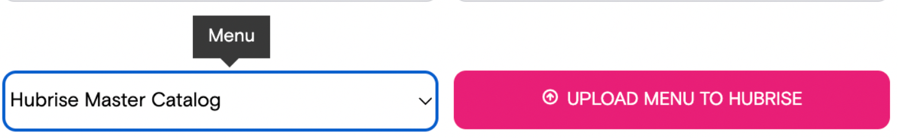

## Receiving orders

### Orders reaching HubRise but never appear in OrderLord

When you set up the integration, you may see that orders are not coming through HubRise to OrderLord. You may see the order in HubRise back-office but it never reaches OrderLord.

This may be caused by two possible reasons:
1. OrderLord didn't enable some types of orders, i.e. collection or store orders. In this case delivery orders may coming through but collection will stuck. You need to contact OrderLord support team [support@orderlord.com](mailto:support@orderlord.com) and ask them to enable needed types of orders.
2. Default menu is not set for connected location. This can be done by navigating to Settings -> Locations -> Edit of the location (gear icon), changing the menu:

Don't forget to hit Save at the bottom of the page.

If you are still having issues after attempting the workaround, contact [support@hubrise.com](mailto:support@hubrise.com).
