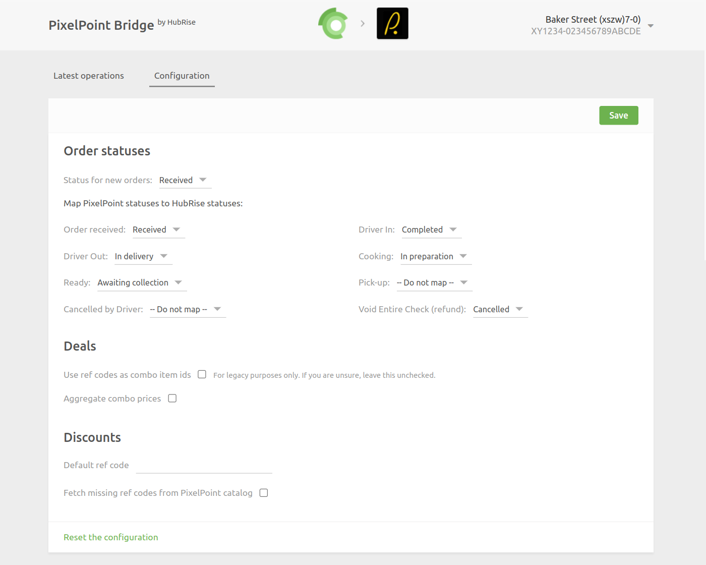

The configuration page allows you to customise the behaviour of PixelPoint Bridge based on your preferences.
These are divided into different sections for an easier navigation.

## Order Statuses

From this section, you can configure how PixelPoint Bridge handles order statuses.

The **Status for new orders** field lets you configure which default status is associated to new orders when they are sent to your PixelPoint EPOS. At the moment, **Received** is the only supported value.

The rest of this section allows you to configure how order status changes on your PixelPoint EPOS are sent back to HubRise, by leveraging the EOIEvents feature in PAR PixelPoint. This is useful, for example, to notify a delivery platform when an order is ready for collection. In this case, you can update an order as "Awaiting collection" on HubRise whenever you mark the same order as "Pick-up" on your EPOS.

---

**IMPORTANT NOTE:** EOIEvents require PAR PixelPoint version 19.6.x or higher. Contact PAR support to verify.

---

## Deals {#deals}

PixelPoint Bridge converts HubRise deals to combos. From this section, you can configure how this conversion is performed.

The **Use ref codes as combo item ids** option is here for legacy reasons. We do not recommend using it.

The **Aggregate combo prices** lets you decide how to handle the price of a combo. If you select this option, PixelPoint Bridge will aggregate the prices of all items in the combo at the combo level. By default, PixelPoint Bridge spreads the price of a combo across the items of the combo.

## Discounts {#discounts}

PixelPoint Bridge sends each discount to your PixelPoint EPOS as a coupon with a ref code.

By default, discounts without a ref code are not sent to your PixelPoint EPOS. From this section, you can configure an alternative behaviour.

- If you specify a ref code in the **Default ref code** field, all discounts without a ref code will use this value and be sent to your PixelPoint EPOS.
- If you select the **Fetch missing ref codes from PixelPoint catalog** checkbox, PixelPoint Bridge will fetch the list of discounts currently available in your EPOS, and match the incoming discount by name, instead of ref code. If a match is found, the discount will be sent to your PixelPoint EPOS.
- If you both specify a default ref code and select the checkbox, PixelPoint Bridge will first try to match the discount by name, and if no match is found, it will use the default ref code. In all cases, the discount will be sent to your PixelPoint EPOS.

---

**IMPORTANT NOTE:** Fetching missing ref codes from PixelPoint requires PAR PixelPoint version 19.12.x or higher. Contact PAR support to verify.

---

## Reset the Configuration {#reset-configuration}

If you need to reset the configuration, click **Reset the configuration** at the bottom of the page.

---

**IMPORTANT NOTE:** Resetting the configuration will instantly disconnect the bridge from PixelPoint. You will need your PixelPoint token to reestablish the connection.

---

Resetting the configuration does not delete the operation logs displayed in the main page.
