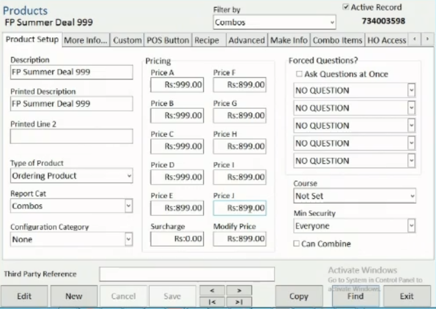
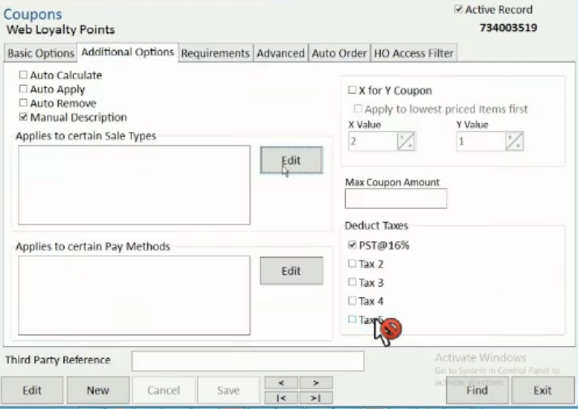

PixelPoint Bridge can push orders but is not able to pull the menu stored in the PAR PixelPoint EPOS. For this reason, all menu items and prices must be manually set in the system to connect with their corresponding product code and ensure a smooth communication between HubRise and PixelPoint.

Every order received in HubRise is forwarded to the EPOS via PixelPoint Bridge. For the transaction to work, products within the catalog, service types (delivery, collection, eat-in) and payment methods should be mapped.

## Products and SKUs

Each product in PAR PixelPoint is identified by its product code. This code appears in the top right corner of the product's edit screen.

PixelPoint has no support for SKUs, so PixelPoint product code is used as the SKU code.

## Options

PixelPoint does not differentiate between products and options. The option ref code in HubRise is the product code of the corresponding product in PixelPoint.

## Deals {#deals}

Deals in HubRise are combos in PixelPoint. Combos are a particular type of product that contains a list of products and/or options.

To find the ref code of a combo, open its configuration page. The ref code is in the top right corner. In the example below, the ref code is `734003598`.

The combo price is defined in the **Pricing** section. Additional charges may be defined on specific items in the **Combo Items** tab.

## Discounts {#discounts}

Discounts in HubRise are coupons in PixelPoint.

To find the ref code of a coupon, open its configuration page. The ref code is in the top right corner. In the example below, the ref code is `734003519`.

Coupons should be configured with the following options:

- **Type of Coupon**: select **Manual by Amount**
- Select **Applies to all categories**
- Select **Manual Description**
- In the **Additional Options** tab, check that no Sale Types or Pay Methods restrictions would prevent the coupon from being applied. If there are, PixelPoint will recalculate the coupon price to `0`.

## Service Types

Each service type (delivery, collection, eat-in) must be associated with the correct PixelPoint EPOS code. The exact values of these codes depend on the particular setup of the restaurant, but they are typically numbers in the `1000`-`1010` range. Contact your PAR representative to get the correct values.

## Payment Methods

PixelPoint has a different code for each payment method. Each payment method allowed in the system to connect must be defined in the PixelPoint EPOS and must be specified with the corresponding code. Contact your PAR representative to get the correct values.

When the customer chooses to pay upon delivery or collection, no payment information should be sent to the EPOS, as doing so would close the transaction.
