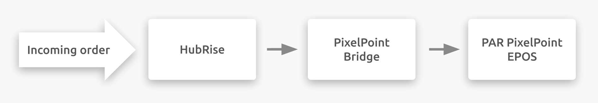

## Description

PAR PixelPoint is an EPOS solution available worldwide.

PixelPoint Bridge is an app developed by HubRise that allows the communication between HubRise and the PAR PixelPoint EPOS via the Web API. PixelPoint Bridge can forward any order from HubRise to the EPOS. These orders could come from online ordering solutions, self-ordering kiosks, online food ordering and delivery platforms or any other such solution connected to your HubRise account.

PixelPoint Bridge also provides a user interface to see the requests sent to the EPOS and responses received. For more technical details about API requests and related responses, see [Understanding Logs](/apps/pixelpoint-bridge/understanding-logs).

## Integration Features

Connecting PixelPoint Bridge to HubRise allows your EPOS to:

- Pull orders from HubRise, including order status.
- Pull customer information from HubRise.

PixelPoint Bridge is a one-way connection from HubRise to the EPOS (push only integration). This means that information only flows from HubRise to the EPOS, not vice versa.

Therefore, PixelPoint Bridge cannot transfer the menu from the EPOS to HubRise, which must then be inserted with a manual process in the online ordering system. For more information, see [Mapping Ref Codes](/apps/pixelpoint-bridge/map-ref-codes). Furthermore, it cannot transfer orders placed on the EPOS back to HubRise.

PixelPoint Bridge can be connected to HubRise from the HubRise back office.

## Why Connect?

Connecting PixelPoint Bridge to HubRise allows your EPOS to communicate with other applications you use every day. Receive orders from your online ordering solution, or food delivery platforms in your EPOS.

Thanks to HubRise, synchronise your menu, your customer and order information with your EPOS, online ordering, food delivery platforms (including Deliveroo, Uber Eats and Just Eat), delivery management, delivery services, eMarketing (SMS/emailing), business intelligence, stock management, loyalty systems, and more. The number of compatible applications increases every month. To see which apps you can connect, see our [Apps page](/apps).

## Prerequisites

To establish a successful connection with your PAR PixelPoint EPOS, PixelPoint Bridge requires:

- PixelHQ and PixelPoint version 12.3 or above.
- PixelPoint's EOI (External Order Interface).
- The HubRise account setup with locations to connect. For more information about accounts and locations, see the [HubRise User Guide](/docs/overview).
