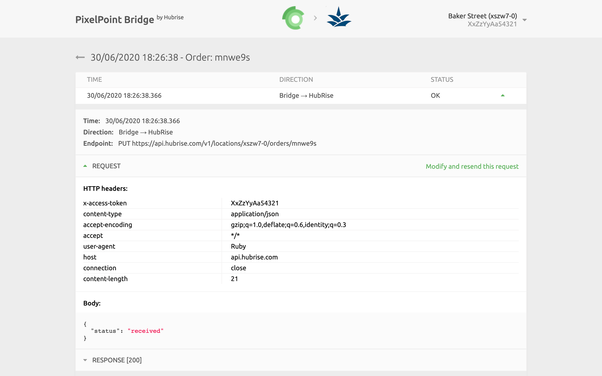
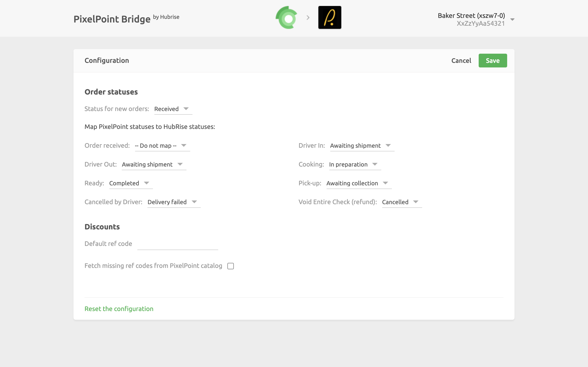

The user interface for PixelPoint Bridge provides basic diagnostic information about your connection. It also provides a link to the logs of the latest HubRise requests sent to the EPOS.

## Main Page

The main page of PixelPoint Bridge displays the latest received orders. Each row shows:

- **TIME**: The date and time of the order.
- **ORDER**: The HubRise order ID.
- **STATUS**: The status of the order. The value OK indicates that the order has been successfully sent, otherwise a message will explain the type of error occurred.

Clicking on an order will open a new page displaying all the information about it.

On the top right corner of the PixelPoint Bridge main page, the HubRise user and location connected are displayed, together with the API token currently used. Clicking the down arrow <InlineImage width="28" height="21"></InlineImage> expands a menu where it is possible to change the language of the interface and to access the **Configuration page**.

---

**IMPORTANT NOTE:** The first time you access the logs from PixelPoint Bridge, you will be asked to **Allow** the Bridge to access the information on your HubRise account.

---

## Order Page

Selecting an order from the list will display all the logs of the API requests exchanged between HubRise and the PixelPoint EPOS via PixelPoint Bridge.

Requests are ordered with the latest on top, and each of them displays the following information:

- **TIME**: The date and time the order was placed.
- **DIRECTION**: The apps sending and receiving the request, in the format Origin → Destination.
- **STATUS**: The status of the request. The value OK indicates that the request has been successfully received, otherwise a message will explain the type of error occurred. Clicking on a request will expand it to reveal the detailed logs of the request and its response. A detailed description of the logs can be found in [Understanding Logs](/apps/pixelpoint-bridge/understanding-logs).

## Language and Navigation

At the top right corner of the main page, you can click on the arrow <InlineImage width="20" height="20"></InlineImage> to expand the menu. From there, you can change the language of the page to English or French.

Clicking on the PixelPoint and HubRise logos on top of any page of PixelPoint Bridge will bring you back to the main page.

## Configuration Page

To access the PixelPoint Bridge Configuration page, click on the arrow <InlineImage width="20" height="20"></InlineImage> at the top right corner of the page to expand the menu, then click **Configuration**.

From this page, you will be able to customise the behaviour of PixelPoint Bridge. For more details, see [Configuration](/apps/pixelpoint-bridge/configuration).
