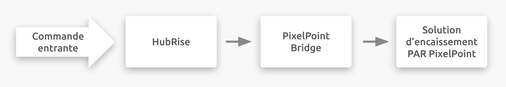

---

**REMARQUE IMPORTANTE :** La documentation complète est disponible <Link href="/apps/pixelpoint-bridge">en anglais uniquement</Link>.

---

## Description

PAR PixelPoint est une logiciel de caisse disponible dans le monde entier.

PixelPoint Bridge est une application développée par HubRise qui permet la communication entre HubRise et la logiciel de caisse PAR PixelPoint via son API Web. PixelPoint Bridge permet de transmettre n'importe quelle commande de HubRise à la logiciel de caisse. Ces commandes peuvent provenir de solutions de commande en ligne, de kiosques de commande, de plateformes de commande et livraison de repas en ligne, ou de toute autre solution de ce type connectée à votre compte HubRise.

PixelPoint Bridge dispose également d'une interface utilisateur permettant de visualiser les requêtes envoyées à la logiciel de caisse et les réponses reçues. Pour plus de détails techniques sur les requêtes d'API et les réponses associées, voir la rubrique <Link href="/apps/pixelpoint-bridge/understanding-logs">Comprendre les logs (en anglais)</Link>.

## Fonctionnalités de l'intégration

Connecter PixelPoint Bridge à HubRise permet à votre logiciel de caisse de :

- Recevoir les commandes de HubRise, dont les statuts de commande.
- Recevoir les informations clients de HubRise.

PixelPoint Bridge établit une connexion unidirectionnelle entre HubRise et la logiciel de caisse (intégration en mode Push uniquement). Les informations circulent donc de HubRise vers la logiciel de caisse et non l'inverse.

PixelPoint Bridge ne permet par conséquent pas de transférer le menu entre la logiciel de caisse et HubRise. L'insertion doit être effectuée manuellement dans un deuxième temps vers le système de commande en ligne. Pour plus d'informations, voir la rubrique <Link href="/apps/pixelpoint-bridge/map-ref-codes">Associer les codes ref (en anglais)</Link>. En outre, la solution ne permet pas de transférer les commandes passées sur la logiciel de caisse vers HubRise.

PixelPoint Bridge peut être connecté à HubRise depuis le back-office de HubRise.

## Pourquoi se connecter ?

En connectant PixelPoint Bridge à HubRise, vous permettez à votre logiciel de caisse de communiquer avec d'autres applications que vous utilisez de manière quotidienne. Recevez les commandes provenant de votre solution de commande en ligne, ou des plateformes de livraison de repas sur votre logiciel de caisse.

Grâce à HubRise, vous pouvez synchroniser votre menu, vos informations clients et vos commandes avec votre logiciel de caisse, de commande en ligne, les plateformes de livraison de repas (dont Deliveroo, Uber Eats et Just Eat), les solutions de gestion de livreurs ou de services de livraison, les solutions eMarketing (SMS / eMailing), business intelligence, systèmes de gestion de stock et de fidélisation client, et bien d'autres encore. Le nombre d'applications compatibles augmente chaque mois. Pour voir les applications que vous pouvez connecter, consultez notre [page Apps](/apps).

## Prérequis

Pour permettre la connexion à votre logiciel de caisse PAR PixelPoint, PixelPoint Bridge requiert la configuration suivante :

- PixelHQ et PixelPoint version 12.3 ou supérieure.
- Le jeton d'API fourni par l'équipe d'assistance de PAR PixelPoint.
- La configuration du compte HubRise avec les points de vente. Pour plus d'informations sur les comptes et les points de vente, voir le [Guide de l'utilisateur de HubRise](/docs/overview).
