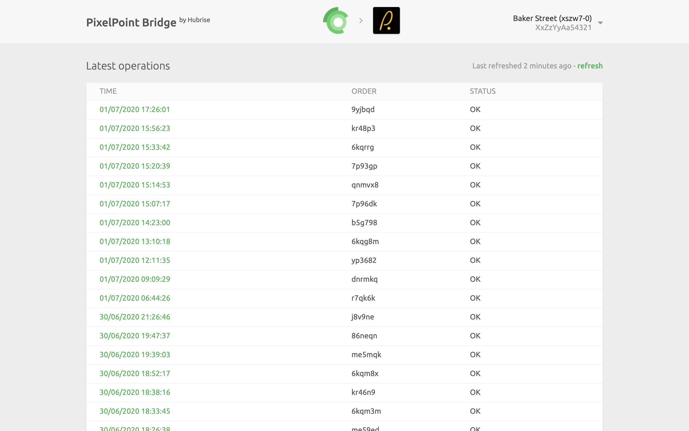
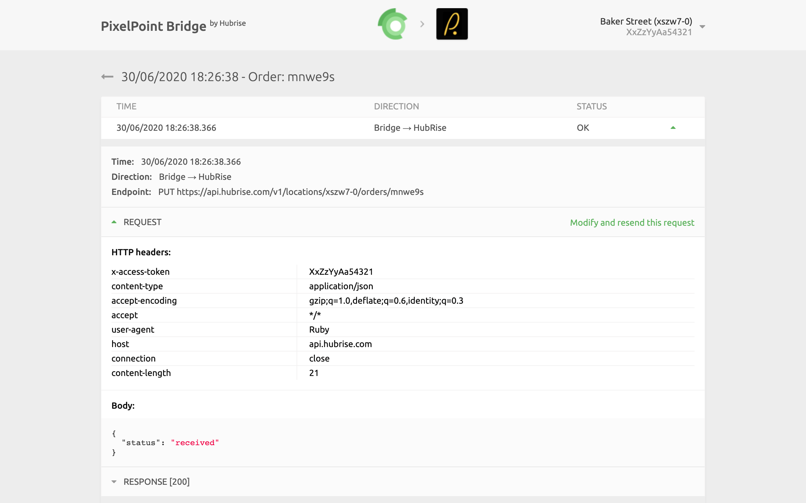
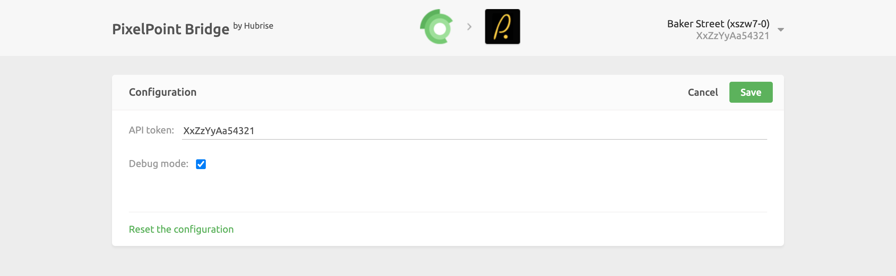

## Setup

PixelPoint Bridge connects a PAR PixelPoint EPOS to a HubRise location. Therefore, you must set up a connection for each of the locations you want to connect to PixelPoint. 

To connect PixelPoint to a specific location:

1.  Open you HubRise back office, click the down arrow **&#8595;** next to **Location** to select the location you want to connect. For help, check the HubRise [Manual](/docs) > [Accounts](/docs/account) and [Locations](/docs/locations). 

2.  Select **CONNECTIONS** > **View available apps**.

3.  Scroll down and select **PixelPoint Bridge** from the list of apps.

4.  Click **Connect**.

5.  Allow PixelPoint permission to access your location registered in HubRise. For accounts with multiple locations, **expand the Choose location** section to select the correct one and **click** on **Allow**. If you have multiple customer lists, you will also be prompted to confirm the one you wish to use.

6.  You will be redirected to the **PixelPoint Bridge** user interface. The first time you connect, the **Configuration** page will appear:

    a.  In the **API token field**, enter your unique **API token** to be provided by the PAR PixelPoint support team. 

    b.  Leave **Debug mode** unselected.

    c.  Click **Save**.

7.  You have now connected PixelPoint to your HubRise location.

---

**IMPORTANT NOTE:** The **API token** you provide during the setup process is only stored in the PixelPoint back office and used for all the API calls to the EPOS. The system does not check the validity of the API token. For information on error handling, see the Troubleshooting section.

---

## User Interface

The user interface for the PixelPoint Bridge provides basic diagnostic information about your connection. It also provides a link to the logs of the latest HubRise requests sent to the EPOS.

### Main page

The main page of PixelPoint Bridge displays the latest received orders. Each row shows:

* **TIME**: The date and time of the order.

* **ORDER**: The HubRise order ID.

* **STATUS**: The status of the order. The value OK indicates that the order has been successfully sent, otherwise a message will explain the type of error occurred.

Clicking on an order will open a new page displaying all the information about it.

On the top right corner of the **PixelPoint Bridge** main page, the HubRise user and location connected are displayed, together with the **API token** currently used.  Clicking the down arrow **&#8595;** expands a menu where it is possible to change the language of the interface and to access the **Configuration page**. 
 
---

**IMPORTANT NOTE**: The first time you access the logs from PixelPoint Bridge, you will be asked to **Allow the Bridge** to access the information on your HubRise account.

---

### Order page

Selecting an order from the list will display all the logs of the API requests exchanged between HubRise and the PixelPoint EPOS via the PixelPoint Bridge. 

Requests are ordered with the latest on top, and each of them displays the following information:

* **TIME**: The date and time the order was placed.

* **DIRECTION**: The apps sending and receiving the request, in the format **Origin → Destination**.

* **STATUS**: The status of the request. The value **OK** indicates that the request has been successfully received, otherwise a message will explain the type of error occurred.

**Clicking** on a request will expand it to reveal the detailed logs of the request and its response. A detailed description of the logs can be found in [Understanding Logs](/apps/pixelpoint/understanding-logs).

## Configuration page

In the **Configuration page**, it is possible to change or reset the API token associated with the location. 

