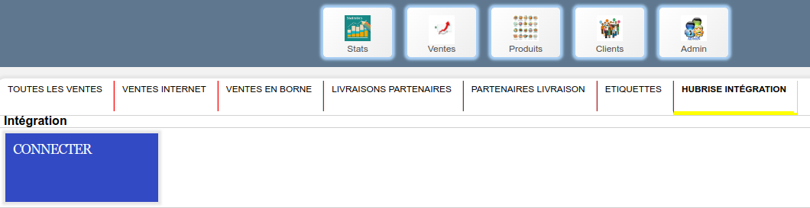
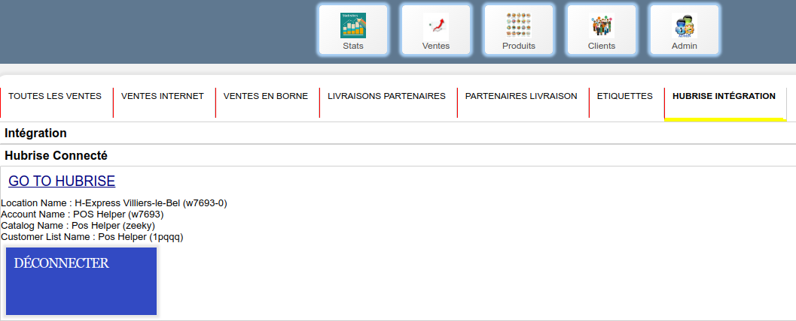

---

**REMARQUE IMPORTANTE :** Si vous ne possédez pas encore de compte HubRise, commencez par en ouvrir un sur la [page d'inscription à HubRise](https://manager.hubrise.com/signup). L'inscription ne prend que quelques minutes !

---

Vous pouvez connecter POS HELPER à HubRise en quelques clics.

## Connecter POS HELPER

Pour connecter POS HELPER à HubRise, suivez les étapes suivantes :

1. Ouvrez le back-office de POS HELPER.
2. Dans la barre de menu, cliquez sur **Ventes**, puis sélectionnez l'onglet **HUBRISE INTEGRATION**.
   
3. Cliquez sur le bouton **CONNECTER**. Vous êtes redirigé vers l'interface HubRise.
4. Si vous avez plusieurs points de vente, choisissez le point de vente à connecter. Si le point de vente sélectionné possède plusieurs listes de clients ou catalogues, cliquez sur **Suivant** pour afficher les listes déroulantes correspondantes, puis sélectionnez les options voulues.
5. Cliquez sur **Autoriser**.
6. Vous êtes redirigé vers l'interface de POS HELPER, et la connexion à HubRise est établie.

## Vérifier la connexion

Pour vérifier le statut de la connexion, cliquez sur **Ventes**, puis **HUBRISE INTEGRATION**, et contrôlez les informations affichées.

## Donner accès au support de POS HELPER

Pour faciliter la prise en charge de vos demandes de support, nous vous recommandons de donner accès à votre compte HubRise à l'éditeur de la solution POS HELPER.

Pour donner accès à POS HELPER, procédez comme suit :

1. Depuis le back-office de HubRise, sélectionnez **CONFIGURATION** dans le menu de gauche.
1. Dans la section **Permissions**, ajoutez support@poshelper.fr en sélectionnant l'option **Manager** dans la liste déroulante des rôles.
1. Cliquez sur l'icône **+** pour ajouter le nouvel utilisateur.

L'ajout d'un utilisateur est le moyen recommandé de donner accès à un tiers à votre point de vente. Le partage de mot de passe est déconseillé pour des raisons de sécurité.

## Déconnecter POS HELPER

1. Ouvrez le back-office de POS HELPER.
2. Dans la barre de menu, cliquez sur **Ventes**, puis sélectionnez l'onglet **HUBRISE INTEGRATION**.
3. Cliquez sur le bouton **DÉCONNECTER**.
4. POS HELPER est déconnecté de HubRise.
