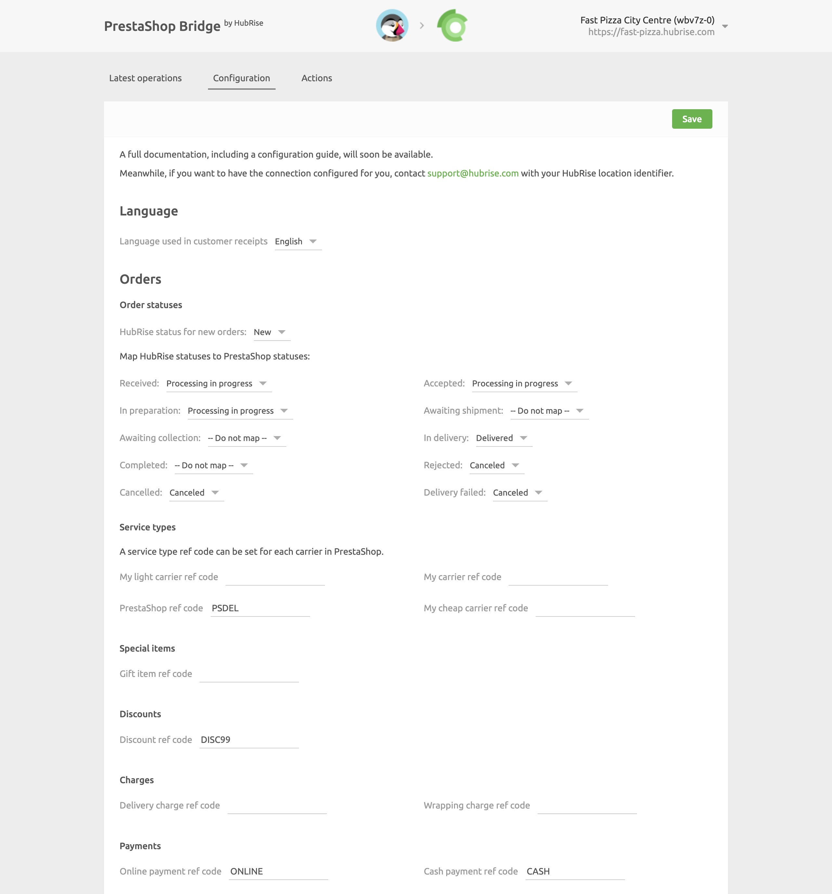

The configuration page allows you to customise the behaviour of PrestaShop Bridge based on your preferences. The settings are divided into different sections for an easier navigation.

## Language

Choose the language to use for generic items such as `Delivery charge`.
These names may appear in customer receipts.

## Orders

### Order Statuses

In this section, you can customise how to map order status changes in HubRise back to PrestaShop.
To ignore an order status change in HubRise, select **Do nothing**.

### Service Types

The carriers you define in PrestaShop might require the corresponding ref code entry. Refer to your EPOS documentation on the HubRise website to verify.

### Special Items

This section lets you specify the ref code applied to gift items.

### Discounts

This section lets you specify the discount ref code applied to your products, in case you have active discount rules in your PrestaShop back-office.
Refer to your EPOS documentation on the HubRise website to see how to obtain the corresponding ref code.

### Charges

If charges apply, a ref code might be required. Refer to your EPOS documentation on the HubRise website to verify.

In this section, you can specify the ref code for delivery charges, and for wrapping fees.

### Payments

PrestaShop customers can pay for their order either online or by cash on delivery, depending on the modules you install in your PrestaShop back-office. Online payments include payments by check, bank wire, or other online payment platforms like PayPal.

This section of the configuration page allows you to specify the ref codes for online and cash payments. Refer to your EPOS documentation on the HubRise website to verify the correct codes to use.

## Catalog

### Catalog Variant to Push

Catalog variants give you the flexibility to disable specific items or adjust prices for your PrestaShop website.

If your catalog includes variants, you have the option to select which one to use. When **(none)** is selected, the default items along with their standard prices are used.

### Automatic Catalog Push

To update your PrestaShop catalog every time this is updated on HubRise, select the checkbox in this section.

Only new products in the HubRise catalog will be sent to PrestaShop. Existing PrestaShop products will not be updated.

## Inventory

To update your PrestaShop inventory every time this is updated on HubRise, select the checkbox in this section.
Products that are unavailable in your HubRise catalog are automatically marked as unavailable in your PrestaShop store.

## Save the Configuration

Once you are happy with the configuration of PrestaShop Bridge, click **Save** at the top of the page to go back to the **Latest operations** page.

## Reset the Configuration

If you want to reset the configuration and erase its values, click **Reset the configuration** at the bottom of the page.

---

**IMPORTANT NOTE:** Resetting the configuration will also erase your integration settings. To continue receiving PrestaShop orders, you will need to set up the connection again.

---

Resetting the configuration does not remove the operation logs displayed in the main page.
