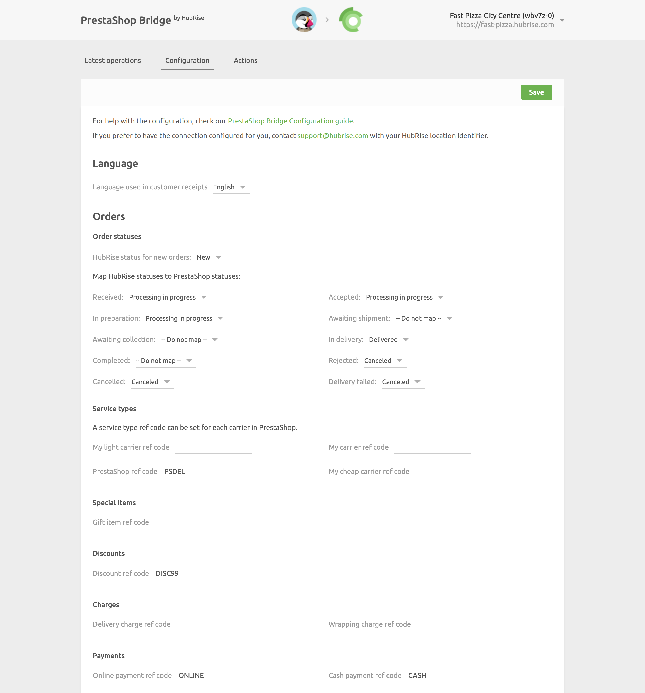
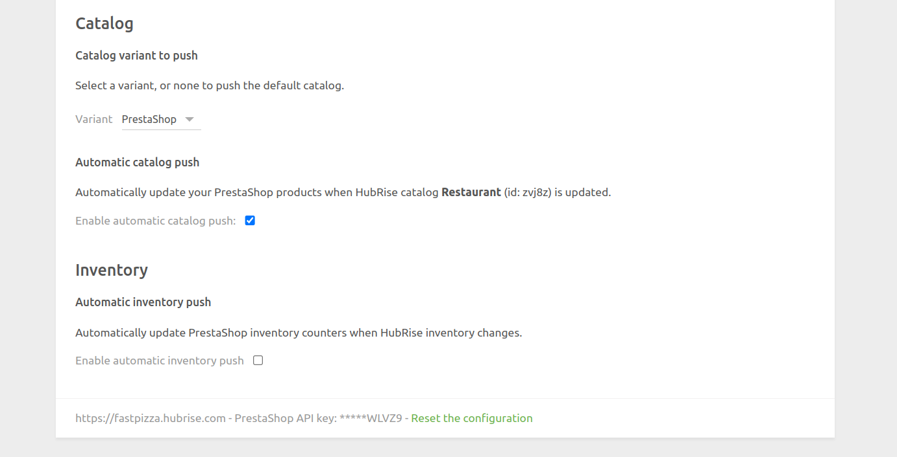

The configuration page allows you to customise the behaviour of PrestaShop Bridge based on your preferences. The settings are divided into different sections for an easier navigation.

## Language

Choose the language to use for generic items such as `Delivery charge`.
These names may appear in customer receipts.

## Orders

### Order Statuses {#order-statuses}

In this section, you can customise how to map order status changes in HubRise back to PrestaShop.
To ignore an order status change in HubRise, select **Do nothing**.

### Service Types {#service-types}

The carriers you define in PrestaShop might require the corresponding ref code entry. Refer to your EPOS documentation on the HubRise website to verify.

### Special Items

This section lets you specify the ref code applied to gift items.

### Discounts

This section lets you specify the discount ref code applied to your products, in case you have active discount rules in your PrestaShop back-office.
Refer to your EPOS documentation on the HubRise website to see how to obtain the corresponding ref code.

### Charges

If charges apply, a ref code might be required. Refer to your EPOS documentation on the HubRise website to verify.

In this section, you can specify the ref code for delivery charges, and for wrapping fees.

### Payments

PrestaShop customers can pay for their order either online or by cash on delivery, depending on the modules you install in your PrestaShop back-office. Online payments include payments by check, bank wire, or other online payment platforms like PayPal.

This section of the configuration page allows you to specify the ref codes for online and cash payments. Refer to your EPOS documentation on the HubRise website to verify the correct codes to use.

## Catalog

### Catalog Variant to Push

Catalog variants give you the flexibility to disable specific items or adjust prices for your PrestaShop website.

If your catalog includes variants, you have the option to select which one to use. When **(none)** is selected, the default items along with their standard prices are used.

### Automatic Catalog Push

Select the **Enable automatic catalog push** checkbox to synchronise your HubRise catalog with PrestaShop whenever it gets updated.

Only new products added to the HubRise catalog will be sent to PrestaShop. Any existing products within PrestaShop will remain unchanged.

## Inventory

Through inventory synchronisation, products that have a stock quantity of zero can be hidden on your PrestaShop website.

Select the **Enable automatic inventory push** checkbox to synchronise your HubRise inventory with PrestaShop whenever it gets updated.

## Save the Configuration

To save the configuration, click **Save** at the top of the page.

## Reset the Configuration

If you need to reset the configuration, click **Reset the configuration** at the bottom of the page.

---

**IMPORTANT NOTE:** Resetting the configuration will instantly disconnect the bridge from PrestaShop.

---

Resetting the configuration does not delete the operation logs displayed in the main page.
