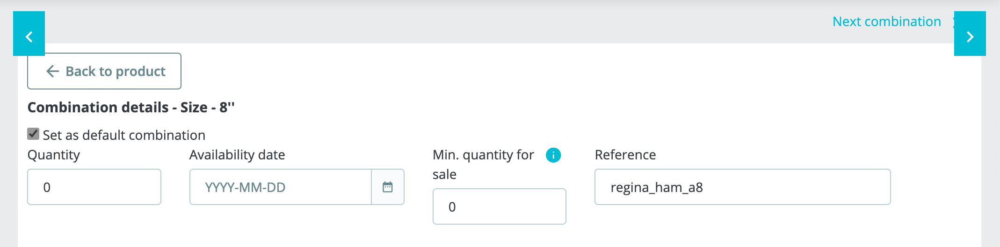

Most EPOS solutions require a ref code for each product to properly interpret orders. Therefore, you need to make sure that each product on PrestaShop is assigned to the correct ref code.

This page explains how to configure ref codes manually in PrestaShop. Some EPOS solutions however offer the ability to export their catalog to HubRise, allowing you to populate PrestaShop products automatically with the correct ref codes. For more details, see [Push the Catalog](/apps/prestashop/push-catalog).

To assign ref codes to your PrestaShop products, follow these steps:

1. Log in to your PrestaShop back office.
2. From the menu, select **Catalog** > **Products**.
3. From the list of products, select the product for which you want to add the ref code.
4. On the product page, under **Basic settings**, enter the ref code for the product in the **Reference** field.
   
5. To confirm, click **Save**.

If your product contains SKUs, you need to enter the ref codes for each combination in your product. Follow these steps:

1. On the product page, under **Combinations**, click the <InlineImage width="20" height="20"></InlineImage>&nbsp;Pencil icon next to the combination.
   
2. On the combination page, under **Combination details**, enter the ref code in the **Reference** field.
   
3. Repeat the process for all the available combinations, then click **Save** to confirm.

You will need to repeat this manual procedure for all your available items.
