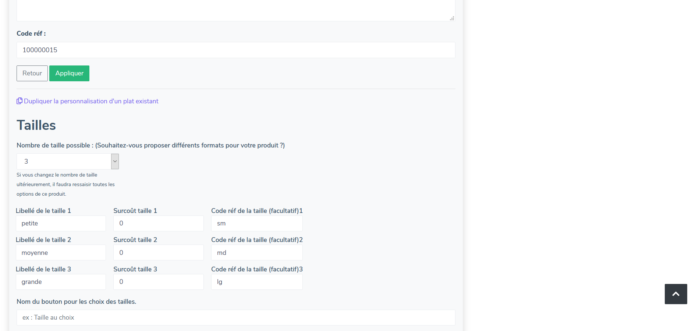
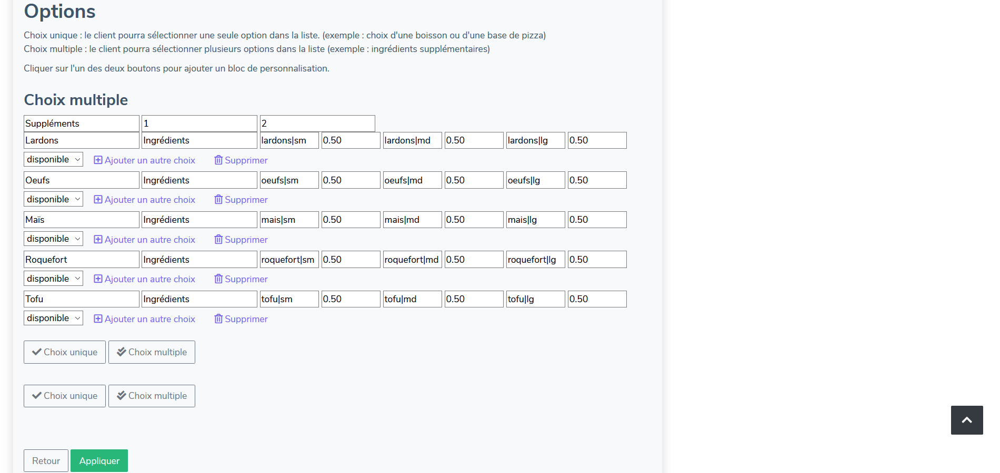
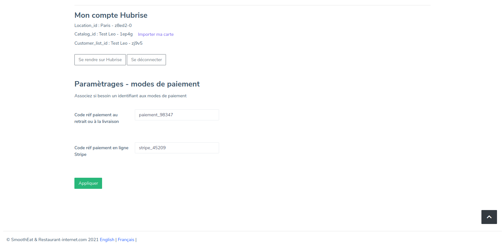
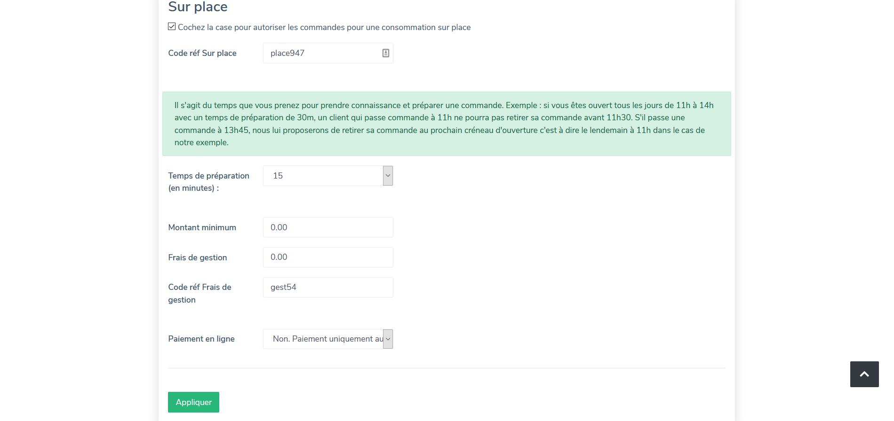

---

**REMARQUE IMPORTANTE :** Les champs de saisie des codes ref ne sont visibles que si votre site Restaurant-internet est connecté à HubRise.

---

## Produits et SKUs

Une SKU (_Stock Keeping Unit_) dans HubRise est une taille de produit sur Restaurant-internet. Restaurant-internet permet de créer jusqu'à 5 tailles par produit.

Pour modifier les codes ref des tailles d'un produit, suivez les étapes suivantes :

1. Dans la barre de menu principale sur Restaurant-internet, sélectionnez **Carte**.
2. Cliquez sur le nom de votre établissement.
3. Identifiez le produit souhaité, puis cliquez sur **Editer**.
4. Dans la section **Tailles**, renseignez les codes ref des SKUs dans les champs nommés **Code réf de la taille (facultatif)_N_**, N étant le numéro de la taille.
   

Restaurant-internet permet de saisir un code ref sur le produit. Ce code n'est pas utilisé en pratique, et seuls les codes refs des tailles doivent être renseignés.

## Options

Restaurant-internet supporte les options à choix unique et à choix multiple. Vous pouvez indiquer un code ref par option et par taille du produit.

Pour modifier les codes ref des options d'un produit, suivez les étapes suivantes :

1. Dans la barre de menu principale sur Restaurant-internet, sélectionnez **Carte**.
2. Cliquez sur le nom de votre établissement.
3. Identifiez le produit souhaité, puis cliquez sur **Editer**.
4. Dans la section **Options**, renseignez les codes ref des options dans les champs correspondants.

Dans l'exemple suivant, les codes ref **tofu|sm**, **tofu|md** et **tofu|lg** correspondent à l'option Tofu, pour chacune des 3 tailles du produit.

## Promotions

Restaurant-internet n'a pas de fonctionnalité équivalente aux promotions HubRise.

## Remises

Restaurant-internet n'a pas de fonctionnalité équivalente aux remises HubRise.

## Frais

Restaurant-internet permet de définir des frais de livraison, ainsi que des frais de gestion pour chacun des trois types de service (livraison, sur place, à emporter).

Pour modifier le code ref des frais, suivez les étapes suivantes :

1. Depuis votre tableau de bord Restaurant-internet, sélectionnez **Paramétrages**.
   
2. Sélectionnez l'onglet **Commande en ligne**, ou alors, dans la partie **Commande en ligne**, cliquez sur **Retrait sur place**, **A emporter**, ou **Livraison**.
3. Renseignez les codes ref dans les champs **Code réf Frais de gestion** ou **Code réf Frais de livraison**.

## Méthodes de paiement

Une méthode de paiement dans HubRise correspond à un mode de paiement dans Restaurant-internet. Pour modifier leur code ref, suivez les étapes suivantes :

1. Depuis votre tableau de bord Restaurant-internet, dans la partie **Modules**, sélectionnez **Marketplace Autres modules**.
2. Sélectionnez **Hubrise - Connection Caisse Gratuit**.
3. En bas de page, dans la partie **Paramètrages - modes de paiement**, renseignez les codes ref dans les champs correspondant à chaque mode de paiement.
   

## Types de service

Pour modifier le code ref de vos types de service, suivez les étapes suivantes :

1. Depuis votre tableau de bord Restaurant-internet, sélectionnez **Paramétrages**.
2. Sélectionnez l'onglet **Commande en ligne**, ou alors, dans la partie **Commande en ligne**, cliquez sur **Retrait sur place**, **A emporter**, ou **Livraison**.
3. Renseignez les codes ref dans les champs **Code réf Sur place**, **Code réf À emporter**, ou **Code réf Livraison**.
   
