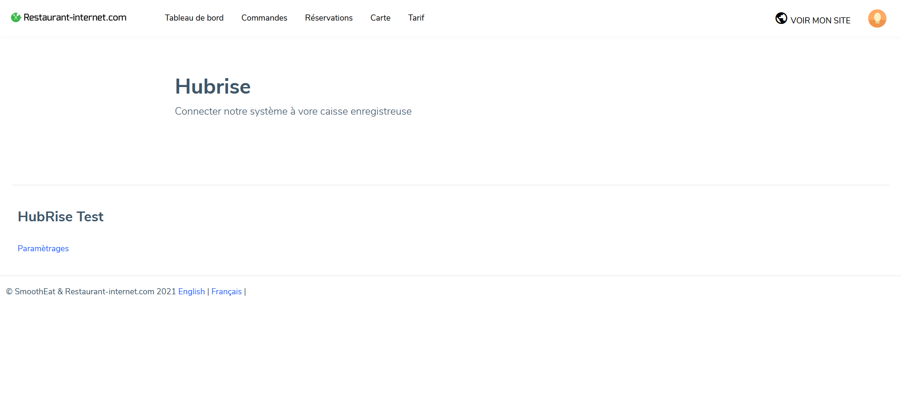
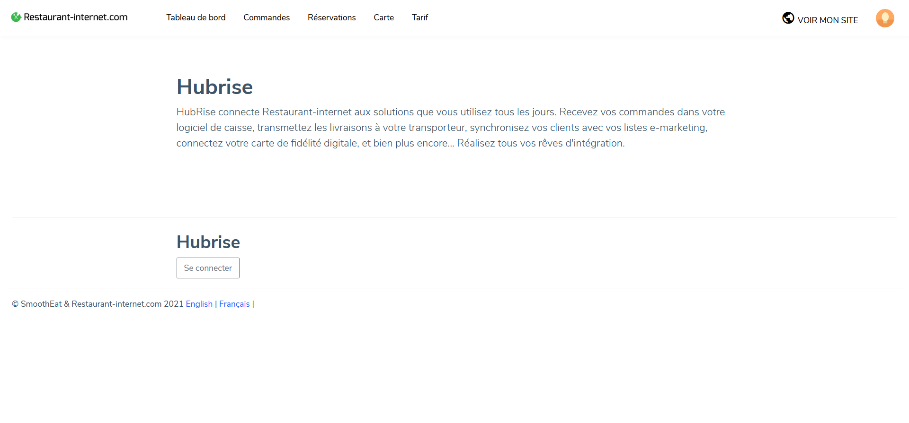

## Importer le catalogue

Si vous avez exporté votre catalogue depuis votre logiciel de caisse ou d'autres applications vers HubRise, vous pouvez l'importer dans votre catalogue Restaurant-internet. Cela inclut les produits avec leur prix, leurs options, et leur catégorie. Pour importer le catalogue, suivez les étapes suivantes :

1. Accédez à la page [Hubrise](https://cockpit.restaurant-internet.com/premium/hubrise).
   
1. Sélectionnez **Paramètrages**.
   
1. Sélectionnez **Importer ma carte**. Un message confirmant que l'import du catalogue a réussi s'affiche.