## Importer le catalogue

Si vous avez exporté votre catalogue depuis votre logiciel de caisse ou d'autres applications vers HubRise, vous pouvez l'importer dans votre catalogue Restaurant-internet. Cela inclut les produits avec leur prix, leurs options, et leur catégorie. Pour importer le catalogue, suivez les étapes suivantes :

1. Depuis votre tableau de bord Restaurant-internet, dans la partie **Modules**, sélectionnez **Marketplace Autres modules**.
   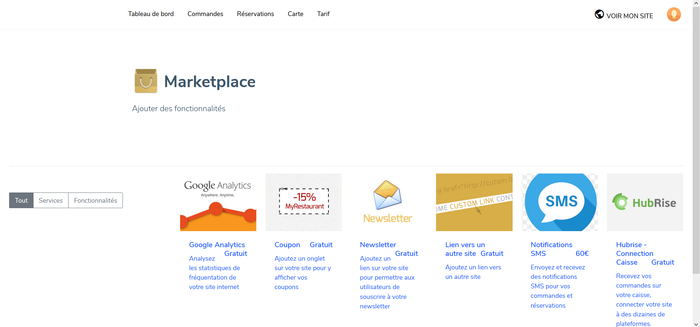
1. Sélectionnez **Hubrise - Connection Caisse Gratuit**.
   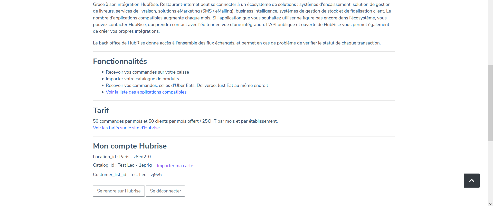
1. En bas de la page, cliquez sur **Importer ma carte**.

## Produits

Pour retrouver le code ref d'un produit :

1. Dans la barre de menu principale, sélectionnez **Carte**.
   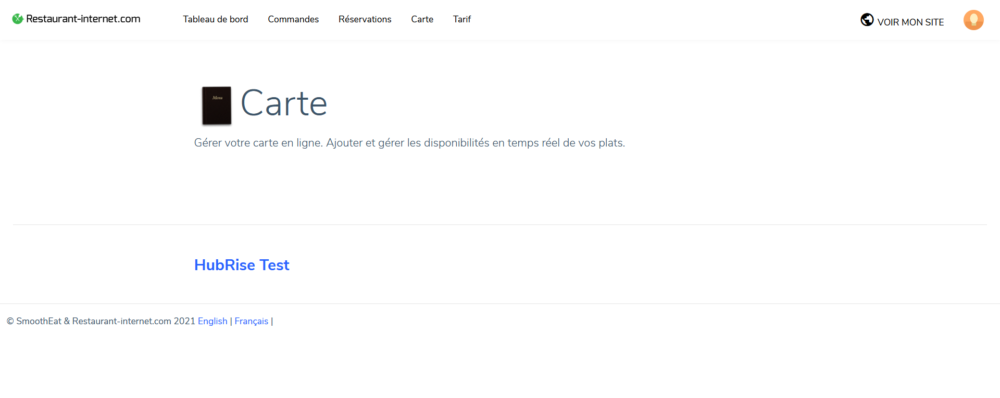
1. Cliquez sur le nom de votre établissement, ici **HubRise Test**.
   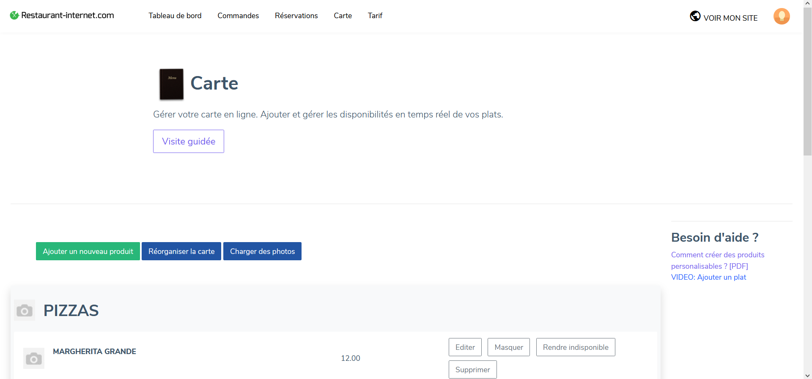
1. Cliquez sur **Editer** sur le produit dont vous souhaitez retrouver le code ref. Dans la partie **Informations générales**, le code ref s'affiche dans le champ **Code réf**.
   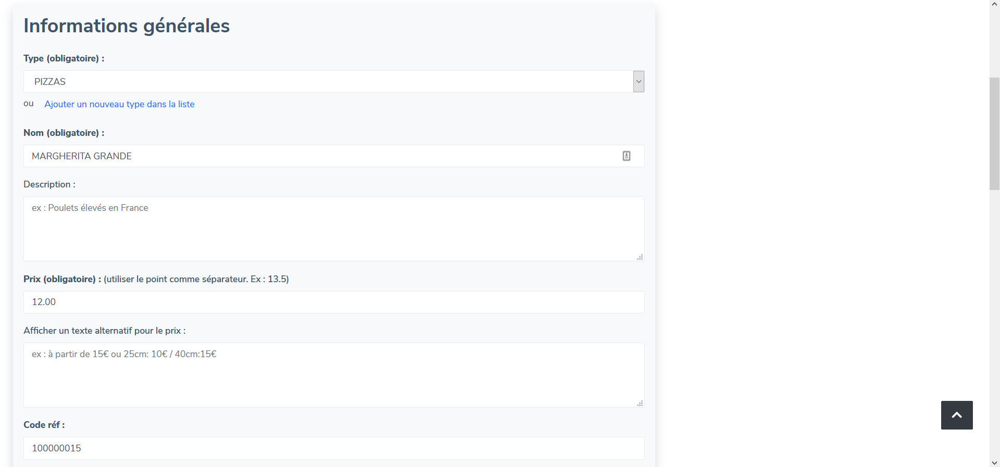

---

**REMARQUE IMPORTANTE :** Ce champ n'est visible que si la connexion entre Restaurant-internet et HubRise est établie. Pour vérifier que tel est le cas, consultez la page [Connexion à HubRise](/apps/restaurant-internet/connexion-hubrise#connecter-restaurant-internet).

---

## SKU

Une SKU (_Stock Keeping Unit_) dans HubRise est un produit Restaurant-internet dans une taille donnée. Pour retrouver leur code ref, suivez tout d'abord les mêmes étapes que dans la section [Produits](/apps/restaurant-internet/associer-codes-ref#produits). Puis sur la même page, dans la partie **Tailles**, vous pouvez retrouver les valeurs de ces codes ref dans les champs appelés **Code réf de la taille (facultatif)_N_**, N étant le numéro de la taille. Le nombre de tailles par produit est limité à 5.
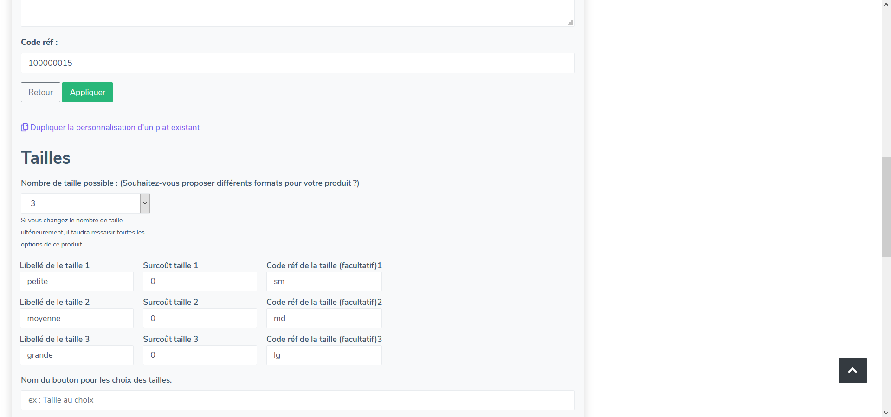

## Options

Restaurant-internet supporte les options à choix unique et à choix multiple.

### Choix unique

Pour retrouver le code ref d'une option à choix unique, suivez tout d'abord les mêmes étapes que dans la section [Produits](/apps/restaurant-internet/associer-codes-ref#produits). Puis sur la même page, dans la partie **Options**, vous pouvez retrouver les valeurs de ces codes dans les différents champs.

Dans l'exemple suivant, le produit est disponible en 3 tailles, chaque choix possible pour l'option **Sauce** est donc composé de 3 codes ref différents. Pour le choix de la sauce pimentée, les codes ref **piment|sm**, **piment|md**, et **piment|lg** correspondent respectivement aux 3 tailles du produit : **petite**, **moyenne**, et **grande**.
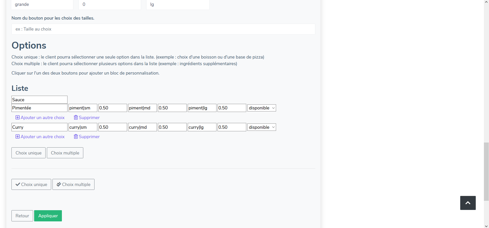

### Choix multiple

Pour retrouver le code ref d'une option à choix multiple, suivez tout d'abord les mêmes étapes que dans la section [Produits](/apps/restaurant-internet/associer-codes-ref#produits). Puis sur la même page, dans la partie **Options**, vous pouvez retrouver les valeurs de ces codes dans les différents champs.

Dans l'exemple suivant, le produit est disponible en 3 tailles, chaque choix possible pour l'option **Suppléments** est donc composé de 3 codes ref différents. Pour le choix du tofu, les codes ref **tofu|sm**, **tofu|md**, et **tofu|lg** correspondent respectivement aux 3 tailles du produit : **petite**, **moyenne**, et **grande**.
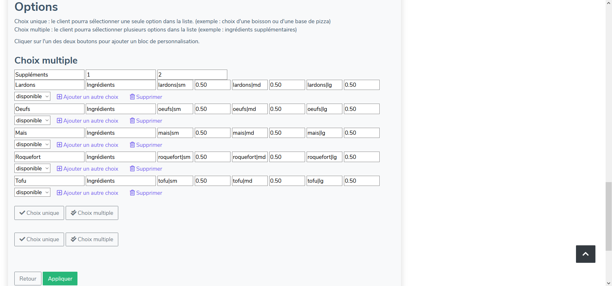

## Remises et promotions

La fonctionnalité d'ajout de remises ou de promotions n'existe actuellement pas dans Restaurant-internet.

## Charges

Pour retrouver le code ref d'une charge, suivez les étapes suivantes :

1. Depuis votre tableau de bord Restaurant-internet, sélectionnez **Paramétrages**.
   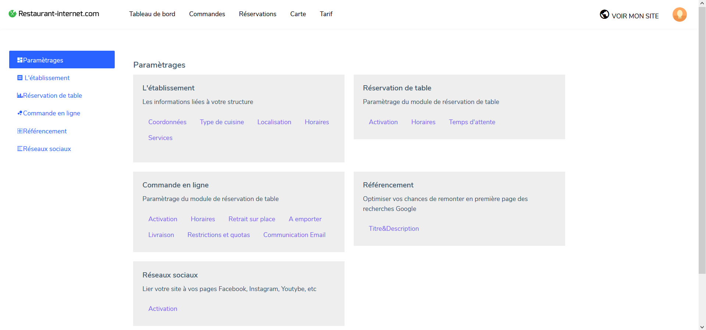
1. Sélectionnez l'onglet **Commande en ligne**, ou alors, dans la partie **Commande en ligne**, cliquez sur **Retrait sur place**, **A emporter**, ou **Livraison**. Les codes ref s'affichent respectivement dans les champs **Code réf Sur place**, **Code réf À emporter**, ou **Code réf Livraison**.
   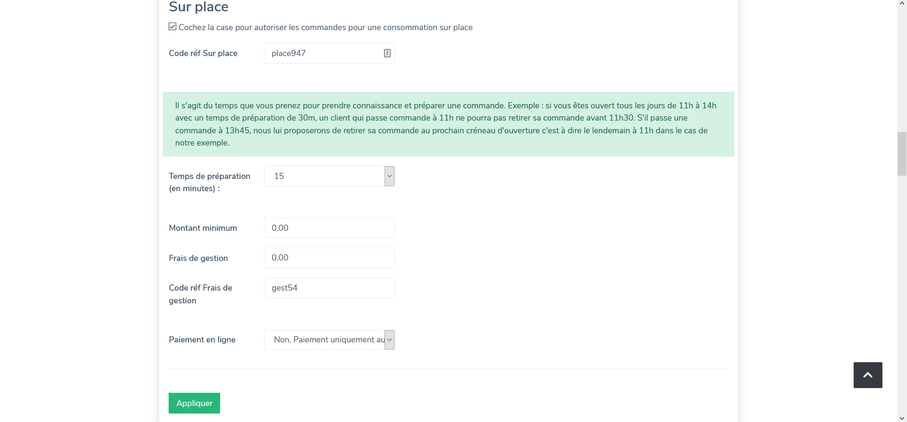

Dans le cas où des frais de gestion sont présents pour un certain mode de livraison, c'est sur cette même page que vous pouvez retrouver le code ref correspondant.

## Méthodes de paiement

Une méthode de paiement dans HubRise correspond à un mode de paiement dans Restaurant-internet. Pour retrouver leur code ref, suivez les étapes suivantes :

1. Depuis votre tableau de bord Restaurant-internet, dans la partie **Modules**, sélectionnez **Marketplace Autres modules**.
   
1. Sélectionnez **Hubrise - Connection Caisse Gratuit**. En bas de page, dans la partie **Paramètrages - modes de paiement**, les codes ref s'affichent dans les champs correspondant à chaque mode de paiement.
   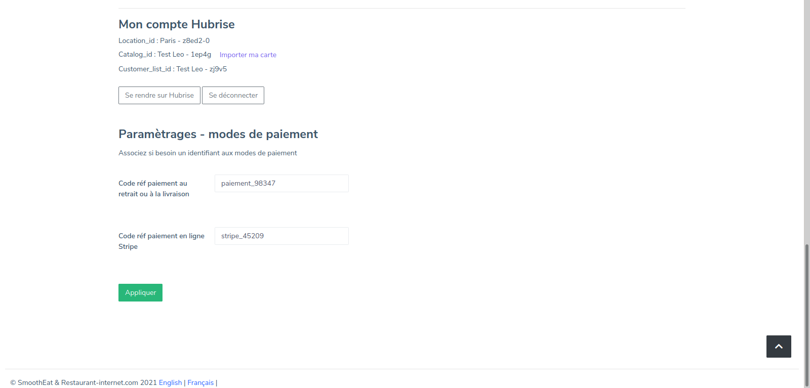
