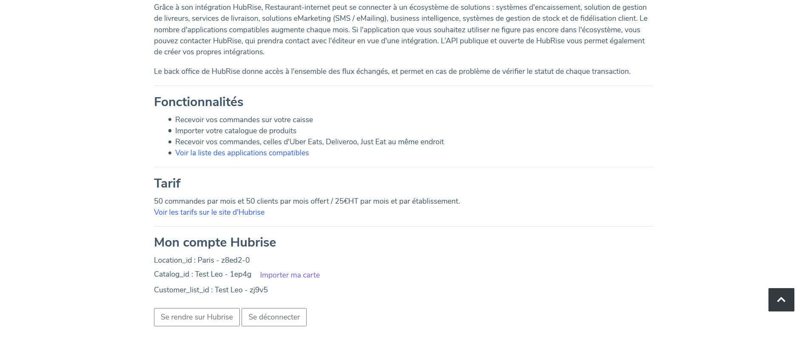

Pour connecter Restaurant-internet à HubRise, il suffit de suivre quelques étapes.

## Connecter Restaurant-internet

Pour établir la connexion entre votre solution de commande en ligne Restaurant-internet et HubRise :

1. Depuis votre tableau de bord Restaurant-internet, dans la partie **Modules**, sélectionnez **Marketplace Autres modules**.
1. Sélectionnez **Hubrise - Connection Caisse Gratuit**.
1. En bas de la page, cliquez sur **Se connecter / Créer un compte**. Vous êtes redirigés vers l'interface HubRise.
1. Choisissez le point de vente que vous désirez connecter et cliquez **Autoriser** pour donner à Restaurant-internet l'accès à vos informations. Si plusieurs listes de clients ou catalogues sont disponibles, cliquez **Suivant** afin d'afficher les listes déroulantes correspondantes avant de cliquer sur **Autoriser**. Vous êtes redirigés vers votre tableau de bord Restaurant-internet, affichant les informations de votre point de vente.
   
1. En cas de besoin, le support de Restaurant-internet peut vous venir en aide. Pour leur donner accès à votre compte HubRise, [ajoutez les permissions nécessaires](/apps/restaurant-internet/connexion-hubrise#donner-acc-s-au-support-de-restaurant-internet).

---

**REMARQUE IMPORTANTE :** Vous devrez vous connecter à un compte HubRise existant, ou créer un nouveau compte pour terminer d'établir la connexion. Pour plus d'informations sur la manière de créer un profil utilisateur ou vous connecter à HubRise, consultez notre [Guide de prise en main](/docs/getting-started/).

---

## Donner accès au support de Restaurant-internet

Il est conseillé de donner au support de Restaurant-internet l'accès à votre compte HubRise. En cas de besoin, ils pourront ainsi vous venir en aide plus facilement. Pour cela, suivez les étapes suivantes :

1. Depuis votre espace HubRise, sélectionnez **CONFIGURATION** > **COMPTES** dans le menu de gauche. La liste de vos comptes s'affiche.
1. Sélectionnez le compte auquel votre point de vente est rattaché.
1. Dans la section **Points de vente**, sélectionnez votre point de vente.
1. Dans la section **Permissions**, ajoutez *contact@restaurant-internet.com* en sélectionnant l'option **Manager** (et non **Admin**) dans la liste déroulante des rôles, puis cliquez sur l'icône **+**. L'ajout d'un utilisateur est le moyen recommandé de donner accès à un tiers à votre point de vente, le partage de mot de passe est déconseillé pour des raisons de sécurité.

## Déconnecter Restaurant-internet

Pour vous déconnecter, suivez les étapes suivantes :

1. Depuis votre tableau de bord Restaurant-internet, dans la partie **Modules**, sélectionnez **Marketplace Autres modules**.
1. Sélectionnez **Hubrise - Connection Caisse Gratuit**.
1. En bas de la page, cliquez sur **Se déconnecter**.
