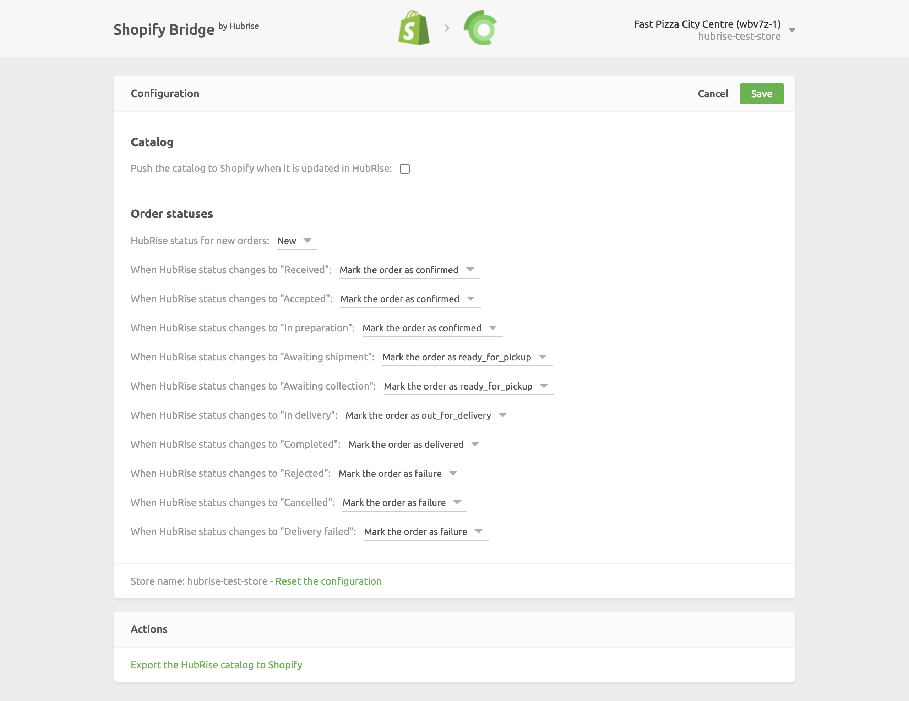

The configuration page allows you to customise the behaviour of Shopify Bridge based on your preferences.
These are divided into different sections for an easier navigation.

## Catalog

To update your Shopify catalog every time this is updated on HubRise, select the checkbox in this section.
Only new products in the HubRise catalog will be sent to Shopify. The Bridge does not update existing Shopify products.

## Order Statuses

In this section, you can customise how to map order status changes in HubRise back to Shopify.
To ignore an order status change in HubRise, select **Do nothing**.

## Save the Configuration

Once you are happy with the configuration of Shopify Bridge, click **Save** at the top of the page to go back to the **Latest operatins** page.

## Reset the Configuration

If you want to reset the configuration and erase its values, click **Reset the configuration** at the bottom of the page.

---

**IMPORTANT NOTE:** Resetting the configuration will also erase your integration settings. To continue receiving Shopify orders, you will need to set up the connection again.

---

Resetting the configuration does not remove the operation logs displayed in the main page.
