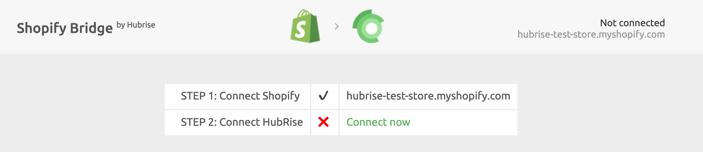
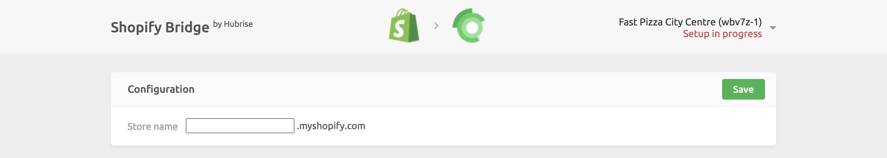
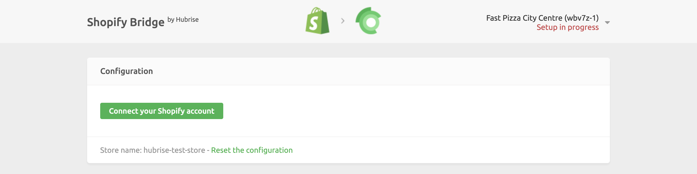

Connecting Shopify to HubRise can be done with a few steps.

---

**IMPORTANT NOTE:** If you do not have a HubRise account yet, register on our [Signup Page](https://manager.hubrise.com/signup). It only takes a minute!

---

## 1. Connect Shopify Bridge

To can connect Shopify to HubRise, you can choose one of the following equivalent procedures:

- Connect from Shopify App Store.
- Connect from the HubRise back office.

### Connect From Shopify Apps Page

To connect Shopify from Shopify App Store, follow these steps.

1. Go to the [HubRise page](https://apps.shopify.com/hubrise) in the Shopify App Store.
1. Click **Add app**.
1. If you are not already logged in to your Shopify account, enter your Shopify credentials.
1. In the authorization page, review the permissions and click **Install app**. You will be redirected to the Shopify Bridge page.
1. Click **Connect now**.

1. From the HubRise authorisation page, select your HubRise location you wish to connect, then click **Allow**.
1. Configure the behaviour of Shopify Bridge, then click **Save** to complete the connection. For more information about configuring your Shopify Bridge, see [Configuration](/apps/shopify/configuration).

### Connect From the HubRise Back Office

To connect Shopify Bridge from the HubRise back office, follow these steps.

1. Log in to your [HubRise account](https://manager.hubrise.com).
1. Select the location you want to connect from the dropdown menu.
1. Select **CONNECTIONS**, then **View available apps**.
1. Select **Shopify Bridge** from the list of apps.
1. Click **Connect**.
1. Click **Allow** to grant Shopify Bridge permission to access the location of your restaurant registered in HubRise. For accounts with multiple locations, expand the **Choose location** section to select the correct one first, and then click **Allow**.
1. A new page asks you to provide your Shopify store name. Enter your store name, then click **Save**.

   

1. Click the **Connect your Shopify account** button. You will be redirected to the Shopify page, where you can select the store to connect to or enter your Shopify credentials.

   

1. In the Shopify back office, review the permissions and click **Install app**. You will be redirected to Shopify Bridge.
1. Configure the behaviour of Shopify Bridge, then click **Save** to complete the connection. For more information about configuring your Shopify Bridge, see [Configuration](/apps/shopify/configuration).

## 2. Upload Your Menu

If you have a catalog of products on HubRise, you can upload it to your Shopify store with a single click.

For more information on HubRise catalogs, see [Catalogs](/docs/catalog/).
To learn how to pull your HubRise catalog into Shopify, see [Pulling the Catalog](/apps/shopify/configuration#pulling-the-menu).
