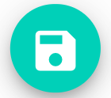

This page explains how you can pull your HubRise catalog into Smood, what information is sent to Smood, and how you can synchronise your inventory.

## Pull a Catalog

As a preliminary step, you need to populate your HubRise catalog. Then you can pull your catalog into Smood automatically when sit is updated on HubRise, or pull it manually when needed.

### Populate a HubRise Catalog

Some EPOS solutions offer the ability to export the catalog to HubRise. If your EPOS does not offer this feature, you can populate your HubRise catalog manually. Refer to your EPOS documentation on the HubRise website to verify.

For more information on HubRise catalogs, see [Catalogs](/docs/catalog/).

### Manual Catalog Pull

Once your catalog is populated on HubRise, you can manually pull it into your Smood restaurant by following these steps:

1. Log in to your [Smood back office](https://manager.smood.ch/).
1. Select the restaurant.
1. Click the **Settings** tab, then in the **Integrations** section, click **Pull HubRise catalog**.
1. To confirm, click **Yes**.

To understand how the HubRise catalog is mapped to Smood, see the [technical reference](#technical-reference) below.

### Automatic Catalog Pull

Smood can automatically pull your HubRise catalog every time it is updated in HubRise. By default, this option is turned off. You can enable it by following these steps:

1. Log in to your [Smood back office](https://manager.smood.ch/).
1. Select the restaurant.
1. Click the **Settings** tab, then under the **Integrations** section, click **Edit POS references**.
1. In the **POS Order References Settings** dialog that appears, select the **Enable automatic sync of the catalog** option, then click <InlineImage width="24" height="24"></InlineImage>&nbsp;**Save**.

## Synchronise Inventory

Smood can mark your products unavailable based on your HubRise inventory. You can let Smood update the inventory automatically, or update it manually.

Products with a stock of `0` in HubRise will be marked unavailable in Smood, and removed from the menu. When the stock is updated in HubRise, the product will be marked available again.

### Automatic Inventory Update

Smood can automatically update the availability of your products when your inventory is updated on HubRise. By default, this option is turned off. To turn it on, follow these steps:

1. Log in to your [Smood back office](https://manager.smood.ch/).
1. Select the restaurant for which you want to edit products.
1. Click the **Settings** tab, then under the **Integrations** section, click **Edit POS references**.
1. In the **POS Order References Settings** dialog that appears, select the **Enable automatic sync of the inventory** option, then click <InlineImage width="24" height="24"></InlineImage>&nbsp;**Save**.

### Manual Inventory Update

To manually update your Smood inventory, follow these steps:

1. Log in to your [Smood back office](https://manager.smood.ch/).
1. Select the restaurant for which you want to edit products.
1. Click the **Settings** tab, then in the **Integrations** section, click **Pull HubRise inventory**.
1. To confirm, click **Yes**.

## Technical Reference

The following sections describe how HubRise catalogs are mapped to Smood.

### Categories

HubRise categories are mapped one-to-one with categories on Smood. Smood uses the categories' `name` and `description` fields.

Smood only supports one level of categories. If you use subcategories in your HubRise catalog, these will be mapped to main categories in Smood.

### Products and SKUs

For every HubRise SKU, Smood creates a product with the following information:

- `product.name` and `skus.name`: The name of the product. For example, if the HubRise product name is `Pizza margherita` and the SKU name is `8"`, Smood creates a product named `Pizza margherita 8"`
- `product.description`: The description of the product.
- `product.image_ids`: The IDs of the images associated with the product.
- `skus.ref`: The ref code of the SKU, which will be passed along in orders.
- `skus.price`: The price of the SKU.

Note that Smood does not natively support products with SKUs, so a product with SKUs in HubRise will be mapped to multiple products in Smood.

### Options

For every option list in the catalog, Smood uses the following information:

- `name`: The name of the option list.
- `min_selections` and `max_selections`: The minimum and maximum number of options that can be selected.

For every option in an option list, Smood uses the following information:

- `ref`: The ref code of the option.
- `name`: The option name.
- `price`: The price for a single option.

### Deals

In HubRise, deals are promotions which apply to a specific set of products. An example deal is a **Lunch menu** deal, that includes a pizza and a dessert.

Deals in HubRise are mapped to products with options in Smood. Smood will use the following information from HubRise:

- `ref`: The ref code of the product.
- `name`: The name of the product.
- `description`: The description of the product.
- `lines[].label`: If present, the name of the group of options.
- `lines[].skus[]`: The options in the group.

The options from the products in the deal are discarded. For example, if a deal includes a pizza, the customer will not be able to choose the pizza toppings.

---

**IMPORTANT NOTE:** Smood discards options from products in deals. Furthermore, if an option is required for a product, the deal will not be imported.

---

It is not possible to create deals manually in the Smood back office. If you want to use deals, you must pull a catalog from HubRise.

### Discounts

Discounts are not imported into Smood.

### Charges

Charges are not imported into Smood.
