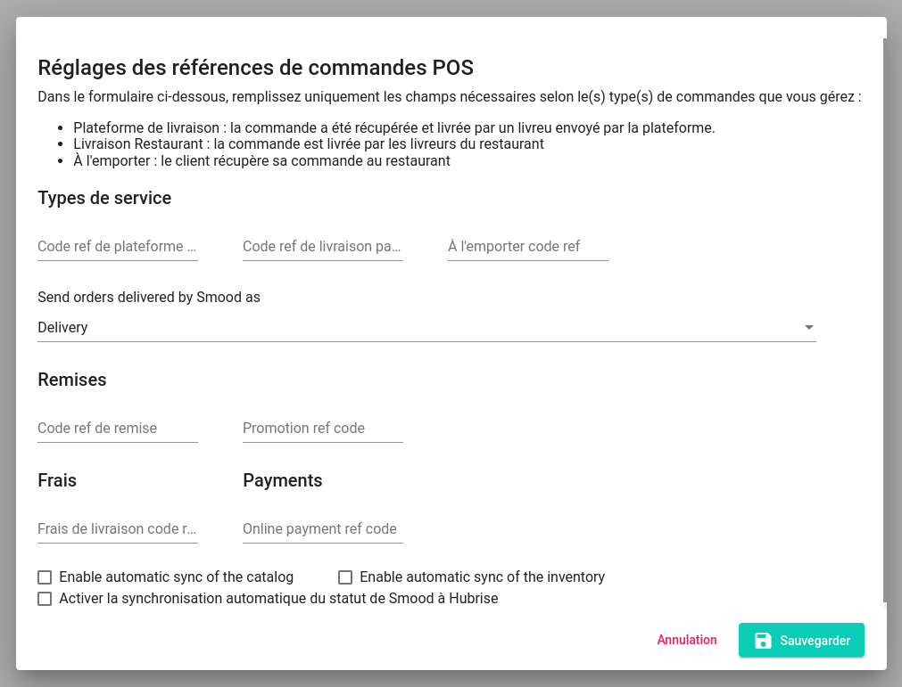

La page de **Configuration** Smood vous permet de configurer la manière dont les commandes sont envoyées à votre logiciel de caisse, ou à toute autre solution connectée à HubRise. Elle inclut également d'autres paramètres liés à l'intégration.

Cette page explique comment ouvrir la page de configuration et configurer votre connexion.

## Ouvrir la page de configuration

Pour ouvrir la page de configuration, suivez ces étapes :

- Connectez-vous à votre [back-office Smood](https://manager.smood.ch).
- Sélectionnez le restaurant dans le menu déroulant de la barre latérale gauche.
- Cliquez sur l'onglet **Paramètres**, puis dans la section **Intégrations**, cliquez sur **Éditer références POS**.

Vous êtes également redirigé vers la page de configuration lorsque vous connectez Smood à HubRise. Pour plus d'informations, voir la rubrique [Connexion à HubRise](/apps/smood/connect-hubrise).

## Configurer vos paramètres {#parameters}

### Types de service {#service-types}

Les types de service tels que **Livraison par la plateforme de livraison**, **Livraison par le restaurant**, ou **À L'emporter**, peuvent nécessiter une entrée de code ref correspondante. Pour vérifier, reportez-vous à la documentation de votre logiciel de caisse sur la [page Apps](/apps) du site internet de HubRise. Pour plus d'informations, voir le paragraphe **Terminologie**, section [Types de service Smood](/apps/smood/terminology#smood-service-types).

De plus, dans cette section, vous pouvez choisir de marquer les commandes Smood en livraison comme des commandes en livraison ou comme des commandes à emporter pour que d'autres applications connectées puissent les traiter selon leurs besoins. Les commandes livrées par le restaurant sont toujours identifiées comme des commandes en livraisons.

### Remises {#discounts}

Dans cette section, vous pouvez configurer les codes ref à utiliser pour les remises et promotions envoyées à HubRise :

- **Remise** : remises qui s'appliquent à l'intégralité de la commande, par exemple une remise de 10 %.
- **Promotion** : remises qui s'appliquent à un ensemble d'articles dans le menu, comme une formule (entrée, plat principal et dessert).

### Frais {#charges}

Des frais de livraison s'appliquent aux commandes livrées par le restaurant. Dans cette section, vous pouvez configurer le code ref à utiliser.

### Paiements {#payments}

Toutes les commandes Smood sont payables en ligne. Les commandes envoyées au logiciel de caisse incluent un paiement. Dans cette section, vous pouvez configurer le code ref à utiliser.

### Paramètres de synchronisation {#synchronisation-settings}

Les cases à cocher de cette section permettent de configurer le flux de synchronisation entre Smood et HubRise :

- **Enable automatic sync of the catalog** (Activer la synchronisation automatique du catalogue) : cochez la case pour que le menu Smood soit automatiquement mis à jour à chaque modification du catalogue HubRise.
- **Enable automatic sync of the inventory** (Activer la synchronisation automatique de l'inventaire) : cochez la case pour que les articles en rupture de stock dans l'inventaire HubRise soient automatiquement supprimés du menu Smood.
- **Activer la synchronisation automatique du statut de Smood à HubRise**: Lorsqu'une commande est annulée dans Smood, la mise à jour de ce statut est toujours envoyée à HubRise. Quand cette option est cochée, d'autres statuts Smood sont également envoyés.

### Enregistrer vos modifications

Une fois vos paramètres configurés, cliquez sur **Enregistrer**.
