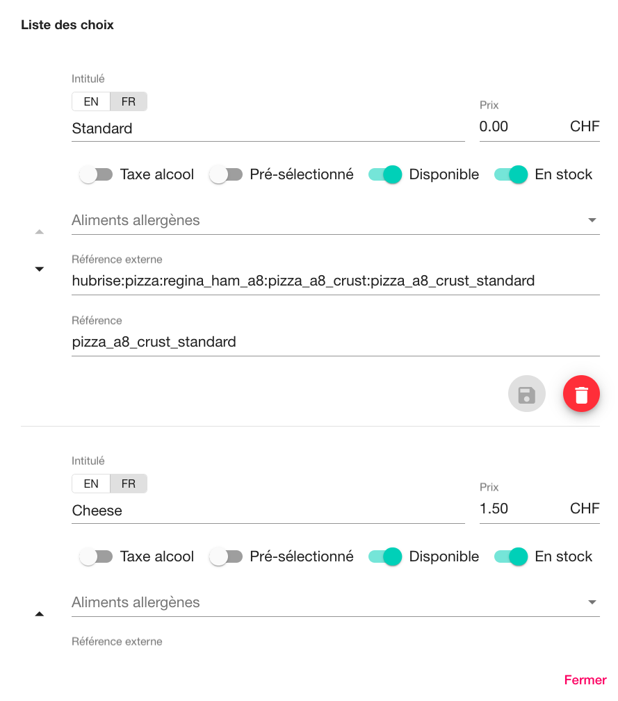

Pour traiter correctement les commandes, la plupart des logiciels de caisse exigent un code ref pour chaque produit. Vous devez donc vérifier que chaque produit dans Smood est associé au bon code ref.

Cette page explique comment configurer manuellement les codes ref dans Smood. Certains logiciels de caisse offrent la possibilité d'exporter leur catalogue vers HubRise, ce qui permet de renseigner automatiquement les bons codes ref des produits Smood. Pour plus d'informations, consultez [Récupérer le catalogue](/apps/smood/recuperer-catalogue).

---

**REMARQUE IMPORTANTE :** Vous ne pouvez pas manuellement modifier le menu Smood ou le code ref des produits lorsque [la synchronisation automatique du catalogue](/apps/smood/configuration/#param-tres-de-synchronisation) est activée.

---

## Produits et SKU

Pour attribuer des codes ref à vos produits Smood, suivez ces étapes :

1. Connectez-vous à votre [back-office Smood](https://manager.smood.ch/).
1. Sélectionnez le restaurant dans la barre latérale gauche.
1. Cliquez sur l'onglet **Menu**, puis sélectionnez le menu que vous souhaitez modifier.
1. Développez la catégorie qui contient les produits à modifier, puis cliquez sur le nom d'un produit.
1. Dans la boîte de dialogue **Editer un produit**, saisissez le code ref dans le champ **Référence**. 
1. Pour confirmer, **Sauvegarder**, puis cliquez sur **Confirmer**.

Répétez cette procédure pour chacun de vos produits.

## Options

Pour attribuer des codes ref à vos options Smood, suivez ces étapes :

1. Connectez-vous à votre [back-office Smood](https://manager.smood.ch/).
1. Sélectionnez le restaurant dans la barre latérale gauche.
1. Cliquez sur l'onglet **Menu**, puis sélectionnez le menu que vous souhaitez modifier.
1. Développez la catégorie qui contient les produits à modifier, puis cliquez sur le nom d'un produit.
1. Dans la boîte de dialogue **Editer un produit**, cliquez sur **Gérer les options de commande**. 
1. Dans la boîte de dialogue **Options de produit**, développez le groupe d'options à modifier.
1. Dans la section **Liste des choix**, identifiez l'option à laquelle vous voulez ajouter le code ref, puis saisissez la valeur dans le champ **Référence**. 
1. Pour confirmer, cliquez sur **Sauvegarder**, puis sur **Confirmer**.

Répétez cette procédure pour toutes les options associées au produit.

## Types de services, remises, frais et paiements

Dans Smood, vous pouvez préciser les codes ref utilisés pour les types de services, les remises, les frais de livraison et les paiements. Pour personnaliser vos codes ref, suivez les étapes indiquées sur la page [Configuration](/apps/smood/configuration).

Pour trouver les codes ref à utiliser, reportez-vous à la documentation de votre logiciel de caisse sur la [page Apps](/apps/) du site internet de HubRise. Par exemple, si vous utilisez Lightspeed, consultez la [documentation Lightspeed](/apps/lightspeed-restaurant), page Plateformes de livraison de repas, section Smood.
