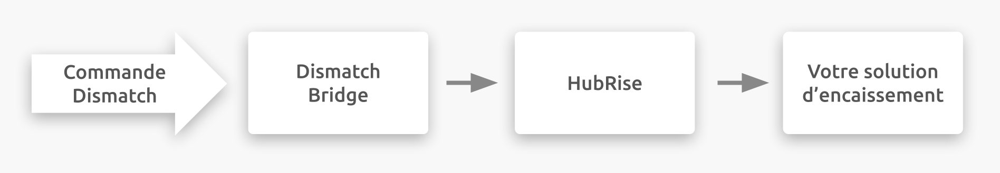

---

**REMARQUE IMPORTANTE :** Une documentation complète de cette intégration sera bientôt disponible.

---

## Description

Smood est une plateforme de livraison de repas qui est présente dans toute la Suisse.

Les restaurants peuvent devenir partenaires Smood pour élargir leur base clientèle grâce à son large réseau. Les restaurateurs peuvent alors se concentrer sur leur activité principale, qui est la préparation de plats.

Les livraisons Smood se font uniquement en voiture.

HubRise est intégré avec Dismatch, le service de livraison de Smood.

## Fonctionnalités de l'intégration

Connecter Dismatch à HubRise permet à votre plateforme de livraison de repas de :

- Recevoir les commandes de HubRise.
- Recevoir les informations clients de HubRise.

Dismatch peut être connecté à HubRise depuis le back-office de HubRise.

## Pourquoi se connecter ?

En connectant Dismatch à HubRise, vous permettez à votre plateforme de livraison de repas de communiquer avec les autres applications que vous utilisez de manière quotidienne. Recevez les commandes provenant de votre solution de commande en ligne, ou des plateformes de livraison de repas sur votre plateforme de livraison de repas.

Grâce à HubRise, vous pouvez synchroniser votre menu, vos informations clients et vos commandes avec votre solution d'encaissement, de commande en ligne, les plateformes de livraison de repas (dont Deliveroo, Uber Eats et Just Eat), les solutions de gestion de livreurs ou de services de livraison, les solutions eMarketing (SMS / eMailing), business intelligence, systèmes de gestion de stock et de fidélisation client, et bien d'autres encore. Le nombre d'applications compatibles augmente chaque mois. Pour voir les applications que vous pouvez connecter, consultez notre [page Apps](/apps).

## Prérequis

Pour établir la connexion entre Dismatch et HubRise, vous devez disposer d'un compte Dismatch.
