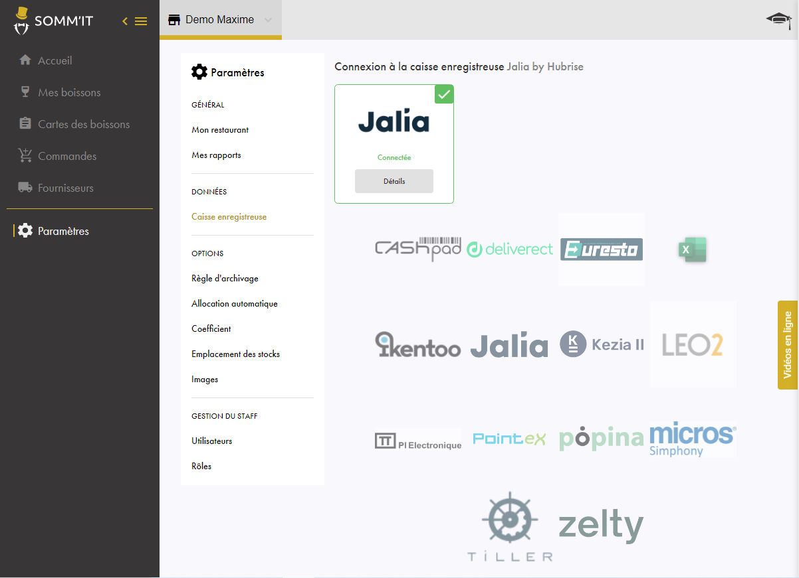
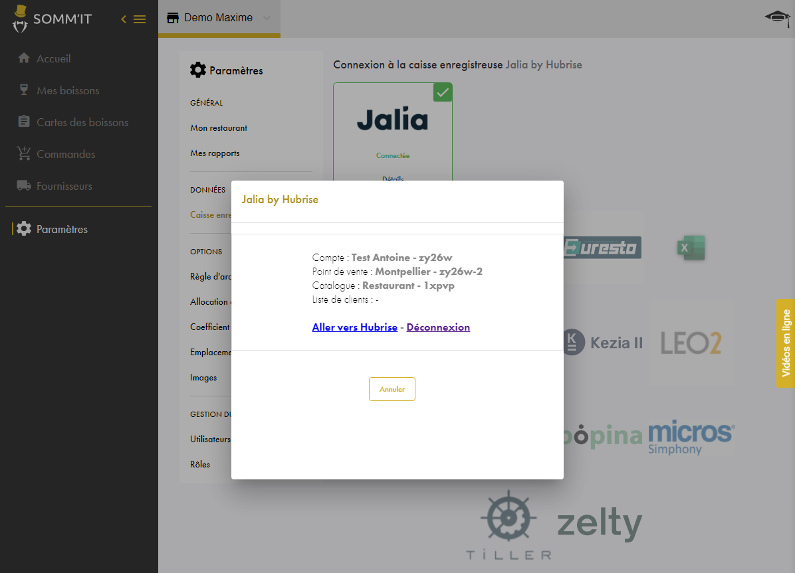

---

**REMARQUE IMPORTANTE :** Si vous ne possédez pas encore de compte HubRise, commencez par en ouvrir un sur la [page d'inscription à HubRise](https://manager.hubrise.com/signup). L'inscription ne prend que quelques minutes !

---

## Connecter SOMM'IT

Pour connecter SOMM'IT et HubRise, suivez ces étapes :

1. Depuis le back office SOMM'IT, dans le menu de gauche, cliquez sur **Paramètres**.
2. Dans le sous-menu qui s'affiche, dans la section **DONNÉES**, cliquez sur **Caisse enregistreuse**. La liste des caisses s'affiche.
   
3. Sous le logo de votre caisse, cliquez sur **Connecter**. La page HubRise s'ouvre dans votre navigateur.
   
4. Si vous avez plusieurs points de vente, choisissez le point de vente à connecter. Si le point de vente sélectionné possède plusieurs catalogues, cliquez sur **Suivant** pour afficher la liste déroulante correspondante, puis sélectionnez l'option voulue.
5. Cliquez sur **Autoriser**.

Lors de l'étape 3, si le bouton **Connecter** est grisé ou si lorsque vous cliquez dessus, une clé d'identification est requise, contactez le support de SOMM'IT.

## Déconnecter SOMM'IT

Pour déconnecter SOMM'IT de HubRise, suivez ces étapes :

1. Depuis le back office SOMM'IT, dans le menu de gauche, cliquez sur **Paramètres**.
2. Dans le sous-menu qui s'affiche, dans la section **DONNÉES**, cliquez sur **Caisse enregistreuse**.
   
3. Sous le logo de la caisse connectée :
   - Si vous voyez le bouton **Détails**, cliquez dessus, puis sur **Déconnexion**. Dans la fenêtre de confirmation **Supprimer la connexion**, cliquez sur **Oui**.
     
     
   - Si vous ne voyez pas de bouton **Détails**, contactez le support de SOMM'IT.

---

**REMARQUE IMPORTANTE :** Après avoir déconnecté une caisse, si vous souhaitez la reconnecter, contactez le support de SOMM'IT.

---
