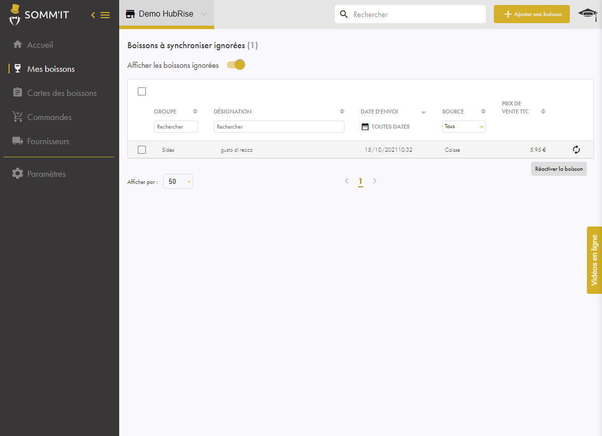

## Importer le catalogue

Le catalogue d'HubRise est automatiquement importé chaque nuit dans SOMM'IT.

Pour importer votre catalogue manuellement, contactez le support de SOMM'IT.

## Traiter les nouvelles références en attente

Lorsqu'un catalogue est importé, les prix des références existantes sont mis à jour. 

Quant aux nouvelles références, vous devez les traiter manuellement, en les intégrant à vos références SOMM'IT ou en les ignorant.

Pour intégrer ou ignorer une nouvelle référence en attente, suivez ces étapes :

1. Depuis votre back office SOMM'IT, dans le menu de gauche, cliquez sur **Mes boissons**.
   
2. En haut de la page, à côté du titre **Mes boissons**, cliquez sur le lien indiquant le nombre de références en attente d'être synchronisées. Par exemple, cliquez sur **194 à synchroniser**.
   
3. Vous pouvez alors :
   - intégrer une référence. Pour cela, en fin de ligne d'une référence, cliquez sur le signe **+**.
   - ignorer une référence pour ne plus la voir dans vos références SOMM'IT à chaque remontée de caisse. Pour cela, en fin de ligne d'une référence, cliquez sur le symbole d'interdiction.
   - intégrer ou ignorer plusieurs références simultanément. Pour cela, en début de ligne des références, cochez les cases des références sur lesquelles vous souhaitez agir et cliquez sur le signe **+** ou le symbole d'interdiction en haut du tableau.

## Réactiver une référence ignorée

Pour réactiver une référence ignorée, suivez ces étapes :

1. Répétez les étapes 1 et 2 ci-dessus permettant d'accéder aux références en attente d'être synchronisées.
2. Cliquez sur le curseur **Afficher les boissons ignorées**. La liste des références ignorées s'affiche.
   
3. Cliquez sur le symbole **Réactivez la boisson** en bout de ligne d'une référence pour la réactiver ou utilisez le système de coche en début de ligne pour en réactiver plusieurs simultanément.

