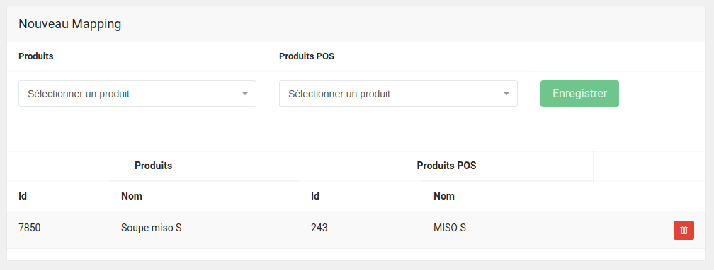

Once your TastyCloud website is connected with HubRise, some configuration is required on TastyCloud to ensure that orders can be processed by the other apps connected to HubRise.

For example, if an EPOS is connected to your HubRise Location, you will need to associate items on TastyCloud with the corresponding items on your EPOS. This process is called "ref code mapping" and it must be done manually from the Tasty Cloud back office, as explained below.

## Products and Options {#products-and-options}

---

**IMPORTANT NOTE:** TastyCloud requires a HubRise catalog to be set up in order to complete the ref code mapping process. Refer to your EPOS documentation on HubRise to check that it can push catalogs to HubRise. Contact TastyCloud if your EPOS does not support this feature.

---

First make sure you have a working connection between TastyCloud and HubRise. For more information on the connection process, see [Connect TastyCloud to HubRise](/apps/tastycloud/connect-hubrise).

Then follow these steps to map items between TastyCloud and HubRise:

1. Log in to your TastyCloud back office.

1. Click **Mapping des produits** (Products mapping) from the left navigation panel.

1. Select the type of mappings you want to update: **Produits** (Products), or **Options** (Options).

1. Select the TastyCloud element to be mapped from the left dropdown, then match it with the HubRise element from the right dropdown. The left dropdown includes all the TastyCloud items that have not yet been mapped. Click **Enregistrer** (Save) to create the mapping.

1. Repeat the process for every item in the left dropdown.

The **Mapping des produits** (Products mapping) page also displays a table with the current mappings between TastyCloud and HubRise. The left side displays the **Id** and the **Nom** (Name) on TastyCloud. The right side displays the HubRise **Id** (EPOS ref code) and **Nom** (EPOS name) it is mapped to.

For example, let's consider the mapping shown in the screenshot above:

- `7850` is the TastyCloud internal identifier of the item.
- `Soupe miso S` is the name displayed on your TastyCloud website.
- `243` is the EPOS ref code of the mapped item.
- `MISO S` is the EPOS name of the mapped item.

The name displayed on the right side is saved at the time the mapping is created. If you change this name in your EPOS, you will need to remove and re-create the mapping to make the change visible in TastyCloud.

To remove an existing mapping between TastyCloud and HubRise, click the red **Delete icon** on the right hand side. Removing a mapping does not delete the item from TastyCloud or HubRise.

## Deals (Menus or Formules)

Menus and Formules in TastyCloud are called deals in HubRise. Deals need to be mapped to HubRise in a similar way to products and options.

Follow the instructions in the previous section. In the **Mapping des produits** page, select **Menus** instead of **Produits** or **Options**.

## Discounts (Promotions)

Promotions in TastyCloud are called discounts in HubRise. Discounts cannot be mapped on TastyCloud, which means that they are sent to HubRise without a ref code. This may create issues with some EPOS systems. Refer to your EPOS documentation on the HubRise website to verify if this works for you, or contact TastyCloud support.

## Payment Methods

TastyCloud offers various payment methods, including cash and online payment. TastyCloud informs HubRise of the selected payment method, but it does not specify the corresponding ref code required by some EPOS. Refer to your EPOS documentation on the HubRise website to verify if this works for you, or contact TastyCloud support.

## Service Types

Service Types such as Delivery, Collection or Eat in are supported. TastyCloud does not associate ref codes to service types, but this might be required for certain EPOS systems. Refer to your EPOS documentation on the HubRise website to verify if this works for you, or contact TastyCloud support.

## Charges

Although TastyCloud supports delivery charges, this information is not sent through to HubRise.
