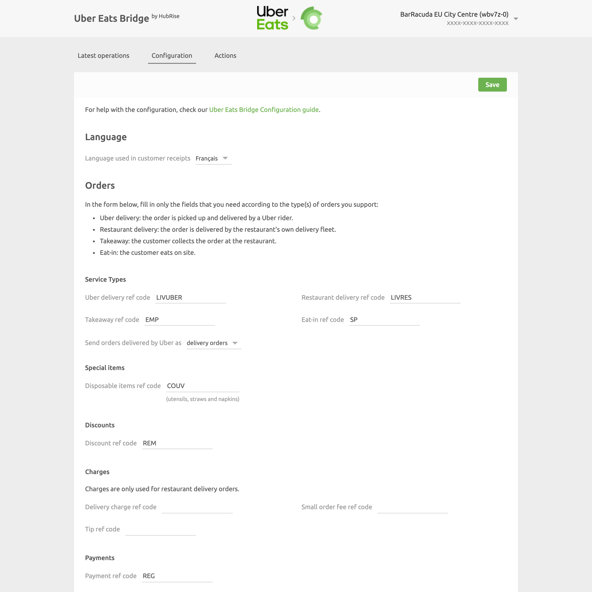
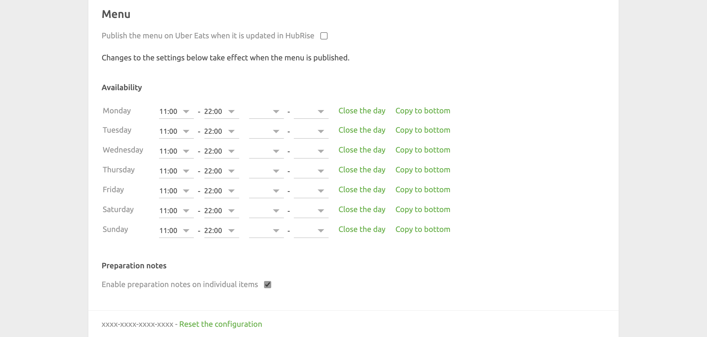

The Configuration page can be accessed by clicking on the arrow <InlineImage width="20" height="20"></InlineImage> at the top right corner of the main page. For more details, see [User Interface](/apps/uber-eats/user-interface).

The Configuration page allows you to customise the behaviour of Uber Eats Bridge based on your preferences.

These are divided into different sections for an easier navigation.

## Language

From this section, you can decide which language is used to localise your receipts.

## Orders

### Service Types

Service types such as Uber Eats delivery, restaurant delivery, takeaway, or eat-in might require the corresponding ref code entry. Refer to your connected EPOS documentation on the HubRise website to verify.

### Special Items

**Disposable items ref code** is the ref code that is used when customers include disposable items in their orders.
Not all Uber Eats restaurants offer their customers the option to request disposable items, such as utensils, straws, and napkins, in an order. But if you do, you need to provide a ref code. Create a "Disposable items" product in your EPOS, and use that ref code here.

The following screenshot shows the **Request utensils, straws, etc.** checkbox that customers can use to request disposable items.

### Discounts

**Discount ref code** is the ref code associated with Uber Eats discounts in your EPOS. Refer to your connected EPOS documentation on the HubRise website to know how to handle discounts in your EPOS.

### Charges

In this section, include the ref codes for the following charges:

- Delivery charges
- Small order fees
- Tips

The ref codes in this section are only applied to orders delivered by your restaurant fleet.

### Payments

**Payment ref code** is the ref code associated with Uber Eats payments in your EPOS. Without such reference, your EPOS will not know how to correctly identify and process Uber Eats payments. Refer to your connected EPOS documentation on the HubRise website to know how to handle Uber Eats payments in your EPOS.

### Order Statuses

Select from the dropdown menu the HubRise status which should make the order accepted in Uber Eats. Refer to your connected EPOS documentation on the HubRise website for your EPOS requirements.

## Menu

In this section, choose if you want to update your Uber Eats catalog every time it is updated on HubRise.
By default, this option it turned off.

### Availability

In the **Availability** section, set the availability for your Uber Eats store.

For each day of the week, set the opening and closing times of your store by specifying one or two time shifts. Customers will not be able to order from your Uber Eats store outside of these time windows.

If your restaurant is closed on a specific day, click **Close the day**.
To quickly copy the availability to all the following days on the list, click **Copy to bottom**.

### Preparation Notes

Select if you want to enable preparation notes for individual products.
If you enable this option, make sure that your connected EPOS supports product level comments.

---

**IMPORTANT NOTE:** To apply the updated availability and preparation notes choice, publish the menu to your Uber Eats store. For more details, see [Pulling The Menu](/apps/uber-eats/pulling-menu).

---

## Saving the Configuration

Once you are happy with the configuration of Uber Eats Bridge, click **Save** at the top of the page to go back to the Operations page.

## Resetting the Configuration

If you want to reset the configuration and erase its values, click **Reset the configuration** at the bottom of the page.

---

**IMPORTANT NOTE:** Resetting the configuration will also erase your Uber Eats Store UUID. To continue receiving Uber Eats orders, you will need to enter your Uber Eats Store UUID again.

---

Resetting the configuration does not remove the operation logs displayed in the main page.
