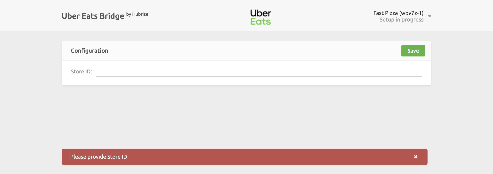

To connect Uber Eats to HubRise, the Uber Eats team needs to log your HubRise location in their back office and assign you a unique store ID.

Don't worry, HubRise will take care of all the paperwork for you!

## Before Connecting Uber Eats

To start receiving Uber Eats orders on HubRise, you should first contact us at <support@hubrise.com> and include in your email the following information:

- The URL of your Uber Eats store(s) you wish to connect.
- Your HubRise account and location ids.

We will then contact Uber Eats on your behalf to establish the connection and get you ready to receive orders in one business day.

## Connect the Uber Eats Bridge to HubRise

---

**IMPORTANT NOTE:** Uber Eats Bridge connects to HubRise at the location level.

---

To connect Uber Eats to HubRise, you first need to log in to your HubRise account.
If you don't have a HubRise account, go to the [HubRise Signup Page](https://manager.hubrise.com/signup) and follow the instructions.

1. Select **CONNECTIONS** from the HubRise back office, then **View available apps**.
1. Select **Uber Eats** from the list of apps.
1. Click **Connect**.
1. Grant Uber Eats permission to access the location of your restaurant registered in HubRise.
   1. If your account has not yet been created on HubRise, select **Create a new location**.
   1. For accounts with multiple locations, expand the **Choose location** section to select the correct one and click on **Allow**.

You have now added Uber Eats to your HubRise apps.
The next step is configure the connection.

## Location ID

---

**IMPORTANT NOTE:** In order to connect your Uber Eats restaurant to HubRise, you need to provide a valid store ID.

---

In the first configuration page, you will need to enter the store ID that has been assigned to you by Uber Eats.
This is necessary to correctly route the incoming orders to your HubRise location.

Once you are finished, click **Save**.
