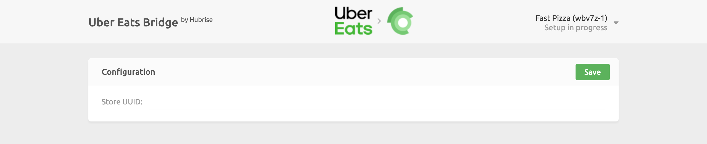

Connecting Uber Eats to HubRise can be done with a few steps. You can connect one or both types of Uber Eats storefronts, depending on your setup:

- Your store hosted on the main Uber Eats platform, accessible at www.ubereats.com.
- Your own branded webstore on Uber Eats, identified by URLs that begin with www.order.store.

---

**IMPORTANT NOTE:** If you do not have a HubRise account yet, register on our [Signup Page](https://manager.hubrise.com/signup). It only takes a minute!

---

## 1. Enable HubRise on Uber Eats

---

**IMPORTANT NOTE:** If you have a branded webstore on Uber Eats (URLs that begin with www.order.store), make sure you have read our [FAQ](/apps/uber-eats/faqs/connect-webstore) before proceeding.

---

As a first step, the HubRise integration must be enabled on your Uber Eats store.

Contact us at support@hubrise.com and include the following information:

- The URL link to your restaurant page on the Uber Eats website. For example: https://www.ubereats.com/store/camile-thai-epsom/V6j2cjCWX9e0WXNyGTdYsg.
- Your HubRise location name and identifier. For example: `Fast Pizza London z6q31-0`.
- The order acceptance mode you want to use for your store: `Manual accept` or `Offered state` mode. For more details, see our [FAQ](/apps/uber-eats/faqs/send-orders-to-epos-without-tablet).

With this information in hand, we will ask Uber Eats support to enable the HubRise connection for your store and provide the Uber Eats Store UUID, for example: `dc638853-bff1-411c-adba-8aa4d7abddd2`.

## 2. Connect Uber Eats Bridge

With your Uber Eats Store UUID in hand, you can now connect the Uber Eats Bridge:

1. Log in to your [HubRise account](https://manager.hubrise.com).
1. Select the location you want to connect from the dropdown menu.
1. Select **CONNECTIONS**, then **View available apps**.
1. Select **Uber Eats** from the list of apps.
1. Click **Connect**.
1. Click **Allow** to grant Uber Eats Bridge access to your registered location on HubRise. If your account has multiple locations, expand the **Choose location** section to select the desired location, and then click **Allow**.
1. A new page asks you to provide your Uber Eats Store UUID. Enter your Store UUID, and click **Save** to complete the connection process.

## 3. Configure Your Preferences

After connecting the bridge, you need to configure a few parameters on the **Configuration** page to send orders correctly to your EPOS.

For more information about the configuration page and how to navigate to it, see [Configuration page](/apps/uber-eats/user-interface#configuration). For details on how to configure the parameters of the Uber Eats Bridge, see [Configuration](/apps/uber-eats/configuration).

## 4. Map Products Ref Codes

Most apps require a ref code for each product to process orders correctly. To learn how to map ref codes on Uber Eats, see [Map Ref Codes](/apps/uber-eats/map-ref-codes).

## 5. Receive Test Orders

Before you start receiving orders from real customers, we recommend that you test the whole integration workflow.

You should place a few orders on your Uber Eats restaurant, make sure they are correctly received by your EPOS, and then cancel them to get a refund. This will ensure that your restaurant is ready to go live.

If you want, you will also be able to get rid of your Uber Eats tablet by switching to a direct integration.
For more details, see [Can Orders Be Sent Directly To My EPOS Without Using Uber Eats Tablets](/apps/uber-eats/faqs/send-orders-to-epos-without-tablet).

If you encounter problems during the tests, contact us at support@hubrise.com.
